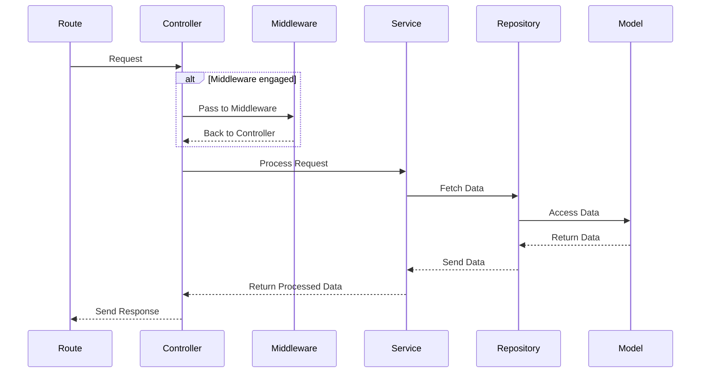

[Handbook](/readme.md) » [Architecture](/architecture/readme.md) » [Design](/architecture/design/readme.md) » Hexagonal

# Arquitectura Hexagonal #

La arquitectura hexagonal, es un patrón de diseño de software que promueve la separación de preocupaciones y la independencia de los componentes de una aplicación. Este enfoque facilita la escalabilidad, mantenibilidad y testabilidad del código.

## 1. **Características Clave**
- **Separación de Lógica:** La arquitectura divide la aplicación en capas bien definidas, cada una con su propia responsabilidad. Esto permite que la lógica de negocio se mantenga separada de las preocupaciones de infraestructura, como el acceso a la base de datos y las interfaces de usuario, facilitando la mantenibilidad y escalabilidad del código.
- **Interacción entre capas:** Cada capa tiene definida con quién interactúa, siguiendo un flujo unidireccional desde los controladores hasta los modelos. Esta interacción se representa como: controller -> service -> repository -> model, lo que garantiza que las capas no se mezclen y mantengan su independencia.
- **Facilita las Pruebas:** La estructura modular y la clara separación de responsabilidades hacen que las pruebas sean más simples y efectivas. Cada capa puede ser probada de forma independiente, lo que facilita la identificación de problemas y mejora la garantía de calidad.
- **Enfoque en la Lógica de Negocio:** La arquitectura hexagonal pone un fuerte énfasis en la lógica de negocio y en cómo interactúa con el mundo exterior, priorizando la funcionalidad y el dominio sobre los detalles técnicos específicos. Esto permite que los desarrolladores se concentren en implementar soluciones que aborden necesidades del negocio.

## 2. **Ventajas**
-	**Flexibilidad:** Permite cambiar fácilmente las implementaciones de la infraestructura sin afectar la lógica de negocio.
-	**Mantenibilidad:** Facilita la comprensión del código y la identificación de errores.
-	**Escalabilidad:** Permite escalar la aplicación de manera más eficiente al agregar nuevas funcionalidades.

## 3. **Cuando usar arquitectura hexagonal**
La arquitectura hexagonal es ideal para proyectos que requieren alta escalabilidad, mantenibilidad y flexibilidad en su desarrollo

-	**Aplicaciones Complejas:** Si tu aplicación tiene una lógica de negocio compleja y necesita ser independiente de detalles técnicos específicos (como frameworks, bases de datos o APIs externas), la arquitectura hexagonal es una excelente opción. Permite definir una capa clara para la lógica de negocio que no dependa de la infraestructura.
- **Múltiples Interfaces o Canales de Entrada:** Si tu aplicación interactúa con varios sistemas externos o interfaces (APIs REST, CLI, interfaces gráficas, etc.), la arquitectura hexagonal facilita el manejo de estas interacciones. Los adaptadores permiten que la lógica de negocio se conecte a diferentes interfaces sin alterar su estructura interna.
- **Aplicaciones de Larga Duración:** En proyectos que requieren mantenimiento a largo plazo y donde se anticipan cambios tecnológicos, esta arquitectura simplifica el proceso de cambio de infraestructura (como cambiar de base de datos o añadir nuevas APIs externas) sin alterar el núcleo de la aplicación.
- **Proyectos Modulares o Microservicios:** Si tu aplicación está construida como una serie de módulos independientes o si estás utilizando una arquitectura de microservicios, la separación de responsabilidades entre controladores, servicios, repositorios y modelos se alinea perfectamente con este enfoque.
- **Aplicaciones con Alta Testabilidad:** La arquitectura hexagonal es ideal cuando se necesita una alta cobertura de pruebas. La separación de capas facilita el mockeo y la creación de pruebas unitarias aisladas para cada componente, sin depender de implementaciones externas o infraestructura.
- **Proyectos con Cambios Constantes:** Si tu aplicación está en constante evolución, ya sea por requerimientos de negocio o tecnología, la arquitectura hexagonal proporciona flexibilidad al permitir modificar adaptadores (como la base de datos o integraciones) sin alterar la lógica de negocio.
- **Proyectos con Equipos Multidisciplinarios:** En proyectos donde los equipos de desarrollo están separados en áreas como backend, infraestructura o negocio, la arquitectura facilita el trabajo paralelo, permitiendo que cada equipo trabaje en su área sin interferir en las capas de los demás.

## 4. **En resumen**
La arquitectura hexagonal es una metodología robusta que ayuda a los desarrolladores a crear aplicaciones bien estructuradas y fáciles de mantener, promoviendo un enfoque centrado en el dominio y la lógica de negocio. Esto resulta en aplicaciones más resilientes y adaptables a los cambios tecnológicos y de negocio.

# Going Deep (ExpressJS example) #

## 1. **Entendiendo la arquitectura hexagonal**
La arquitectura hexagonal está organizada en capas bien definidas, cada una con una responsabilidad clara, lo que facilita la escalabilidad, mantenibilidad y testabilidad del código.

### 1.1 **Diagrama**


### 1.2 **Detalle de cada capa**
#### **Rutas**
- **Descripción:** Esta capa define las rutas de la API que están relacionadas con los usuarios. Cada ruta mapea una solicitud HTTP a un controlador específico.
-	**Función:** Se encarga de recibir las solicitudes del cliente y enrutar estas solicitudes a los controladores correspondientes, asegurando que las respuestas sean enviadas correctamente.
-	**Ejemplo:**
```
// user.routes.ts
import { Router } from 'express';
import { getUser, createUser } from '../controllers/user.controller';

const router = Router();

router.get('/users/:id', getUser);
router.post('/users', createUser);

export default router;
```
#### **Controladores**
- **Descripción:** Los controladores manejan la lógica de negocio relacionada con las solicitudes y respuestas de la API.
- **Función:** Interactúan con los servicios para ejecutar la lógica de negocio, procesar los datos y devolver respuestas adecuadas al cliente.
- **Ejemplo:** 
```
// user.controller.ts
import { Request, Response } from 'express';
import { getUserService, createUserService } from '../services/user.service';

export const getUser = async (req: Request, res: Response) => {
  const userId = req.params.id;
  const user = await getUserService(userId);
  res.json(user);
};

export const createUser = async (req: Request, res: Response) => {
  const userData = req.body;
  const newUser = await createUserService(userData);
  res.status(201).json(newUser);
};
```
#### **Servicios**
- **Descripción:** Esta capa contiene toda la lógica necesaria para ejecutar la acción que el controlador está solicitando.
-	**Función:** Los servicios implementan las reglas de negocio y orquestan las interacciones con los repositorios para realizar operaciones sobre los modelos.
-	**Ejemplo:**
```
// user.service.ts
import { User } from '../models/user.model';
import { UserRepository } from '../repositories/user.repository';

export const getUserService = async (id: string) => {
    return UserRepository.findById(id);
};

export const createUserService = async (userData: any) => {
    const user = new User(userData);
    return UserRepository.create(user);
};
```
#### **Repositorios**
-	Descripción: Los repositorios interactúan con la base de datos para realizar operaciones de CRUD sobre los modelos.
-	Función: Encapsulan la lógica de acceso a datos y proporcionan métodos para crear, leer, actualizar y eliminar datos.
-	Ejemplo:
```
// user.repository.ts
import { UserModel } from '../models/user.model';

export const UserRepository = {
    findById: async (id: string) => UserModel.findByPk(id),
    create: async (user: any) => UserModel.create(user),
    // Otras operaciones CRUD...
};
```
#### **Modelos**
-	**Descripción:** Esta capa define la estructura y los atributos de los datos que se manejarán en la aplicación.
-	**Función:** Utilizan ORM (como Sequelize) para mapear las tablas de la base de datos a objetos en el código, facilitando así el acceso y la manipulación de datos.
-	**Ejemplo:**
```
// user.model.ts
import { Model, DataTypes } from 'sequelize';
import { sequelize } from '../config/database/sequelize';

export const UserModel = sequelize.define('User', {
    id: {
        type: DataTypes.UUID,
        primaryKey: true,
        defaultValue: DataTypes.UUIDV4,
    },
    name: {
        type: DataTypes.STRING,
        allowNull: false,
    },
    email: {
        type: DataTypes.STRING,
        allowNull: false,
        unique: true,
    },
    // Otros atributos...
});
```

## 2. **Modulos**
Un módulo es una agrupación lógica de funcionalidades y componentes relacionados a una parte específica del sistema, como “user” o “client”. Un módulo contiene todo lo necesario para manejar las operaciones asociadas a esa parte, como los controladores, modelos, servicios y repositorios.

### 2.1 **¿Cómo identificar un módulo?**
-	**Responsabilidad única:** Cada módulo tiene una responsabilidad clara y maneja un conjunto de operaciones relacionadas, como la gestión de usuarios.
-	**Autonomía relativa:** Los módulos son autónomos en el sentido de que contienen todas las capas necesarias para manejar su funcionalidad, desde la lógica de negocio hasta el acceso a la base de datos.
-	**Agrupación funcional:** Si varias funciones, clases o servicios se relacionan con un mismo dominio o área del sistema, se agrupan bajo un mismo módulo.

### 2.2 **Ejemplo de un módulo**
Por ejemplo, el módulo user contiene toda la funcionalidad relacionada con usuarios, y está organizado de la siguiente manera:
```
src/
  ├── user/
  │   ├── controllers/
  │   ├── models/
  │   ├── repositories/
  │   ├── services/
```

## 3. Estructura de carpetas
La estructura de las carpetas tiene un diseño que organiza de manera clara las responsabilidades, asegurando una fácil escalabilidad y mantenibilidad del sistema.

### 3.1 **Diagrama**
Diagrama de como podría verse una estructura de carpetas con un modulo User
```
src/
  ├── app.ts
  ├── app.types.ts
  ├── config/
  │   ├── database/
  │   │   ├── config.ts
  │   │   ├── sequelize.ts
  │   │   └── index.ts
  │   ├── routes/
  │   │   ├── user.ts
  │   │   └── index.ts
  ├── user/
  │   ├── controllers/
  │   │   ├── user.controller.ts
  │   │   ├── user.controller.test.ts
  │   │   ├── user.controller.type.ts
  │   │   └── index.ts
  │   ├── models/
  │   │   ├── user.model.ts
  │   │   ├── user.model.test.ts
  │   │   ├── user.model.type.ts
  │   │   └── index.ts
  │   ├── repositories/
  │   │   ├── user.repository.ts
  │   │   ├── user.repository.test.ts
  │   │   ├── user.repository.type.ts
  │   │   └── index.ts
  │   ├── services/
  │   │   ├── user.service.ts
  │   │   ├── user.service.test.ts
  │   │   ├── user.service.type.ts
  │   │   └── index.ts
  │   ├── middlewares/
  │   │   ├── user.middleware.ts
  │   │   ├── user.middleware.test.ts
  │   │   ├── user.middleware.type.ts
  │   │   └── index.ts
```
### 3.2 **Carpetas y archivos core**
- src/: Es el directorio principal que contiene todo el código fuente de la aplicación. Dentro de esta carpeta se organiza el proyecto en módulos y capas que siguen la arquitectura definida para garantizar una separación clara de responsabilidades y un código modular y mantenible. 
- app.ts: Es el punto de entrada de la aplicación, donde se configura y levanta el servidor, las rutas y otros aspectos importantes como middlewares globales.
- app.types.ts: Define los tipos o interfaces que no son parte de ningun módulo y que son globales o que se comparten entre varios módulos.
- config/: Contiene las configuraciones clave de la aplicación, tales como la configuración de la base de datos y las rutas que la aplicación va a exponer. Cada una de estas configuraciones se separa por modulos a ser configurados, por ejemplo, `database/` o `kafka/`

### 3.3 **Estructura y Convención de Archivos**
En la estructura de cada módulo dentro de src/, cada carpeta sigue una convención estándar para garantizar la organización, consistencia y separación de responsabilidades. Aquí se detalla cómo se maneja el contenido en cada carpeta:

#### **Estructura y Convención de Archivos**
- **index.ts:** Este archivo se utiliza para exportar todos los componentes de la carpeta en la que se encuentra. Esto simplifica las importaciones desde otros módulos, permitiendo que se importen múltiples funcionalidades desde un único archivo.
- ***.types.ts:** Cada carpeta contiene un archivo .types.ts que define los tipos o interfaces que se utilizan en esa parte del módulo. Esto asegura una tipificación clara y estricta en TypeScript, lo que mejora la consistencia y previene errores a nivel de tipos.
- ***.test.ts:** Este archivo contiene las pruebas unitarias para la lógica dentro de la carpeta correspondiente. Asegura que el código funcione correctamente y permite realizar pruebas de manera aislada. Se suelen usar frameworks de pruebas como Vitest o Jest.

### 3.4 **Estructura de carpetas y archivos dentro de un modulo**

#### **Ejemplo Aplicado al Módulo user**

##### **controllers/**

-	user.controller.ts: Contiene la lógica para manejar las solicitudes HTTP y respuestas relacionadas con el usuario.
-	user.controller.types.ts: Define los tipos necesarios, como tipos de respuestas HTTP y estructuras de los datos que maneja el controlador.
-	user.controller.test.ts: Contiene las pruebas para verificar que el controlador funcione como se espera.
-	index.ts: Exporta todos los controladores de la carpeta para ser utilizados en otras partes del módulo o aplicación.

##### **models/**
-	user.model.ts: Define la estructura del modelo de usuario, utilizando Sequelize para mapear la tabla de usuarios en la base de datos.
-	user.model.types.ts: Define los tipos asociados al modelo, como los atributos del usuario y sus relaciones con otros modelos.
-	user.model.test.ts: Contiene pruebas que verifican la correcta creación y manipulación de los modelos en la base de datos.
-	index.ts: Exporta el modelo del usuario para que esté disponible en el repositorio u otros módulos.

##### **repositories/**
-	user.repository.ts: Define las funciones de acceso a la base de datos, como búsquedas o actualizaciones de usuarios.
-	user.repository.types.ts: Contiene tipos específicos para las operaciones realizadas en el repositorio.
-	user.repository.test.ts: Incluye pruebas para verificar que las operaciones en la base de datos, como las consultas y actualizaciones, se ejecuten correctamente.
-	index.ts: Exporta todas las funcionalidades del repositorio.

##### **services/**
-	user.service.ts: Contiene la lógica de negocio que define las reglas y procesos relacionados con los usuarios.
-	user.service.types.ts: Define los tipos necesarios para manejar la lógica de negocio, como estructuras de datos y parámetros de las funciones.
-	user.service.test.ts: Verifica que la lógica de negocio implementada en los servicios se comporte correctamente.
-	index.ts: Exporta todos los servicios disponibles dentro de la carpeta.

##### **middlewares/**:
- user.middleware.ts: Un middleware que se encarga de autenticar y autorizar a los usuarios, asegurando que solo usuarios autorizados puedan acceder a ciertas rutas.
- user.middleware.test.ts: Pruebas unitarias para garantizar que el middleware funcione correctamente.
- user.middleware.type.ts: Definición de los tipos necesarios para el middleware, asegurando que el tipo de datos manejado sea consistente.
- index.ts: Exporta todos los middlewares del módulo, facilitando su importación en otras capas de la aplicación.

#### **Beneficios**
-	Modularidad: Cada carpeta encapsula su funcionalidad y es fácilmente reutilizable.
-	Escalabilidad: Al seguir esta estructura, es sencillo agregar nuevas funcionalidades sin romper las existentes.
-	Mantenibilidad: Facilita la navegación y comprensión del código, haciendo que las modificaciones y el debugging sean más eficientes.
-	Tipificación estricta: Al utilizar archivos .types.ts, se asegura que todas las interacciones estén bien definidas y seguras en cuanto a tipos.

### 3.5 **Archivos de configuración**
En la estructura del proyecto, todos los archivos de configuración necesarios para herramientas externas, como Vitest, ESLint o TypeScript, deben estar ubicados en la raíz del proyecto, es decir, fuera de la carpeta src/. Esto asegura una configuración centralizada y facilita su gestión cuando se requieren ajustes globales.

#### **Algunos archivos de configuración**
- vitest.config.ts: Configura las pruebas del proyecto, definiendo el comportamiento de Vitest para ejecutar los tests unitarios de manera adecuada. Esto incluye la definición de rutas de alias y otras configuraciones relacionadas con el entorno de pruebas.
- .eslintrc.js: Define las reglas de ESLint para mantener la consistencia del estilo de código y prevenir errores. Las reglas pueden incluir convenciones de estilo, como comillas o uso de const, así como mejores prácticas recomendadas para TypeScript y JavaScript.
- tsconfig.json: Configura TypeScript, especificando opciones como el strict mode, la resolución de módulos, y los paths de alias utilizados en el proyecto. Es crucial para asegurar que el código TypeScript se compile correctamente y esté bien tipado.
- prettier.config.js: Configura Prettier, una herramienta que asegura un formato de código consistente en todo el proyecto, como el espaciado y las comillas.
- package.json: Contiene las dependencias del proyecto y scripts de NPM que permiten ejecutar diferentes comandos, como la inicialización del servidor, la ejecución de pruebas o la construcción del proyecto.

#### **Diagrama con archivos de configuración**
```
/
├── src/
│   ├── app.ts
│   ├── config/
│   ├── user/
│   └── ...
├── vitest.config.ts
├── .eslintrc.js
├── tsconfig.json
├── prettier.config.js
├── .env
├── package.json
└── ...
```

#### **Beneficios**
- Centralización: Al tener todos los archivos de configuración en la raíz, se facilita el acceso a ellos y su modificación.
- Separación clara: Las configuraciones de herramientas y entorno se mantienen separadas del código fuente (src/), evitando mezclar configuraciones con la lógica de la aplicación.
- Simplicidad: Facilita la integración de nuevas herramientas o cambios en las existentes, ya que todos los ajustes necesarios están en un solo lugar.