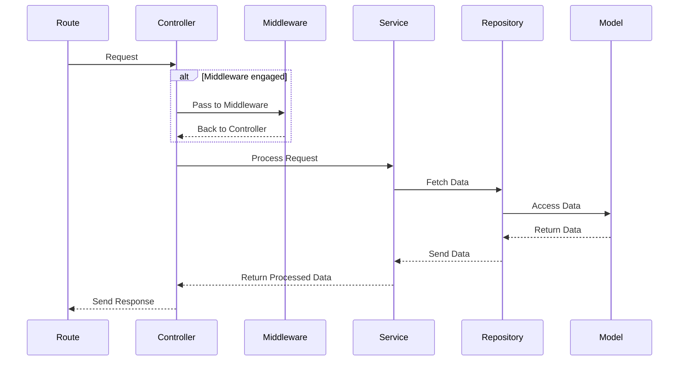
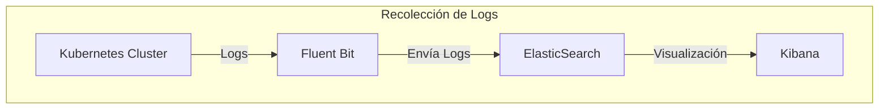
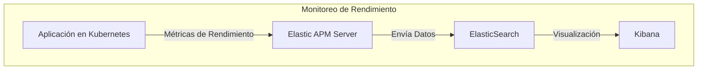

Archivo: architecture/design/apis.md

[Handbook](/readme.md) » [Architecture](/architecture/readme.md) » [Design](/architecture/design/readme.md) » API

# API

## 1. Communication Methods

### 1.1 **RESTful API**
- **When to Use**:
  - Ideal para operaciones CRUD y recursos que se asignan directamente a métodos HTTP (GET, POST, PUT, DELETE).
  - Funciona bien para la mayoría de las interacciones cliente-servidor tradicionales, donde la simplicidad y la escalabilidad son prioridades.
- **Best Practices**:
  - Implementar versionado con *namespaces* (por ejemplo, `/api/v1/`) para compatibilidad retroactiva.
  - Usar códigos de estado HTTP estándar y mensajes de error significativos.

### 1.2 **GraphQL**
- **When to Use**:
  - Adecuado para clientes que requieren flexibilidad en la consulta de datos, especialmente cuando diferentes clientes necesitan diferentes subconjuntos de datos.
  - Útil para optimizar el rendimiento al reducir el sobreaprovisionamiento o la subobtención de datos.
- **Best Practices**:
  - Definir un esquema claro con tipos, consultas y mutaciones.
  - Usar resolvers para encapsular la lógica para obtener datos y ejecutar mutaciones.
  - Implementar técnicas de agrupación (`graphql-batch`) para reducir problemas de consultas N+1.

### 1.3 **Asynchronous Messaging**
- **When to Use**:
  - Adecuado para desacoplar servicios y habilitar arquitecturas impulsadas por eventos.
  - Ideal para tareas que no requieren respuesta inmediata o que pueden procesarse en segundo plano, como enviar correos electrónicos o procesar grandes volúmenes de datos.
- **Best Practices**:
  - Implementar idempotencia en los mensajes para manejar reintentos y evitar duplicaciones.
  - Asegurar una adecuada monitorización y registro de las colas de mensajes para manejar fallos.

### 1.4 **WebSockets**
- **When to Use**:
  - Adecuado para necesidades de comunicación en tiempo real, como aplicaciones de chat, notificaciones en vivo o actualizaciones de datos en tiempo real.
- **Best Practices**:
  - Implementar autenticación y autorización para asegurar la comunicación.
  - Usar canales para organizar y gestionar las conexiones WebSocket.

Archivo: architecture/design/common-challenges/readme.md

[Handbook](/readme.md) » [Architecture](/architecture/readme.md) » [Design](/architecture/design/readme.md) » Common Technical Challenges & Solutions

# Common Technical Challenges & Solutions


Archivo: architecture/design/hexagonal.md

[Handbook](/readme.md) » [Architecture](/architecture/readme.md) » [Design](/architecture/design/readme.md) » Hexagonal

# Arquitectura Hexagonal #

La arquitectura hexagonal, es un patrón de diseño de software que promueve la separación de preocupaciones y la independencia de los componentes de una aplicación. Este enfoque facilita la escalabilidad, mantenibilidad y testabilidad del código.

## 1. **Características Clave**
- **Separación de Lógica:** La arquitectura divide la aplicación en capas bien definidas, cada una con su propia responsabilidad. Esto permite que la lógica de negocio se mantenga separada de las preocupaciones de infraestructura, como el acceso a la base de datos y las interfaces de usuario, facilitando la mantenibilidad y escalabilidad del código.
- **Interacción entre capas:** Cada capa tiene definida con quién interactúa, siguiendo un flujo unidireccional desde los controladores hasta los modelos. Esta interacción se representa como: controller -> service -> repository -> model, lo que garantiza que las capas no se mezclen y mantengan su independencia.
- **Facilita las Pruebas:** La estructura modular y la clara separación de responsabilidades hacen que las pruebas sean más simples y efectivas. Cada capa puede ser probada de forma independiente, lo que facilita la identificación de problemas y mejora la garantía de calidad.
- **Enfoque en la Lógica de Negocio:** La arquitectura hexagonal pone un fuerte énfasis en la lógica de negocio y en cómo interactúa con el mundo exterior, priorizando la funcionalidad y el dominio sobre los detalles técnicos específicos. Esto permite que los desarrolladores se concentren en implementar soluciones que aborden necesidades del negocio.

## 2. **Ventajas**
-	**Flexibilidad:** Permite cambiar fácilmente las implementaciones de la infraestructura sin afectar la lógica de negocio.
-	**Mantenibilidad:** Facilita la comprensión del código y la identificación de errores.
-	**Escalabilidad:** Permite escalar la aplicación de manera más eficiente al agregar nuevas funcionalidades.

## 3. **Cuando usar arquitectura hexagonal**
La arquitectura hexagonal es ideal para proyectos que requieren alta escalabilidad, mantenibilidad y flexibilidad en su desarrollo

-	**Aplicaciones Complejas:** Si tu aplicación tiene una lógica de negocio compleja y necesita ser independiente de detalles técnicos específicos (como frameworks, bases de datos o APIs externas), la arquitectura hexagonal es una excelente opción. Permite definir una capa clara para la lógica de negocio que no dependa de la infraestructura.
- **Múltiples Interfaces o Canales de Entrada:** Si tu aplicación interactúa con varios sistemas externos o interfaces (APIs REST, CLI, interfaces gráficas, etc.), la arquitectura hexagonal facilita el manejo de estas interacciones. Los adaptadores permiten que la lógica de negocio se conecte a diferentes interfaces sin alterar su estructura interna.
- **Aplicaciones de Larga Duración:** En proyectos que requieren mantenimiento a largo plazo y donde se anticipan cambios tecnológicos, esta arquitectura simplifica el proceso de cambio de infraestructura (como cambiar de base de datos o añadir nuevas APIs externas) sin alterar el núcleo de la aplicación.
- **Proyectos Modulares o Microservicios:** Si tu aplicación está construida como una serie de módulos independientes o si estás utilizando una arquitectura de microservicios, la separación de responsabilidades entre controladores, servicios, repositorios y modelos se alinea perfectamente con este enfoque.
- **Aplicaciones con Alta Testabilidad:** La arquitectura hexagonal es ideal cuando se necesita una alta cobertura de pruebas. La separación de capas facilita el mockeo y la creación de pruebas unitarias aisladas para cada componente, sin depender de implementaciones externas o infraestructura.
- **Proyectos con Cambios Constantes:** Si tu aplicación está en constante evolución, ya sea por requerimientos de negocio o tecnología, la arquitectura hexagonal proporciona flexibilidad al permitir modificar adaptadores (como la base de datos o integraciones) sin alterar la lógica de negocio.
- **Proyectos con Equipos Multidisciplinarios:** En proyectos donde los equipos de desarrollo están separados en áreas como backend, infraestructura o negocio, la arquitectura facilita el trabajo paralelo, permitiendo que cada equipo trabaje en su área sin interferir en las capas de los demás.

## 4. **En resumen**
La arquitectura hexagonal es una metodología robusta que ayuda a los desarrolladores a crear aplicaciones bien estructuradas y fáciles de mantener, promoviendo un enfoque centrado en el dominio y la lógica de negocio. Esto resulta en aplicaciones más resilientes y adaptables a los cambios tecnológicos y de negocio.

# Going Deep (ExpressJS example) #

## 1. **Entendiendo la arquitectura hexagonal**
La arquitectura hexagonal está organizada en capas bien definidas, cada una con una responsabilidad clara, lo que facilita la escalabilidad, mantenibilidad y testabilidad del código.

### 1.1 **Diagrama**


### 1.2 **Detalle de cada capa**
#### **Rutas**
- **Descripción:** Esta capa define las rutas de la API que están relacionadas con los usuarios. Cada ruta mapea una solicitud HTTP a un controlador específico.
-	**Función:** Se encarga de recibir las solicitudes del cliente y enrutar estas solicitudes a los controladores correspondientes, asegurando que las respuestas sean enviadas correctamente.
-	**Ejemplo:**
```
// user.routes.ts
import { Router } from 'express';
import { getUser, createUser } from '../controllers/user.controller';

const router = Router();

router.get('/users/:id', getUser);
router.post('/users', createUser);

export default router;
```
#### **Controladores**
- **Descripción:** Los controladores manejan la lógica de negocio relacionada con las solicitudes y respuestas de la API.
- **Función:** Interactúan con los servicios para ejecutar la lógica de negocio, procesar los datos y devolver respuestas adecuadas al cliente.
- **Ejemplo:** 
```
// user.controller.ts
import { Request, Response } from 'express';
import { getUserService, createUserService } from '../services/user.service';

export const getUser = async (req: Request, res: Response) => {
  const userId = req.params.id;
  const user = await getUserService(userId);
  res.json(user);
};

export const createUser = async (req: Request, res: Response) => {
  const userData = req.body;
  const newUser = await createUserService(userData);
  res.status(201).json(newUser);
};
```
#### **Servicios**
- **Descripción:** Esta capa contiene toda la lógica necesaria para ejecutar la acción que el controlador está solicitando.
-	**Función:** Los servicios implementan las reglas de negocio y orquestan las interacciones con los repositorios para realizar operaciones sobre los modelos.
-	**Ejemplo:**
```
// user.service.ts
import { User } from '../models/user.model';
import { UserRepository } from '../repositories/user.repository';

export const getUserService = async (id: string) => {
    return UserRepository.findById(id);
};

export const createUserService = async (userData: any) => {
    const user = new User(userData);
    return UserRepository.create(user);
};
```
#### **Repositorios**
-	Descripción: Los repositorios interactúan con la base de datos para realizar operaciones de CRUD sobre los modelos.
-	Función: Encapsulan la lógica de acceso a datos y proporcionan métodos para crear, leer, actualizar y eliminar datos.
-	Ejemplo:
```
// user.repository.ts
import { UserModel } from '../models/user.model';

export const UserRepository = {
    findById: async (id: string) => UserModel.findByPk(id),
    create: async (user: any) => UserModel.create(user),
    // Otras operaciones CRUD...
};
```
#### **Modelos**
-	**Descripción:** Esta capa define la estructura y los atributos de los datos que se manejarán en la aplicación.
-	**Función:** Utilizan ORM (como Sequelize) para mapear las tablas de la base de datos a objetos en el código, facilitando así el acceso y la manipulación de datos.
-	**Ejemplo:**
```
// user.model.ts
import { Model, DataTypes } from 'sequelize';
import { sequelize } from '../config/database/sequelize';

export const UserModel = sequelize.define('User', {
    id: {
        type: DataTypes.UUID,
        primaryKey: true,
        defaultValue: DataTypes.UUIDV4,
    },
    name: {
        type: DataTypes.STRING,
        allowNull: false,
    },
    email: {
        type: DataTypes.STRING,
        allowNull: false,
        unique: true,
    },
    // Otros atributos...
});
```

## 2. **Modulos**
Un módulo es una agrupación lógica de funcionalidades y componentes relacionados a una parte específica del sistema, como “user” o “client”. Un módulo contiene todo lo necesario para manejar las operaciones asociadas a esa parte, como los controladores, modelos, servicios y repositorios.

### 2.1 **¿Cómo identificar un módulo?**
-	**Responsabilidad única:** Cada módulo tiene una responsabilidad clara y maneja un conjunto de operaciones relacionadas, como la gestión de usuarios.
-	**Autonomía relativa:** Los módulos son autónomos en el sentido de que contienen todas las capas necesarias para manejar su funcionalidad, desde la lógica de negocio hasta el acceso a la base de datos.
-	**Agrupación funcional:** Si varias funciones, clases o servicios se relacionan con un mismo dominio o área del sistema, se agrupan bajo un mismo módulo.

### 2.2 **Ejemplo de un módulo**
Por ejemplo, el módulo user contiene toda la funcionalidad relacionada con usuarios, y está organizado de la siguiente manera:
```
src/
  ├── user/
  │   ├── controllers/
  │   ├── models/
  │   ├── repositories/
  │   ├── services/
```

## 3. Estructura de carpetas
La estructura de las carpetas tiene un diseño que organiza de manera clara las responsabilidades, asegurando una fácil escalabilidad y mantenibilidad del sistema.

### 3.1 **Diagrama**
Diagrama de como podría verse una estructura de carpetas con un modulo User
```
src/
  ├── app.ts
  ├── app.types.ts
  ├── config/
  │   ├── database/
  │   │   ├── config.ts
  │   │   ├── sequelize.ts
  │   │   └── index.ts
  │   ├── routes/
  │   │   ├── user.ts
  │   │   └── index.ts
  ├── user/
  │   ├── controllers/
  │   │   ├── user.controller.ts
  │   │   ├── user.controller.test.ts
  │   │   ├── user.controller.type.ts
  │   │   └── index.ts
  │   ├── models/
  │   │   ├── user.model.ts
  │   │   ├── user.model.test.ts
  │   │   ├── user.model.type.ts
  │   │   └── index.ts
  │   ├── repositories/
  │   │   ├── user.repository.ts
  │   │   ├── user.repository.test.ts
  │   │   ├── user.repository.type.ts
  │   │   └── index.ts
  │   ├── services/
  │   │   ├── user.service.ts
  │   │   ├── user.service.test.ts
  │   │   ├── user.service.type.ts
  │   │   └── index.ts
  │   ├── middlewares/
  │   │   ├── user.middleware.ts
  │   │   ├── user.middleware.test.ts
  │   │   ├── user.middleware.type.ts
  │   │   └── index.ts
```
### 3.2 **Carpetas y archivos core**
- src/: Es el directorio principal que contiene todo el código fuente de la aplicación. Dentro de esta carpeta se organiza el proyecto en módulos y capas que siguen la arquitectura definida para garantizar una separación clara de responsabilidades y un código modular y mantenible. 
- app.ts: Es el punto de entrada de la aplicación, donde se configura y levanta el servidor, las rutas y otros aspectos importantes como middlewares globales.
- app.types.ts: Define los tipos o interfaces que no son parte de ningun módulo y que son globales o que se comparten entre varios módulos.
- config/: Contiene las configuraciones clave de la aplicación, tales como la configuración de la base de datos y las rutas que la aplicación va a exponer. Cada una de estas configuraciones se separa por modulos a ser configurados, por ejemplo, `database/` o `kafka/`

### 3.3 **Estructura y Convención de Archivos**
En la estructura de cada módulo dentro de src/, cada carpeta sigue una convención estándar para garantizar la organización, consistencia y separación de responsabilidades. Aquí se detalla cómo se maneja el contenido en cada carpeta:

#### **Estructura y Convención de Archivos**
- **index.ts:** Este archivo se utiliza para exportar todos los componentes de la carpeta en la que se encuentra. Esto simplifica las importaciones desde otros módulos, permitiendo que se importen múltiples funcionalidades desde un único archivo.
- ***.types.ts:** Cada carpeta contiene un archivo .types.ts que define los tipos o interfaces que se utilizan en esa parte del módulo. Esto asegura una tipificación clara y estricta en TypeScript, lo que mejora la consistencia y previene errores a nivel de tipos.
- ***.test.ts:** Este archivo contiene las pruebas unitarias para la lógica dentro de la carpeta correspondiente. Asegura que el código funcione correctamente y permite realizar pruebas de manera aislada. Se suelen usar frameworks de pruebas como Vitest o Jest.

### 3.4 **Estructura de carpetas y archivos dentro de un modulo**

#### **Ejemplo Aplicado al Módulo user**

##### **controllers/**

-	user.controller.ts: Contiene la lógica para manejar las solicitudes HTTP y respuestas relacionadas con el usuario.
-	user.controller.types.ts: Define los tipos necesarios, como tipos de respuestas HTTP y estructuras de los datos que maneja el controlador.
-	user.controller.test.ts: Contiene las pruebas para verificar que el controlador funcione como se espera.
-	index.ts: Exporta todos los controladores de la carpeta para ser utilizados en otras partes del módulo o aplicación.

##### **models/**
-	user.model.ts: Define la estructura del modelo de usuario, utilizando Sequelize para mapear la tabla de usuarios en la base de datos.
-	user.model.types.ts: Define los tipos asociados al modelo, como los atributos del usuario y sus relaciones con otros modelos.
-	user.model.test.ts: Contiene pruebas que verifican la correcta creación y manipulación de los modelos en la base de datos.
-	index.ts: Exporta el modelo del usuario para que esté disponible en el repositorio u otros módulos.

##### **repositories/**
-	user.repository.ts: Define las funciones de acceso a la base de datos, como búsquedas o actualizaciones de usuarios.
-	user.repository.types.ts: Contiene tipos específicos para las operaciones realizadas en el repositorio.
-	user.repository.test.ts: Incluye pruebas para verificar que las operaciones en la base de datos, como las consultas y actualizaciones, se ejecuten correctamente.
-	index.ts: Exporta todas las funcionalidades del repositorio.

##### **services/**
-	user.service.ts: Contiene la lógica de negocio que define las reglas y procesos relacionados con los usuarios.
-	user.service.types.ts: Define los tipos necesarios para manejar la lógica de negocio, como estructuras de datos y parámetros de las funciones.
-	user.service.test.ts: Verifica que la lógica de negocio implementada en los servicios se comporte correctamente.
-	index.ts: Exporta todos los servicios disponibles dentro de la carpeta.

##### **middlewares/**:
- user.middleware.ts: Un middleware que se encarga de autenticar y autorizar a los usuarios, asegurando que solo usuarios autorizados puedan acceder a ciertas rutas.
- user.middleware.test.ts: Pruebas unitarias para garantizar que el middleware funcione correctamente.
- user.middleware.type.ts: Definición de los tipos necesarios para el middleware, asegurando que el tipo de datos manejado sea consistente.
- index.ts: Exporta todos los middlewares del módulo, facilitando su importación en otras capas de la aplicación.

#### **Beneficios**
-	Modularidad: Cada carpeta encapsula su funcionalidad y es fácilmente reutilizable.
-	Escalabilidad: Al seguir esta estructura, es sencillo agregar nuevas funcionalidades sin romper las existentes.
-	Mantenibilidad: Facilita la navegación y comprensión del código, haciendo que las modificaciones y el debugging sean más eficientes.
-	Tipificación estricta: Al utilizar archivos .types.ts, se asegura que todas las interacciones estén bien definidas y seguras en cuanto a tipos.

### 3.5 **Archivos de configuración**
En la estructura del proyecto, todos los archivos de configuración necesarios para herramientas externas, como Vitest, ESLint o TypeScript, deben estar ubicados en la raíz del proyecto, es decir, fuera de la carpeta src/. Esto asegura una configuración centralizada y facilita su gestión cuando se requieren ajustes globales.

#### **Algunos archivos de configuración**
- vitest.config.ts: Configura las pruebas del proyecto, definiendo el comportamiento de Vitest para ejecutar los tests unitarios de manera adecuada. Esto incluye la definición de rutas de alias y otras configuraciones relacionadas con el entorno de pruebas.
- .eslintrc.js: Define las reglas de ESLint para mantener la consistencia del estilo de código y prevenir errores. Las reglas pueden incluir convenciones de estilo, como comillas o uso de const, así como mejores prácticas recomendadas para TypeScript y JavaScript.
- tsconfig.json: Configura TypeScript, especificando opciones como el strict mode, la resolución de módulos, y los paths de alias utilizados en el proyecto. Es crucial para asegurar que el código TypeScript se compile correctamente y esté bien tipado.
- prettier.config.js: Configura Prettier, una herramienta que asegura un formato de código consistente en todo el proyecto, como el espaciado y las comillas.
- package.json: Contiene las dependencias del proyecto y scripts de NPM que permiten ejecutar diferentes comandos, como la inicialización del servidor, la ejecución de pruebas o la construcción del proyecto.

#### **Diagrama con archivos de configuración**
```
/
├── src/
│   ├── app.ts
│   ├── config/
│   ├── user/
│   └── ...
├── vitest.config.ts
├── .eslintrc.js
├── tsconfig.json
├── prettier.config.js
├── .env
├── package.json
└── ...
```

#### **Beneficios**
- Centralización: Al tener todos los archivos de configuración en la raíz, se facilita el acceso a ellos y su modificación.
- Separación clara: Las configuraciones de herramientas y entorno se mantienen separadas del código fuente (src/), evitando mezclar configuraciones con la lógica de la aplicación.
- Simplicidad: Facilita la integración de nuevas herramientas o cambios en las existentes, ya que todos los ajustes necesarios están en un solo lugar.
Archivo: architecture/design/microservices.md

[Handbook](/readme.md) » [Architecture](/architecture/readme.md) » [Design](/architecture/design/readme.md) » Microservices

# Microservices

Los microservicios representan un enfoque arquitectónico que descompone aplicaciones complejas en 
servicios independientes y autónomos. Cada microservicio está diseñado para manejar una función específica 
del sistema y se comunica con otros microservicios a través de interfaces bien definidas. Este enfoque modular 
permite una mayor flexibilidad, escalabilidad y facilidad de mantenimiento en comparación con las arquitecturas 
monolíticas tradicionales.

## 1. **When to Use Microservices**

### 1.1 **Complex Domain**
- Cuando el dominio de la aplicación es complejo y puede dividirse naturalmente en subdominios distintos.
- Ejemplo: Un sistema de e-commerce con módulos de inventario, pedidos, pagos y envíos.

### 1.2 **Scalability Requirements**
- Cuando diferentes componentes de la aplicación tienen requisitos de escalabilidad distintos.
- Ejemplo: El servicio de procesamiento de pagos necesita escalar más durante las ventas de temporada.

### 1.3 **Team Structure**
- Cuando hay múltiples equipos trabajando en diferentes partes de la aplicación.
- Beneficio: Permite a los equipos desarrollar, desplegar y escalar sus servicios de forma independiente.

### 1.4 **Technology Diversity**
- Cuando diferentes partes de la aplicación se beneficiarían de diferentes stacks tecnológicos.
- Ejemplo: Usar Node.js para servicios en tiempo real y Java para procesamiento pesado de datos.

### 1.5 **Frequent Updates**
- Cuando ciertas partes de la aplicación requieren actualizaciones frecuentes.
- Beneficio: Permite desplegar cambios en servicios específicos sin afectar todo el sistema.

## 2. **When to Add Features to Current Projects**

### 2.1 **Tight Coupling**
- Cuando la nueva funcionalidad está estrechamente acoplada con la lógica existente.
- Ejemplo: Agregar un sistema de recomendaciones basado en el historial de compras en un servicio de e-commerce.

### 2.2 **Small Scale**
- Cuando la nueva característica es relativamente pequeña y no justifica la sobrecarga de un nuevo microservicio.
- Consideración: Evaluar el impacto en el rendimiento y la complejidad del proyecto existente.

### 2.3 **Shared Resources**
- Cuando la nueva funcionalidad comparte muchos recursos (como bases de datos) con el sistema existente.
- Precaución: Asegurarse de que esto no lleve a un acoplamiento excesivo a largo plazo.

### 2.4 **Time Constraints**
- Cuando hay limitaciones de tiempo y agregar un nuevo microservicio retrasaría significativamente el lanzamiento.
- Consideración: Planificar una posible refactorización futura si la característica crece.

### 2.5 **Consistency Requirements**
- Cuando la nueva funcionalidad requiere una fuerte consistencia de datos con el sistema existente.
- Ejemplo: Agregar un sistema de puntos de fidelidad que debe estar siempre sincronizado con las transacciones de los usuarios.

## 3. **Considerations for Both Approaches**

### 3.1 **Performance Impact**
- Microservicios: Evaluar la latencia adicional debido a la comunicación entre servicios.
- Monolito: Considerar el impacto en el rendimiento general al agregar nuevas características.

### 3.2 **Maintenance Overhead**
- Microservicios: Considerar la complejidad adicional en el despliegue y monitoreo.
- Monolito: Evaluar si agregar nuevas características hará que el proyecto sea demasiado grande para mantener eficientemente.

### 3.3 **Data Management**
- Microservicios: Planificar cómo se gestionará la consistencia de datos entre servicios.
- Monolito: Considerar si las nuevas características requerirán cambios significativos en el esquema de datos existente.

### 3.4 **Team Skills**
- Microservicios: Asegurarse de que el equipo tenga las habilidades necesarias para desarrollar y mantener una arquitectura distribuida.
- Monolito: Evaluar si el equipo puede manejar la creciente complejidad del proyecto monolítico.

### 3.5 **Future Growth**
- Microservicios: Considerar si la nueva funcionalidad tiene potencial para crecer significativamente en el futuro.
- Monolito: Evaluar si agregar la nueva característica podría dificultar futuras divisiones en microservicios si fuera necesario.

## 4. **Types of Services**

### 4.1 **Aggregators**
- Servicios que combinan datos de múltiples servicios para proporcionar una vista unificada.
- Ejemplo: Un servicio que agrega información de inventario, precios y reseñas para mostrar detalles completos de un producto.
- Consideración: Útil para reducir la complejidad en el cliente y mejorar el rendimiento.

### 4.2 **APIs**
- Servicios que exponen funcionalidades y datos a través de interfaces bien definidas.
- Ejemplo: Una API RESTful que proporciona datos de productos para un catálogo en línea.
- Consideración: Fundamental para la interoperabilidad y la integración con sistemas externos.

### 4.3 **Backoffices**
- Servicios que proporcionan interfaces de administración y gestión interna.
- Ejemplo: Un panel de control para que los administradores gestionen usuarios y contenido.
- Beneficio: Centraliza las tareas administrativas y de gestión en una interfaz dedicada.

### 4.4 **BFFs (Backend for Frontend)**
- Servicios específicos para cada tipo de cliente (web, móvil, etc.) que agregan y adaptan datos de múltiples servicios.
- Ejemplo: Un BFF para la aplicación móvil que optimiza las respuestas para dispositivos con ancho de banda limitado.
- Beneficio: Permite optimizar la comunicación entre el frontend y el backend para cada plataforma. 

### 4.5 **Event Processors**
- Servicios que manejan y procesan eventos en una arquitectura basada en eventos.
- Ejemplo: Un servicio que procesa eventos de "pedido realizado" y actualiza inventario, notificaciones y análisis.
- Beneficio: Permite una arquitectura desacoplada y reactiva.

### 4.6 **Workers**
- Servicios diseñados para procesar tareas en segundo plano o de larga duración.
- Ejemplo: Un servicio para procesar y analizar grandes volúmenes de datos de logs.
- Consideración: Ideal para tareas que no requieren respuesta inmediata al usuario.

Cada tipo de servicio tiene un propósito específico en la arquitectura de microservicios. La elección del tipo de servicio dependerá de los requisitos funcionales, no funcionales y de las necesidades específicas de tu aplicación. Es común que una arquitectura de microservicios madura incluya una combinación de estos tipos de servicios para lograr un sistema completo y eficiente.

Recuerda, la decisión entre microservicios y agregar características a proyectos existentes no es binaria. A menudo, la mejor solución es un enfoque híbrido que evoluciona con el tiempo. Siempre considera las necesidades específicas de tu proyecto, las capacidades de tu equipo y los objetivos a largo plazo de la organización al tomar estas decisiones arquitectónicas.
Archivo: architecture/design/readme.md

[Handbook](/readme.md) » [Architecture](/architecture/readme.md) » Design

# Design
Archivo: architecture/readme.md

[Handbook](/readme.md) » Architecture

# Architecture

La arquitectura de software es la base sobre la cual se construyen y desarrollan aplicaciones y sistemas tecnológicos. 
Actúa como un plano maestro que define la estructura, los componentes y las interacciones entre las distintas partes 
del sistema. Una arquitectura bien diseñada no solo facilita el desarrollo y el mantenimiento del software, sino que 
también asegura que el sistema sea escalable, flexible y capaz de adaptarse a futuras necesidades.

El objetivo de esta sección es proporcionar una comprensión profunda y práctica de cómo construir arquitecturas de 
software robustas y eficientes. Independientemente de si estás iniciando un nuevo proyecto o mejorando un sistema 
existente, los conceptos y técnicas presentados aquí te ayudarán a diseñar soluciones que sean resilientes, mantenibles 
y capaces de soportar los desafíos del mundo real.

# Content

- [Design](/architecture/design/readme.md)
  - [Common Challenges](/architecture/design/common-challenges/readme.md)
  - [APIs](/architecture/design/apis.md)
  - [Microservices](/architecture/design/microservices.md)
- [Standarizations](/architecture/standarizations/readme.md)
  - [Naming Conventions](/architecture/standarizations/naming-conventions/readme.md)
  - [Repository Configurations and Required Workflows](/architecture/standarizations/repository-configurations/readme.md)
  - [Message Guidelines](/architecture/standarizations/message-guidelines/readme.md)
  - [Configuration Standards](/architecture/standarizations/configuration-standards/readme.md)
- [Technology Stack](/architecture/stack/readme.md)
  - [Backend](/architecture/stack/backend/readme.md)
    - [Java](/architecture/stack/backend/java.md)
    - [NodeJS](/architecture/stack/backend/nodejs.md)
    - [Ruby on Rails](/architecture/stack/backend/ruby-on-rails.md)
  - [Frontend](/architecture/stack/frontend/readme.md)
    - [ReactJS](/architecture/stack/frontend/react/readme.md)
      - [NextJS](/architecture/stack/frontend/react/nextjs.md)
      - [Single-SPA](/architecture/stack/frontend/react/single-spa.md)
      - [Standalone](/architecture/stack/frontend/react/standalone.md)
  - [Database](/architecture/stack/database/readme.md)

Archivo: architecture/stack/backend/express.md

[Handbook](/readme.md) » [Architecture](/architecture/readme.md) » [Technology Stack](/architecture/stack/readme.md) » [Backend](/architecture/stack/backend/readme.md) » Express.js

# Express #

## 1. **Overview**  
Este documento proporciona directrices para diseñar y estructurar microservicios utilizando Express dentro de la organización. Cubre métodos de comunicación, patrones de diseño, gestión de datos y otros aspectos críticos para garantizar consistencia, mantenibilidad y escalabilidad en los microservicios.

## 2. **Core Architectural Principles**  
### 2.1 Service Structure

  - **Single Responsibility Principle (SRP):** Cada micro servicio debe enfocarse en una sola capacidad de negocio.
  -	**Arquitectura Hexagonal:** El proyecto sigue el flujo estricto del patro de arquitectura [hexagonal](/architecture/design/hexagonal.md)
  - **Service Boundaries:** Definir límites claros del micro servicio para encapsular la lógica de negocio y los datos. Usar Diseño Orientado al Dominio (DDD) para identificar agregados y contextos delimitados.
  -	**Routes Design:** Definir los puntos de entrada del sistema. Las rutas deben ser simples y delegar la lógica de negocio a los controladores.
  -	**Skinny Controllers:** Procesar las solicitudes entrantes y delegar la lógica a los servicios. Mantener los controladores ligeros.
  -	**Service Design:** Contener toda la lógica de negocio y manipulación de datos compleja. Interactuar con los repositorios para obtener, crear o actualizar datos.
  -	**Repository Design:** Manejar la comunicación con la base de datos a través de los modelos de [Sequelize](https://sequelize.org/) o [Mongoose](https://mongoosejs.com/).
  -	**Model Design:** Usar ODMs como [Mongoose](https://mongoosejs.com/) para [MongoDB](https://www.mongodb.com/) o ORMs como [Sequelize](https://sequelize.org/) para bases de datos SQL. Representar las entidades de la base de datos. Mantener la lógica de negocio fuera de los modelos. Minimizar el uso de callbacks en los modelos. (Los modelos son las definiciones de los schemas)

### 2.2 **Project Folder Structure**
  -	**Modular Structure:** Los subdirectorios dentro de src/ están organizados por modulos, y cada modulo tiene subdirectorios específicos como `models/`, `controllers/`, `middlewares/`, `services/`, `repositories/`.
  -	**Centralized Configuration:** Ubicar todas las configuraciones del proyecto en la carpeta `config/`, separando claramente las configuraciones por modulo (`config/database/`, `config/kafka/`, `config/routes/`, etc).
  - **Utils Directory:** Colocar utilidades específicas del dominio en el directorio `utils/`. Asegurarse de que estén bien documentadas y probadas.

### 2.3 **Programming Style**
  -	**Functional Programming:** Todo el código del proyecto sigue un enfoque funcional, evitando el uso de clases o patrones orientados a objetos, excepto en casos específicos.
  -	**Models Exception:** En el caso de usar [Sequelize](https://sequelize.org/), se debe construir una clase para facilitar la definición de los modelos, siguiendo las recomendaciones de [Sequelize](https://sequelize.org/). Sin embargo, el modelo debe exportar una función que permita su uso dentro del paradigma funcional.

## 3. **Communication Methods**
Referirse a [API](/architecture/design/apis.md) para obtener información de cuándo usar cada uno.

  ### 3.1 **API RESTful**
  - Utilizar [express](https://expressjs.com/es/) junto con TypeScript para crear endpoints RESTful.
  - Utilizar [axios](https://axios-http.com/es/docs/intro) para consumir otras APIs. 

  ### 3.2 **GraphQL**  
  - Usar la librería [graphql-request](https://github.com/jasonkuhrt/graffle) para consumir a través de GraphQL.
  - Usar la librería [@apollo/server](https://www.apollographql.com/docs/apollo-server/getting-started/) para enviar datos a través de GraphQL. 
  - Utilizar [GraphiQL](https://github.com/graphql/graphiql) para explorar y probar las API de GraphQL.

  ### 3.3 **Asynchronous Messaging**  
  - Implementar Kafka para la mensajería asíncrona.
  - Usar [kafkajs](https://kafka.js.org/) Producer/Consumer para consumir eventos de tópicos en Kafka.
  - Asegurar el manejo de idempotencia en los mensajes de kafka al momento de consumir

  ### 3.4 **WebSockets**  
  - Utilizar la librería [socket.io](https://socket.io/) para implementar WebSockets.

## 4. **Data Management**
  ### 4.1 **Database Design**  
  - **Primary Database:** Se recomienda [MongoDB](https://www.mongodb.com/) para aplicaciones basadas en documentos o [PostgreSQL](https://www.postgresql.org/) para aplicaciones que requieren un modelo relacional más estricto.
  - **Schema Design:** Para [MongoDB](https://www.mongodb.com/), diseñar esquemas flexibles pero consistentes. Para SQL, seguir principios de normalización pero desnormalizar donde sea necesario por razones de rendimiento
  - **Migrations:** Mantener las migraciones de bases de datos compatibles hacia atrás. Para cambios a gran escala, considerar migraciones en fases. Usar herramientas como [Sequelize CLI](https://sequelize.org/docs/v6/) para gestionar y versionar cambios en el esquema de la base de datos.

  ### 4.2 **Caching**  
  - **In-Memory Caching:** Utilizar [node-cache](https://github.com/node-cache/node-cache) para almacenamiento en caché en memoria.
  - **Query Caching:** Utilizar el caché de consultas de [Sequelize](https://sequelize.org/) para mejorar el rendimiento de datos consultados frecuentemente.  
  - **Redis:** Usar Redis con [node-redis](https://github.com/redis/node-redis) para almacenamiento en caché distribuido.

## 5. **Security**  
  ### 5.1 **Authentication & Authorization**  
  - **Authentication:** Implementar JWT para autenticación en APIs RESTful usando bibliotecas como [jsonwebtoken](https://github.com/auth0/node-jsonwebtoken).
  - **Authorization:** Utilizar middleware personalizado o bibliotecas como [express-jwt](https://github.com/auth0/express-jwt#readme) para control de acceso basado en roles (RBAC).
  - **Encryption:** Cifrar datos sensibles usando bibliotecas como [crypto-js](https://www.npmjs.com/package/crypto-js).

  ### 5.2 **Security Practices**  
  - **Paramaters Filter:** Asegurarse de que los parámetros sensibles (como contraseñas o tokens) sean filtrados en los registros.  
  - **Input Validation:** Usar [yup](https://github.com/jquense/yup) para validar entradas de usuario.
  - **CSRF Protection:** Implementar protección [CSRF](https://es.wikipedia.org/wiki/Cross-site_request_forgery#:~:text=El%20CSRF%20) usando csurf para aplicaciones web.

## 6. **Background Jobs & Asynchronous Processing**
  ### 6.1 **Background Job Processing**
  - **Tooling:** Usar [bull](https://github.com/OptimalBits/bull) para el procesamiento de trabajos en segundo plano en Node.js con Redis.  
  - **Retry Strategies:** Implementar mecanismos de reintento o rollback para trabajos fallidos, asegurando la idempotencia para evitar efectos adversos.

  ### 6.2 **Scheduled Jobs**
  - **Tooling:** Utilizar [bull](https://github.com/OptimalBits/bull)  para programar tareas recurrentes.
  - **Best Practices:** Asegurar que los trabajos programados sean idempotentes.

## 7. **Testing Strategy**  
  ### 7.1 **Test Types**  
  - **Unit Tests:** Utilizar [Vitest](https://vitest.dev/) para pruebas unitarias de funciones.   
  - **Integration Tests:** Escribir pruebas de integración para probar interacciones entre diferentes componentes. 
  - **API Tests:** Validar las respuestas de la API usando [axios](https://axios-http.com/es/docs/intro) en combinación con [Vitest](https://vitest.dev/).

  ### 7.2 **Coverage** 
  - **Test Coverage:** Utilizar la cobertura integrada de [Vitest](https://vitest.dev/) para monitorizar la cobertura de pruebas.

## 8. **Configuration and Secrets Management**

### 8.1 **Settings**

- **Settings JSON:** Se utiliza un archivo settings.json para centralizar configuraciones no sensibles que definen el comportamiento de la aplicación en función del entorno (por ejemplo, URLs, timeouts, flags, etc.).

-	**Settings JS:** El archivo settings.js debe importar el JSON y exportar una configuración enriquecida, resolviendo valores dinámicos según el entorno actual (NODE_ENV). Este archivo actúa como punto único de acceso a las variables de configuración del proyecto.
Archivo: architecture/stack/backend/java.md

[Handbook](/readme.md) » [Architecture](/architecture/readme.md) » [Technology Stack](/architecture/stack/readme.md) » [Backend](/architecture/stack/backend/readme.md) » Java

# Java

## 1. **Overview**

Este documento proporciona directrices para diseñar y estructurar microservicios en Java dentro de la organización. Cubre métodos de comunicación, patrones de diseño, gestión de datos y otros aspectos críticos para garantizar consistencia, mantenibilidad y escalabilidad en los microservicios.

## 2. **Core Architectural Principles**

### 2.1 **Service Structure**
- **Single Responsibility Principle (SRP)**: Cada servicio debe enfocarse en una sola capacidad de negocio.
- **Service Boundaries**: Definir límites claros del servicio para encapsular la lógica de negocio y los datos. Usar Diseño Orientado al Dominio (DDD) para identificar agregados y contextos delimitados.
- **Thin Controllers**: Mantener los controladores lo más simples posible delegando la lógica de negocio a servicios y objetos de dominio. Utilizar validadores de esquema para la validación de entradas.
- **Model Design**: Usar entidades JPA para encapsular la lógica de acceso a datos. Mantener los modelos sencillos moviendo la lógica de negocio a servicios u otros objetos de dominio. Definir consultas complejas usando JPQL o Criteria API.

### 2.2 **Project Folder Structure**
- **Standard Spring Boot Structure**: Seguir la estructura convencional de Spring Boot (`src/main/java`, `src/main/resources`, etc.), adaptándola para la lógica específica del servicio.
- **Modular Organization**: Usar paquetes como `com.company.service.domain`, `com.company.service.application`, y `com.company.service.infrastructure` para organizar el código.
- **Utility Classes**: Colocar utilidades y clases auxiliares en un paquete `com.company.service.common`.

### 2.3 **Service Layer**
- **Purpose**: Encapsular la lógica de negocio compleja o las interacciones entre múltiples entidades en servicios.
- **Structure**: Usar interfaces para definir contratos de servicio e implementaciones concretas.
- **Dependency Injection**: Utilizar la inyección de dependencias de Spring para gestionar las dependencias entre componentes.

## 3. **Communication Methods**
Referirse a [API](/architecture/design/apis.md) para obtener información de cuándo usar cada uno.

### 3.1 **RESTful API**
- Usar Spring Web para implementar endpoints RESTful.
- Para serialización compleja, usar Jackson con anotaciones personalizadas.

### 3.2 **GraphQL**
- Utilizar Spring for GraphQL para implementar APIs GraphQL.
- Usar GraphiQL o GraphQL Playground para explorar y probar APIs GraphQL.

### 3.3 **Asynchronous Messaging**
- Usar Spring Kafka para integración con Apache Kafka para mensajería asíncrona.
- Implementar listeners de Kafka para consumir eventos de tópicos.

### 3.4 **WebSockets**
- Utilizar Spring WebSocket para implementar comunicación bidireccional en tiempo real.
- Considerar STOMP sobre WebSocket para mensajería estructurada.

## 4. **Data Management**

### 4.1 **Database Design**
- **Primary Database**: Se recomienda PostgreSQL por su amplio conjunto de características y rendimiento.
- **Schema Design**: Seguir principios de normalización pero desnormalizar donde sea necesario por razones de rendimiento. Usar claves foráneas para mantener la integridad referencial.
- **Migrations**: Usar Flyway o Liquibase para gestionar y versionar cambios en el esquema de la base de datos.

### 4.2 **Caching**
- **Query Caching**: Utilizar el caché de segundo nivel de Hibernate para mejorar el rendimiento en datos frecuentemente accedidos.
- **Distributed Caching**: Usar Spring Cache con Redis como proveedor para almacenamiento en caché distribuido.

## 5. **Security**

### 5.1 **Authentication & Authorization**
- **Authentication**: Implementar JWT para autenticación en APIs RESTful usando Spring Security.
- **Authorization**: Utilizar anotaciones de Spring Security como `@PreAuthorize` para control de acceso basado en roles (RBAC).
- **Encryption**: Cifrar datos sensibles en reposo y en tránsito usando las utilidades de cifrado de Spring.

### 5.2 **Security Practices**
- **Input Validation**: Usar Bean Validation (JSR 380) para validar entradas de usuario.
- **CSRF Protection**: Habilitar protección CSRF en Spring Security para aplicaciones web.

## 6. **Background Jobs & Asynchronous Processing**

### 6.1 **Background Job Processing**
- **Tooling**: Utilizar Spring Batch para procesamiento de trabajos en lotes.
- **Job Structure**: Definir jobs y steps en configuraciones de Spring Batch.
- **Retry Strategies**: Implementar políticas de reintento usando Spring Retry.

### 6.2 **Scheduled Jobs**
- **Tooling**: Usar `@Scheduled` de Spring para tareas programadas simples, o Quartz Scheduler para casos más complejos.
- **Best Practices**: Asegurar que los trabajos programados sean idempotentes.

## 7. **Testing Strategy**

### 7.1 **Test Types**
- **Unit Tests**: Usar JUnit 5 con Mockito para pruebas unitarias de servicios y otros componentes.
- **Integration Tests**: Escribir pruebas de integración usando Spring Boot Test para probar interacciones entre diferentes componentes.
- **API Tests**: Validar las respuestas de la API usando RestAssured o TestRestTemplate.
- **End-to-End Tests**: Usar Selenium WebDriver para pruebas de extremo a extremo de la aplicación.

### 7.2 **Coverage**
- **Test Coverage**: Integrar JaCoCo para monitorizar la cobertura de pruebas.

### 7.3 **Test Data Management**
- **Test Containers**: Utilizar Testcontainers para proporcionar bases de datos y servicios reales durante las pruebas.
- **Data Builders**: Implementar el patrón Builder para crear datos de prueba flexibles y reutilizables.
Archivo: architecture/stack/backend/readme.md

[Handbook](/readme.md) » [Architecture](/architecture/readme.md) » [Technology Stack](/architecture/stack/readme.md) » Backend

# Backend

## When to Use Each Technology

**Importante**: La elección de un lenguaje de programación y framework debe ser congruente con los conocimientos técnicos de tu equipo.
No elijas una tecnología que tu equipo no conozca, ya que esto puede resultar en un aumento en el tiempo de desarrollo, 
en la calidad del código y en la dificultad de mantenimiento.

### Java

[Java](/architecture/stack/backend/java.md)

- **Performance**: Java ofrece excelente rendimiento para aplicaciones que manejan cargas pesadas.
- **Complex business logic**: El tipado fuerte de Java y su robustez lo hacen ideal para implementar lógica de negocio compleja.
- **Critical consistency**: Cuando la consistencia de datos es crucial, Java proporciona herramientas sólidas para garantizarla.
- **Enterprise integration**: Java tiene un amplio soporte para integración con sistemas empresariales legacy.
- **Real-time processing**: Ideal para aplicaciones que requieren procesamiento en tiempo real y baja latencia.

**Considerations**:
- Requiere desarrolladores con experiencia en Java y sus frameworks (como Spring Boot).
- Excelente para proyectos a largo plazo que necesitan escalabilidad y mantenibilidad.
- Puede tener una curva de aprendizaje más pronunciada para desarrolladores junior.

### Express

[Express](/architecture/stack/backend/express.md)

- **Light and Small**: Ideal para microservicios con responsabilidades limitadas y bien definidas.
- **Low Complexity APIs**: Excelente para crear APIs rápidas y eficientes con Express.js.
- **Real-time Services**: NodeJS brilla en aplicaciones que requieren comunicación en tiempo real (como chats o notificaciones push).
- **Collaboration with frontend**: Permite a los desarrolladores de frontend contribuir más fácilmente al backend.
- **Asynchronous Processing**: Ideal para servicios que manejan muchas operaciones I/O concurrentes.

**Considerations**:
- Perfecto para equipos con fuerte experiencia en JavaScript.
- Excelente para proyectos que requieren prototipado rápido y ciclos de desarrollo cortos.
- Puede no ser la mejor opción para aplicaciones con cálculos intensivos o que requieren mucho procesamiento en CPU.

### Ruby on Rails

[Ruby on Rails](/architecture/stack/backend/ruby-on-rails.md)

- **CRUD**: Rails destaca en la creación rápida de aplicaciones con operaciones CRUD estándar.
- **Backoffices**: La facilidad de uso de Rails y sus gemas lo hacen ideal para construir interfaces de administración.
- **Boilerplate**: Rails puede ahorrar tiempo en servicios que requieren mucha configuración inicial.
- **RESTful APIs**: Rails API mode es excelente para crear APIs RESTful de manera eficiente.

**Considerations**:
- Ideal para equipos familiarizados con Ruby y su ecosistema.
- Excelente para proyectos que requieren un desarrollo rápido y mantenimiento a largo plazo.
- Puede no ser la mejor opción para aplicaciones que requieren un rendimiento extremadamente alto.

## General Recommendations

1. **Project Requirements**: Considera el rendimiento requerido, la complejidad de la lógica de negocio y las habilidades del equipo.

2. **Scalability**: Java puede ser preferible para aplicaciones que necesitarán escalar significativamente en el futuro.

3. **Long-term**: Ruby on Rails puede ser más fácil de mantener para aplicaciones CRUD estándar.

4. **Development Speed**: NodeJS y Ruby on Rails pueden ofrecer un desarrollo más rápido para ciertos tipos de aplicaciones.

5. **Ecosystem**: Considera las bibliotecas y herramientas disponibles en cada ecosistema que puedan beneficiar tu proyecto.

6. **Consult with Architecture Team**: Para decisiones importantes sobre la elección de tecnología, siempre es recomendable consultar con el equipo de arquitectura para asegurar la alineación con la estrategia tecnológica de la empresa.

Recuerda, estas son pautas generales. Cada proyecto puede tener requisitos únicos que pueden influir en la elección de la tecnología. Siempre evalúa caso por caso y no dudes en consultar con el equipo de arquitectura si tienes dudas.

Archivo: architecture/stack/backend/ruby-on-rails.md

[Handbook](/readme.md) » [Architecture](/architecture/readme.md) » [Technology Stack](/architecture/stack/readme.md) » [Backend](/architecture/stack/backend/readme.md) » Ruby on Rails

# Ruby on Rails

## 1. **Overview**

Este documento proporciona directrices para diseñar y estructurar microservicios en Ruby on Rails dentro de la organización. Cubre métodos de comunicación, patrones de diseño, gestión de datos y otros aspectos críticos para garantizar consistencia, mantenibilidad y escalabilidad en los microservicios.

## 2. **Core Architectural Principles**

### 2.1 **Service Structure**
- **Single Responsibility Principle (SRP)**: Cada servicio debe enfocarse en una sola capacidad de negocio.
- **Service Boundaries**: Definir límites claros del servicio para encapsular la lógica de negocio y los datos. Usar Diseño Orientado al Dominio (DDD) para identificar agregados y contextos delimitados.
- **Skinny Controllers**: Mantener los controladores lo más simples posible delegando la lógica de negocio a objetos de servicio, objetos de consulta y concerns. Utilizar interfaces o validadores de esquema para la validación de entradas, pero delegar la lógica de validación compleja a otros objetos.
- **Model Design**: Usar modelos para encapsular la lógica de acceso a datos. Mantener los modelos sencillos moviendo la lógica de negocio a objetos de servicio, concerns u otros objetos de dominio. Definir lógica de consulta reutilizable dentro de los modelos usando scopes, pero usar *query objetcs* para consultas más complejas. Minimizar el uso de callbacks para evitar efectos secundarios ocultos y asegurar flujos de datos claros. Preferir llamadas de métodos explícitas dentro de objetos de servicio u otros objetos de dominio.

### 2.2 **Project Folder Structure**
- **Standard Rails Structure**: Seguir la estructura convencional de Rails (`app/models`, `app/controllers`, etc.), pero adaptarla para la lógica específica del servicio.
- **Modular Organization**: Usar `app/services` y `app/actors` para la lógica de dominio, encapsulando operaciones de negocio complejas.
- **Concerns**: Organizar comportamientos compartidos entre modelos, controladores y otras clases usando `app/models/concerns` y `app/controllers/concerns`.
- **Lib Directory**: Colocar utilidades y bibliotecas no específicas del dominio en el directorio `lib/`. Asegurarse de que estén bien documentadas y probadas.

### 2.3 **Service Objects**
- **Purpose**: Encapsular la lógica de negocio compleja o las interacciones entre múltiples modelos en objetos de servicio ubicados en `app/services` o  `app/actors`. Implementar *command pattern* con `actors` para encapsular la lógica de negocio que involucra flujos de trabajo complejos, especialmente aquellos que pueden cambiar o evolucionar con el tiempo.
- **Structure**: Usar una interfaz clara, típicamente un único método `call` que maneja la operación.
- **Dependency Injection**: Pasar dependencias (por ejemplo, repositorios, otros servicios) a los objetos de servicio a través de inicializadores para facilitar las pruebas y el mantenimiento.
- **Other Service Objects**: Trabajando con microservicios lo suficientemente pequeños, que debería ser la mayoría de los casos, para mantener el orden no debería ser necesario crear otros tipos de objetos de servicio como `decorators`, `query`, `strategy`, `facade` y otros. Sólo en casos justificados, se preferirá usar estos otros tipos de objetos.

## 3. **Communication Methods**
Referirse a [API](/architecture/design/apis.md) para obtener información de cuándo usar cada uno.

### 3.1 **RESTful API**
- Usar `ActionController::API` de Rails para *endpoints* RESTful.
- Para serialización compleja, usar `ActiveModel::Serializers` o `JSON:API Serializer`.

### 3.2 **GraphQL**
- Usar la gema `graphql-ruby` para implementar GraphQL en Rails.
- `GraphiQL` puede ser usado como IDE en el navegador para explorar APIs GraphQL.

### 3.3 **Asynchronous Messaging**
- Usar `Kafka` para emitir mensajería asíncrona.
- Usar `Karafka` para consumir eventos de tópicos en Kafka para comunicación asíncrona.

### 3.4 **WebSockets**
- Usar `ActionCable` de Rails para WebSockets.
- Para entornos de producción, asegurar una escalabilidad adecuada usando Redis como backend para `ActionCable`.

## 4. **Data Management**

### 4.1 **Database Design**
- **Primary Database**: Se recomienda PostgreSQL por su amplio conjunto de características, incluyendo soporte para JSONB y búsqueda de texto completo.
- **Schema Design**: Seguir principios de normalización pero desnormalizar donde sea necesario por razones de rendimiento. Usar claves foráneas para mantener la integridad referencial.
- **Migrations**: Mantener las migraciones de bases de datos compatibles hacia atrás. Para cambios a gran escala, considerar migraciones en fases.


### 4.2 **Caching**
- **Query Caching**: Usar el almacenamiento en caché de consultas integrado en ActiveRecord para mejorar el rendimiento en datos frecuentemente accedidos.
- **Fragment Caching**: Usar el almacenamiento en caché de fragmentos de Rails para almacenar partes de vistas que no cambian con frecuencia.
- **Redis Caching**: Usar Redis para almacenamiento en memoria de consultas costosas o respuestas de la API. Implementar estrategias claras de invalidación de caché.

### 4.3 Pagination
- Paginating database records: Usar la gema de Pagy para manejar paginación en los registros de base de datos.

## 5. **Security**

### 5.1 **Authentication & Authorization**
- **Authentication**: Usar `Devise` para la autenticación de usuarios, e implementar tokens JWT para endpoints públicos de la API. Si no es un servicio expuesto públicamente, se puede limitar la comunicación a redes privadas y usar un sistema simple de autenticación.
- **Authorization**: Implementar control de acceso basado en roles (RBAC) usando `CanCanCan`.
- **Encryption**: Cifrar datos sensibles en reposo usando `pgcrypto` para PostgreSQL y en tránsito usando TLS.

### 5.2 **Security Practices**
- **Parameter Filtering**: Asegurarse de que los parámetros sensibles (por ejemplo, contraseñas, tokens) se filtren de los registros.
- **Input Validation**: Validar y sanear todas las entradas de usuario para prevenir inyecciones SQL, XSS y otras vulnerabilidades.

## 6. **Background Jobs & Asynchronous Processing**

### 6.1 **Background Job Processing**
- **Tooling**: Usar `Sidekiq` para procesamiento de trabajos en segundo plano, con Redis como almacén de trabajos.
- **Job Structure**: Colocar trabajos en segundo plano en `app/jobs`, asegurando que cada trabajo encapsule una sola unidad de trabajo.
- **Retry Strategies**: Implementar mecanismos de reintento o rollback para trabajos fallidos, con retroceso exponencial, colas de mensajes fallidos e idempotencia para manejar la reejecución o repetición de trabajos sin efectos adversos.

### 6.2 **Scheduled Jobs**
- **Tooling**: Usar `Sidekiq-Cron` para programar tareas recurrentes.
- **Best Practices**: Mantener los trabajos programados idempotentes para manejar la reejecución sin efectos adversos.

## 7. **Testing Strategy**

### 7.1 **Test Types**
- **Unit Tests**: Usar `RSpec` con `FactoryBot` para pruebas unitarias de modelos, objetos de servicio y otros componentes. Usar las funciones integradas de `RSpec` para mocking y stubbing.
- **Integration Tests**: Escribir pruebas de integración usando `RSpec` para probar interacciones entre diferentes componentes, particularmente puntos finales de la API.
- **API Tests**: Validar las respuestas de la API usando herramientas como `RSpec` combinado con `VCR` y `WebMock` para solicitudes HTTP externas.
- **System Tests**: Usar `Capybara` para pruebas de extremo a extremo de la aplicación desde la perspectiva del usuario.

### 7.2 **Coverage**
- **Test Coverage**: Integrar `SimpleCov` para monitorizar la cobertura de pruebas y asegurar que las rutas críticas estén bien probadas.

### 7.3 **Test Data Management**
- **Factories**: Usar `FactoryBot` para crear datos de prueba flexibles y reutilizables. Definir traits para diferentes variaciones de datos de prueba.
- **Fixtures**: Limitar el uso de fixtures de Rails para evitar pruebas frágiles, y preferir factories para datos dinámicos.

## 8. **Configuration and Secret Management**

### 8.1 **Settings**
- **Settings**: Utilizamos la gema `settings` para manejar variables de configuración de manera centralizada y consistente. Esta proporciona un único punto de acceso a valores definidos por entorno a lo largo del proyecto.
Archivo: architecture/stack/database.md

[Handbook](/readme.md) » [Architecture](/architecture/readme.md) » [Technology Stack](/architecture/stack/readme.md) » Database

# Database

## PostgreSQL

PostgreSQL es una base de datos relacional de código abierto. Es altamente confiable y se utiliza comúnmente para almacenar grandes volúmenes de datos estructurados. Esta debería ser la elección en la mayoría de los casos, ya que es altamente escalable y soporta una gran cantidad de tipos de datos. Permite la definición de esquemas flexibles y la implementación de índices avanzados, lo que la convierte en una opción ideal para la mayoría de los microservicios. Además, cuenta con una gran cantidad de extensiones y funciones que lo hacen muy flexible y potente, que incluso puede reemplazar a servicios como MongoDB, Redis o Elasticsearch, descritos en las siguientes secciones.

## MongoDB

MongoDB es una base de datos NoSQL de código abierto. Es altamente escalable y se utiliza comúnmente para almacenar grandes volúmenes de datos no estructurados.

## Redis

Redis es una base de datos en memoria de código abierto. Es altamente escalable y se utiliza comúnmente para almacenar grandes volúmenes de datos en memoria.

## Elasticsearch

Elasticsearch es una base de datos de búsqueda y análisis de código abierto. Es altamente escalable y se utiliza comúnmente para almacenar grandes volúmenes de datos en los cuales se requiere hacer acciones de búsqueda y análisis.

Archivo: architecture/stack/frontend/react/nextjs.md

[Handbook](/readme.md) » [Architecture](/architecture/readme.md) » [Technology Stack](/architecture/stack/readme.md) » [Frontend](/architecture/stack/frontend/readme.md) » [ReactJS](/architecture/stack/frontend/react/readme.md) » NextJS

# NextJS

## Specific Considerations

### 1. **Server-Side Rendering (SSR)**
- **Performance**: Mejora significativamente los tiempos de carga inicial y el rendimiento percibido por el usuario.
- **SEO**: Facilita la indexación del contenido por los motores de búsqueda, mejorando el posicionamiento.

### 2. **Static Site Generation (SSG)**
- **Caching**: Permite generar páginas estáticas en tiempo de compilación, mejorando aún más el rendimiento.
- **Hosting**: Reduce los costos de hosting al permitir el despliegue en CDNs o servicios de alojamiento estático.

### 3. **API Routes**
- **Backend Integration**: Facilita la creación de APIs serverless directamente en la aplicación NextJS.
- **Seguridad**: Permite manejar lógica sensible del lado del servidor sin exponerla al cliente.

### 4. **Image Optimization**
- **Rendimiento**: Optimiza automáticamente las imágenes para mejorar los tiempos de carga y el Core Web Vitals.
- **Responsive**: Facilita la creación de imágenes responsivas adaptadas a diferentes dispositivos.

### 5. **Routing**
- **Flexibilidad**: Ofrece un sistema de enrutamiento basado en el sistema de archivos, simplificando la estructura del proyecto.
- **Dynamic Routes**: Permite crear rutas dinámicas fácilmente, ideal para contenido generado dinámicamente.

### 6. **TypeScript Support**
- **Type Safety**: Proporciona soporte nativo para TypeScript, mejorando la calidad y mantenibilidad del código.

### 7. **CSS Support**
- **CSS Modules**: Soporta CSS Modules out of the box, facilitando la creación de estilos encapsulados.
- **Sass**: Ofrece soporte integrado para Sass, permitiendo usar características avanzadas de CSS.

### 8. **Deployment**
- **Vercel Integration**: Ofrece una integración perfecta con la plataforma Vercel para despliegues rápidos y sencillos.
- **Custom Server**: Permite configurar un servidor personalizado si se necesita más control sobre el proceso de servidor.

Recuerda que NextJS es especialmente beneficioso para proyectos que requieren un alto rendimiento, buen SEO y una experiencia de desarrollo fluida. Sin embargo, puede tener una curva de aprendizaje inicial para desarrolladores que no están familiarizados con sus conceptos específicos.
Archivo: architecture/stack/frontend/react/readme.md

[Handbook](/readme.md) » [Architecture](/architecture/readme.md) » [Technology Stack](/architecture/stack/readme.md) » [Frontend](/architecture/stack/frontend/readme.md) » ReactJS

# ReactJS

## 1. **Overview**

Este documento proporciona directrices para diseñar y estructurar aplicaciones frontend basadas en ReactJS dentro de la organización. Cubre mejores prácticas, elección de bibliotecas y estructura de proyectos para garantizar consistencia, mantenibilidad y escalabilidad en nuestras aplicaciones frontend.

## 2. **Core Architectural Principles**

### 2.1 **Component Structure**
- **Functional Components**: Utilizar componentes funcionales con hooks como estándar para todos los nuevos componentes.
- **Component Composition**: Favorecer la composición de componentes pequeños y reutilizables sobre componentes grandes y complejos.
- **Presentational and Container Components**: Separar los componentes de presentación (UI pura) de los componentes contenedores (manejo de estado y lógica).

### 2.2 **State Management**
- **Local State**: Usar `useState` para estado local simple de componentes.
- **Context API**: Utilizar Context API para estado global compartido entre componentes cercanos en el árbol.
- **Zustand**: Para aplicaciones grandes y complejas, para manejar el estado global de la aplicación.
- **Async State**: Usar React Query para manejar estado asíncrono y caching de datos del servidor.

### 2.3 **Project Folder Structure**
- **Feature-based Structure**: Organizar el código por características o módulos de la aplicación.
- **Shared Components**: Mantener componentes compartidos en una carpeta `components` en la raíz.
- **Utilities and Helpers**: Colocar funciones de utilidad y helpers en una carpeta `utils`.
- **API Calls**: Centralizar las llamadas a la API en una carpeta `services` o `api`.

## 3. **Library Choices**
- **Zero Dependencies**: Mantener y justificar cualquier librería de terceros, de lo contrario todo debe ser desarrollado internamente.

### 3.1 **UI Components**
- **Primary UI Library**: [Amethyst](https://github.com/agendapro/amethyst) , [Emerald](https://github.com/agendapro/emerald) o [Emerald-Icons](https://github.com/agendapro/emerald-icons).
- **Form Handling**: React Hook Form.

### 3.2 **Routing**
- **Router**: Usar React Router para el manejo de rutas en aplicaciones de página única (SPA) .

### 3.3 **Styling**
- **CSS-in-JS**: Tailwind.

### 3.4 **Testing**
- **Testing Framework**: Vitest.
- **Component Testing**: React Testing Library para pruebas de componentes.
- **E2E Testing**: Cypress para pruebas de extremo a extremo.
- **MSW**: para mocking de solicitudes y data.

## 4. **Best Practices**

### 4.1 **Performance Optimization**
- **Code Splitting**: Utilizar lazy loading y Suspense para cargar componentes de forma dinámica.
- **Memoization**: Usar `useMemo` y `useCallback` para optimizar renders innecesarios.
- **Virtual Lists**: Implementar listas virtualizadas para renderizar grandes conjuntos de datos eficientemente (Caso App Mobile).
- **Compression**: Siempre usar al configuración de compresión Brotli y Gzip. Ej: [Vite.config](https://github.com/agendapro/agendapro-dsk-template-react/blob/main/vite.config.ts#L35)
  
### 4.2 **Error Handling**
- **Error Boundaries**: Implementar Error Boundaries para capturar y manejar errores en la interfaz de usuario.
- **Fallback UI**: Proporcionar interfaces de usuario de respaldo para estados de error y carga.

### 4.3 **Accessibility**
- **ARIA Attributes**: Usar atributos ARIA apropiadamente para mejorar la accesibilidad.
- **Keyboard Navigation**: Asegurar que la aplicación sea navegable completamente por teclado.

### 4.4 **Code Quality**
- **Linting**: Utilizar ESLint con la configuración de Airbnb como base, personalizando según sea necesario.
- **Formatting**: Usar Prettier para mantener un estilo de código consistente.
- **Type Checking**: Implementar TypeScript para añadir tipado estático y mejorar la calidad del código.

## 5. **Security**

### 5.1 **Data Protection**
- **Sensitive Data**: Nunca almacenar datos sensibles en el estado del cliente o en el almacenamiento local sin cifrar.
- **API Security**: Usar HTTPS para todas las comunicaciones con el backend. Implementar tokens JWT para autenticación.

### 5.2 **Input Validation**
- **Client-side Validation**: Implementar validación de entrada del lado del cliente, pero siempre como complemento a la validación del servidor, nunca como reemplazo.

## 6. **Testing Strategy**

### 6.1 **Unit Testing**
- **Component Tests**: Escribir pruebas unitarias para componentes individuales utilizando React Testing Library.
- **Hook Tests**: Probar hooks personalizados de forma aislada.

### 6.2 **Integration Testing**
- **User Flows**: Escribir pruebas de integración para flujos de usuario comunes utilizando React Testing Library.

### 6.3 **E2E Testing**
- **Critical Paths**: Implementar pruebas E2E con Cypress para los flujos críticos de la aplicación.

### 6.4 **Performance Testing**
- **Lighthouse**: Utilizar Lighthouse para auditar el rendimiento, accesibilidad y mejores prácticas.
- **Bundle Analysis**: Usar herramientas como Webpack Bundle Analyzer o [Vite Bundle Analyzer](https://www.npmjs.com/package/vite-bundle-visualizer) para optimizar el tamaño del bundle.

## 7. **Deployment and CI/CD**

### 7.1 **Build Process**
- **Bundling**: Vite o NextJs + Amplify según sea el caso.
- **Environment Variables**: Manejar configuraciones específicas del entorno a través de variables de entorno.

### 7.2 **Continuous Integration**
- **CI Pipeline**: Configurar un pipeline de CI que ejecute linting, pruebas y build en cada pull request.
- **Automated Deployment**: Implementar despliegues automatizados a entornos de staging y producción tras la aprobación de pull requests.

Recuerda, estas son pautas generales para nuestros proyectos ReactJS. Cada proyecto puede tener requisitos únicos que pueden requerir ajustes en estas prácticas. Siempre consulta con el equipo de arquitectura si tienes dudas o necesitas hacer modificaciones significativas a estas directrices.

Archivo: architecture/stack/frontend/react/single-spa.md

[Handbook](/readme.md) » [Architecture](/architecture/readme.md) » [Technology Stack](/architecture/stack/readme.md) » [Frontend](/architecture/stack/frontend/readme.md) » [ReactJS](/architecture/stack/frontend/react/readme.md) » Single-SPA

# Single-SPA

## Specific Considerations

### 1. **Micro-Frontend Architecture**
- **Modularidad**: Permite dividir la aplicación en partes más pequeñas y manejables, facilitando el desarrollo y mantenimiento.
- **Escalabilidad**: Facilita el crecimiento de la aplicación y del equipo de desarrollo.

### 2. **Technology Agnostic**
- **Flexibilidad**: Permite usar diferentes frameworks (React, Angular, Vue) en diferentes partes de la aplicación.
- **Migración Gradual**: Facilita la migración gradual de aplicaciones legacy a tecnologías más modernas.

### 3. **Independent Deployment**
- **CI/CD**: Permite implementar y desplegar diferentes partes de la aplicación de forma independiente.
- **Riesgo Reducido**: Minimiza el impacto de los despliegues al afectar solo a partes específicas de la aplicación.

### 4. **Shared Dependencies**
- **Optimización**: Permite compartir dependencias comunes entre diferentes micro-frontends, optimizando el tamaño total de la aplicación.
- **Gestión de Versiones**: Requiere una cuidadosa gestión de las versiones de las dependencias compartidas.

### 5. **Routing**
- **Complejidad**: El enrutamiento puede volverse más complejo al manejar múltiples aplicaciones.
- **Flexibilidad**: Permite usar diferentes estrategias de enrutamiento para diferentes partes de la aplicación.

### 6. **State Management**
- **Aislamiento**: Cada micro-frontend puede manejar su propio estado de forma aislada.
- **Estado Compartido**: Requiere estrategias adicionales para compartir estado entre micro-frontends cuando sea necesario.

### 7. **Performance**
- **Carga Inicial**: Puede aumentar el tiempo de carga inicial debido a la carga de múltiples aplicaciones.
- **Optimización**: Permite optimizar la carga de recursos cargando solo lo necesario en cada momento.

### 8. **Testing**
- **Aislamiento**: Facilita las pruebas unitarias al tener componentes más pequeños y aislados.
- **Integración**: Requiere estrategias adicionales para pruebas de integración entre micro-frontends.

Single-SPA es ideal para aplicaciones grandes y complejas que requieren flexibilidad y escalabilidad. Sin embargo, introduce una complejidad adicional en términos de configuración y coordinación entre equipos, por lo que es importante evaluar si los beneficios superan los costos para tu proyecto específico.
Archivo: architecture/stack/frontend/react/standalone.md

[Handbook](/readme.md) » [Architecture](/architecture/readme.md) » [Technology Stack](/architecture/stack/readme.md) » [Frontend](/architecture/stack/frontend/readme.md) » [ReactJS](/architecture/stack/frontend/react/readme.md) » Standalone React

# Standalone React

## Specific Considerations

### 1. **Project Setup**
- **Flexibilidad**: Permite una configuración personalizada del proyecto según las necesidades específicas.
- **Complejidad**: Puede requerir más tiempo inicial para configurar todas las herramientas y dependencias necesarias.

### 2. **Build Configuration**
- **Control Total**: Ofrece control completo sobre la configuración de Webpack, Babel y otras herramientas de build.
- **Mantenimiento**: Requiere mantener y actualizar manualmente las configuraciones de build.

### 3. **Routing**
- **Flexibilidad**: Permite elegir e implementar la solución de routing que mejor se adapte al proyecto (React Router, Reach Router, etc.).
- **Configuración Manual**: Requiere configuración manual del routing y la gestión de rutas.

### 4. **State Management**
- **Opciones**: Libertad para elegir la solución de gestión de estado más adecuada (Redux, MobX, Recoil, etc.).
- **Escalabilidad**: Permite adaptar la gestión del estado a medida que crece la aplicación.

### 5. **Styling**
- **Flexibilidad**: Permite elegir entre CSS tradicional, CSS-in-JS, o cualquier otra solución de estilado.
- **Configuración**: Puede requerir configuración adicional para algunas soluciones de estilado.

### 6. **Performance Optimization**
- **Control**: Permite implementar optimizaciones de rendimiento personalizadas.
- **Responsabilidad**: Requiere un conocimiento más profundo de las mejores prácticas de optimización en React.

### 7. **Testing**
- **Flexibilidad**: Permite elegir y configurar las herramientas de testing preferidas.
- **Configuración**: Requiere configuración manual del entorno de testing.

### 8. **Deployment**
- **Opciones**: Permite elegir cualquier solución de despliegue que se adapte a las necesidades del proyecto.
- **Configuración**: Puede requerir más trabajo para configurar el proceso de despliegue y CI/CD.

### 9. **SEO**
- **Limitaciones**: Por defecto, las aplicaciones de React standalone son client-side rendered, lo que puede afectar el SEO.
- **Soluciones**: Requiere implementar soluciones adicionales (como react-helmet) para mejorar el SEO.

Standalone React es ideal para proyectos pequeños a medianos, prototipos rápidos, o cuando se necesita un control total sobre la configuración del proyecto. Sin embargo, requiere más trabajo inicial de configuración y puede no ser la mejor opción para proyectos que necesitan SEO avanzado o renderizado del lado del servidor sin configuración adicional.
Archivo: architecture/stack/frontend/readme.md

[Handbook](/readme.md) » [Architecture](/architecture/readme.md) » [Technology Stack](/architecture/stack/readme.md) » Frontend

# Frontend

## ReactJS

Actualmente, nuestros frontend son desarrollados en ReactJS. Puedes encontrar más detalles sobre la tecnología y las mejores prácticas en la sección de [ReactJS](/architecture/stack/frontend/react/readme.md). 

Dependiendo del tipo de aplicación que se desee desarrollar, existen 3 formas de implementar ReactJS:

- [NextJS](/architecture/stack/frontend/react/nextjs.md)
- [Single-SPA](/architecture/stack/frontend/react/single-spa.md)
- [Standalone](/architecture/stack/frontend/react/standalone.md)

En la siguiente sección, se presentan las consideraciones para cada una de las opciones.

## When to Use Each React-based Technology

### NextJS

[NextJS](/architecture/stack/frontend/react/nextjs.md)

- **SEO is critical**: NextJS ofrece renderizado del lado del servidor (SSR) y generación de sitios estáticos (SSG), lo que mejora significativamente el SEO.
- **Performance is crucial**: El renderizado del lado del servidor y la división de código automática mejoran los tiempos de carga inicial.
- **Dynamic routes are needed**: NextJS proporciona un sistema de enrutamiento potente y flexible.
- **Image optimization is important**: NextJS incluye optimización de imágenes automática.
- **Scalability is required**: NextJS se adapta bien a proyectos pequeños y grandes por igual, y escala con facilidad.

**Considerations**:
- Ideal para aplicaciones web complejas que requieren un buen SEO.
- Excelente para proyectos que necesitan un rendimiento optimizado desde el inicio.
- Puede tener una curva de aprendizaje inicial para desarrolladores nuevos en el framework.

### Single-SPA (Micro-frontends)

[Single-SPA](/architecture/stack/frontend/react/single-spa.md)

- **A micro-frontend architecture is required**: Permite dividir la aplicación en partes más pequeñas y manejables.
- **Different teams work on different sections**: Facilita el desarrollo paralelo y la implementación independiente.
- **Technological flexibility is needed**: Permite usar diferentes frameworks o versiones de React en diferentes partes de la aplicación.
- **Team scalability is a priority**: Ayuda a escalar el desarrollo permitiendo que múltiples equipos trabajen de forma independiente.

**Considerations**:
- Ideal para aplicaciones grandes y complejas con múltiples equipos de desarrollo.
- Requiere una buena planificación y coordinación entre equipos.
- Puede aumentar la complejidad de la configuración inicial y el despliegue.

### Standalone React

[Standalone React](/architecture/stack/frontend/react/standalone.md)

- **The project is not part of the main platform**: Para aplicaciones o herramientas independientes.
- **Maximum flexibility is required**: Permite total control sobre la configuración y las dependencias.
- **The project is relatively simple**: Para aplicaciones pequeñas o medianas sin necesidades complejas de SEO o renderizado del lado del servidor.
- **Creating a rapid prototype**: React standalone permite iniciar rápidamente sin la sobrecarga de frameworks adicionales.

**Considerations**:
- Ideal para proyectos pequeños a medianos o para experimentación.
- Requiere más configuración manual para características como enrutamiento o manejo de estado.
- Puede ser menos optimizado para SEO sin configuración adicional.

## General Recommendations

1. **Evaluate project needs**: Considera factores como SEO, rendimiento, escalabilidad y complejidad del proyecto.

2. **Consider team experience**: Elige la tecnología con la que tu equipo se sienta más cómodo, o esté dispuesto a aprender.

3. **Consider integration with existing systems**: Si el proyecto necesita integrarse con la plataforma principal, Single-SPA podría ser la mejor opción.

4. **Analyze performance requirements**: Si el rendimiento y el SEO son críticos, NextJS podría ser la mejor elección.

5. **Value development speed**: Para proyectos pequeños o prototipos, React standalone puede ofrecer la ruta más rápida.

6. **Think about long-term maintenance**: Considera cómo la elección afectará el mantenimiento y la escalabilidad futura del proyecto.

7. **Consult with the architecture team**: Para decisiones importantes sobre la elección de tecnología, siempre es recomendable consultar con el equipo de arquitectura para asegurar la alineación con la estrategia tecnológica de la empresa.

Recuerda, estas son pautas generales. Cada proyecto puede tener requisitos únicos que pueden influir en la elección de la tecnología. Siempre evalúa caso por caso y no dudes en consultar con el equipo de arquitectura si tienes dudas.
Archivo: architecture/stack/readme.md

[Handbook](/readme.md) » [Architecture](/architecture/readme.md) » Technology Stack

# Technology Stack

El stack tecnológico se refiere al conjunto de tecnologías, herramientas y servicios
utilizados para desarrollar y ejecutar una aplicación. Este stack abarca desde los lenguajes de programación y 
frameworks hasta las bases de datos, servidores y servicios de nube. La elección adecuada de estas tecnologías es 
crucial para garantizar el rendimiento, la escalabilidad y la mantenibilidad del sistema.

Ya sea que estés empezando a trabajar en el proyecto o buscando optimizar una implementación existente, esta 
sección te brindará las bases necesarias para tomar decisiones informadas y efectivas en cuanto al uso de tecnologías
en nuestra organización.

## Backend

La elección del framework backend dependerá del tipo de aplicación que se desee desarrollar. Puedes encontrar más detalles sobre cada elección en la sección de [Backend](/architecture/stack/backend/readme.md). Actualmente, se tienen las siguientes opciones:

| Opción    | Lenguaje de programación | Framework                |
|-----------|--------------------------|--------------------------|
| [Ruby On Rails](/architecture/stack/backend/ruby-on-rails.md)  | Ruby | Ruby On Rails |
| [Express](/architecture/stack/backend/express.md)  | NodeJs | Express.js |
| [Java](/architecture/stack/backend/java.md)  | Java | Spring Boot |

## Frontend

La elección del tipo de frontend dependerá del tipo de aplicación que se desee desarrollar. Puedes encontrar más detalles sobre cada elección en la sección de [Frontend](/architecture/stack/frontend/readme.md), y una guía con las mejores prácticas generales para proyectos en ReactJS en la sección de [ReactJS](/architecture/stack/frontend/react/readme.md).
Actualmente, se tienen las siguientes opciones:

| Opción    | Lenguaje de programación | Framework                |
|-----------|--------------------------|--------------------------|
| [NextJS](/architecture/stack/frontend/react/nextjs.md)  | Typescript | NextJS |
| [Single-SPA](/architecture/stack/frontend/react/single-spa.md)  | Typescript | ReactJS |
| [Standalone](/architecture/stack/frontend/react/standalone.md)  | Typescript | ReactJS |

## Bases de Datos

La elección de la base de datos dependerá del tipo de aplicación que se desee desarrollar. Puedes encontrar más detalles sobre cada elección en la sección de [Database](/architecture/stack/database/readme.md). Actualmente, se tienen las siguientes opciones:

| Propósito                         | Base de datos       | Proveedor       |
|-----------------------------------|---------------------|-----------------|
| Base de Datos Relacional          | PostgreSQL          | AWS RDS         |
| Base de Datos NoSQL               | MongoDB             | AWS DocumentDB  |
| Caché y Almacenamiento en Memoria | Redis               | AWS ElastiCache |
| Búsquedas y Análisis              | Elasticsearch       | AWS OpenSearch  |

## Excepciones

En algunos casos, puede ser necesario utilizar tecnologías o herramientas que no estén incluidas en este stack.
En estos casos, es importante que se justifique adecuadamente la elección de dichas tecnologías y que se consulte
con el equipo de arquitectura y tecnología para asegurar que la implementación sea coherente con los estándares y
las prácticas de la organización.

Archivo: architecture/standarizations/configuration-standards/environments.md

[Handbook](/readme.md) » [Architecture](/architecture/readme.md) » [Standarizations](/architecture/standarizations/readme.md) » [Configuration standards](/architecture/standarizations/configuration-standards/readme.md) » Environments

## Variables de Entorno vs. Secretos: Definición y Buenas Prácticas

Para garantizar claridad, seguridad y consistencia en nuestros proyectos, seguimos una separación clara entre configuración de entorno y secretos.

### Configuración

La configuración hace referencia a valores no sensibles que definen cómo debe comportarse una aplicación en un entorno determinado. Algunos ejemplos son:
-	Flags de funcionalidades
-	Límites de reintentos
-	Valores por defecto (zona horaria, localización, etc.)
-	URLs internas o identificadores de servicios

Estos valores generalmente no representan un riesgo de seguridad, por lo que pueden almacenarse en archivos de configuración versionados. Su objetivo principal es permitir modificar el comportamiento de la aplicación sin cambiar el código.

### Secretos

Los secretos son credenciales sensibles que nunca deben almacenarse en el control de versiones. Algunos ejemplos son:
-	Claves de API
-	Contraseñas de bases de datos
-	Claves de cifrado
-	Tokens de autenticación

Los secretos deben gestionarse mediante un sistema seguro de manejo de secretos, en nuestro caso [Vault](/devops/security/readme.md).
Archivo: architecture/standarizations/configuration-standards/readme.md

[Handbook](/readme.md) » [Architecture](/architecture/readme.md) » [Standarizations](/architecture/standarizations/readme.md) » [Configuration standards](/architecture/standarizations/configuration-standards/readme.md)

# Configuration standards

Esta sección define las buenas prácticas y lineamientos para la gestión de configuraciones en nuestros proyectos. Una configuración clara, estructurada y segura es clave para mantener sistemas consistentes, auditables y fáciles de operar en distintos entornos.

El objetivo principal es establecer una forma unificada de definir, estructurar y acceder a configuraciones de sistema, servicios externos, observabilidad y otros componentes transversales, minimizando errores, maximizando la seguridad y facilitando el mantenimiento.

# Content

- [Environments](/architecture/standarizations/configuration-standards/environments.md)

Archivo: architecture/standarizations/message-guidelines/kafka.md

[Handbook](/readme.md) » [Architecture](/architecture/readme.md) » [Standarizations](/architecture/standarizations/readme.md) » [Message Guidelines](/architecture/standarizations/message-guidelines/readme.md) » Kafka

## Reglas Generales
1. No incluir `métodos` en los mensajes para evitar lógica en el payload y reducir inconsistencias.
2. Evitar a toda costa el uso de `includes` para mantener los mensajes ligeros.

### Excepciones (Requieren Validación del Arquitecto)

1. `include` permitido para asociaciones has_one o belongs_to:
	- Se puede incluir la información de una relación directa si representa un único objeto (un elemento).

```ruby
{
  "id": 1,
  "name": "Producto A",
  "category": {
    "id": 10,
    "name": "Electrónica"
  }
}
```

2. `include` permitido para asociaciones has_many:
	- Asociaciones has_many (lista acotada y estática: 1 a 3 elementos)
	-	Se permite incluir hasta 3 elementos en una lista, solo si es estática y limitada.

```ruby
{
  "id": 1,
  "name": "Orden 123",
  "items": [
    { "id": 101, "name": "Laptop" },
    { "id": 102, "name": "Mouse" }
  ]
}
```

## Estrategias para Obtener Datos Relacionados

Para evitar excesiva carga en los mensajes de Kafka, la data adicional debe obtenerse de una de estas maneras:
1.	Solicitar la data de manera interna por API
	-	Los micro servicios pueden hacer llamadas a otros microservicios a traves de su red interna para obtener más detalles.
	-	Ejemplo: Un mensaje de booking solo incluye location_id, y el micro servicio de reminders hace un API call para obtener los datos del location.
2.	Replicar la data mediante eventos de los modelos
	-	Para evitar consultas adicionales, los micro servicios puede subscribirse a los respectivos eventos de los modelos que necesitan sincronizarse.
	-	Ejemplo: Cuando un usuario cambia su dirección, se emite un evento con la nueva dirección en lugar de consultarla en cada mensaje.
Archivo: architecture/standarizations/message-guidelines/readme.md

[Handbook](/readme.md) » [Architecture](/architecture/readme.md) » [Standarizations](/architecture/standarizations/readme.md) » [Message Guidelines](/architecture/standarizations/message-guidelines/readme.md)

# Message Guidelines

Esta sección define las reglas y mejores prácticas para estructurar los mensajes que enviamos a traves de servicios de mensajería como Kafka. El objetivo es garantizar mensajes consistentes, livianos y fáciles de consumir, evitando problemas de sobrecarga de datos y asegurando que la información fluya de manera eficiente entre micro servicios servicios.

# Content

- [Kafka](/architecture/standarizations/message-guidelines/kafka.md)

Archivo: architecture/standarizations/naming-conventions/microservices.md

[Handbook](/readme.md) » [Architecture](/architecture/readme.md) » [Naming Conventions](/architecture/standarizations/naming-conventions/readme.md) » Microservices

# Microservices

Elegir el nombre correcto para nuestro microservicio es muy importante. Los buenos nombres nos ayudan a
comunicarnos mejor, mantener las cosas organizadas y hacer que nuestros sistemas sean más fáciles de
gestionar y expandir. En el diseño de sistemas de microservicios, el nombramiento es un
aspecto crítico que a menudo requiere una consideración cuidadosa para garantizar claridad, consistencia
y mantenibilidad.

WIP
Archivo: architecture/standarizations/naming-conventions/readme.md

[Handbook](/readme.md) » [Architecture](/architecture/readme.md) » [Standarizations](/architecture/standarizations/readme.md) » Naming Conventions

# Naming Conventions

Los naming conventions (convenciones de nombres) son un conjunto de reglas y pautas 
que se siguen al nombrar elementos en un programa, sistema, o entorno de desarrollo. 
Estas convenciones son esenciales para el desarrollo de software de alta calidad, ya que mejoran la 
legibilidad, consistencia y mantenibilidad del código o sistemas. Siguiendo estas convenciones, los desarrolladores 
pueden trabajar de manera más efectiva y colaborativa.

# Content

- [Microservices](/architecture/standarizations/naming-conventions/microservices.md)
- [Kafka Topics](/architecture/standarizations/naming-conventions/topics.md)

Archivo: architecture/standarizations/naming-conventions/topics.md

[Handbook](/readme.md) » [Architecture](/architecture/readme.md) » [Naming Conventions](/architecture/standarizations/naming-conventions/readme.md) » Topics

# Topics

Un tópico en Kafka es una categoría o un canal donde los registros/eventos se escriben y se leen. Es similar a una cola de 
mensajes o a un canal de publicación/suscripción.

Cada tópico se divide en varias particiones. Una partición es un registro ordenado e inmutable de mensajes, 
donde cada mensaje se identifica con un número de secuencia llamado "offset". Las particiones permiten el 
paralelismo y la distribución del procesamiento de datos entre varios consumidores.

### Tipos de eventos

Existen dos tipos de mensajes que se pueden enviar a través de Kafka: **eventos** y **comandos**. Por una parte,
los eventos representan un cambio o suceso en el estado de un sistema, mientras que los comandos representan una acción
que debe ser ejecutada por un componente.

### Diferencias entre Eventos y Comandos
- Eventos:
  - Representan algo que ya ha sucedido.
  - Pueden ser consumidos por múltiples suscriptores.
  - Se nombran en tiempo pasado: OrderCreated, ProfileUpdated.
- Comandos:
  - Representan la intención de ejecutar una acción.
  - Se envían a un único componente.
  - Se nombran en tiempo presente (imperativo): OrderCreate, ProfileUpdate.

### Algunas sugerencias para nombrar tópicos

- Deben utilizar una estructura jerárquica con niveles de granularidad para que sea fácil de entender. 
Por ejemplo, [dominio]\_[entidad]\_[contexto]\_[accion].
- Deben ser escritos en mayúsculas, separados por guiones bajos y en idioma inglés. 
- Deben ser descriptivos y claros sobre el evento que representan.
- Deben ser escritos en presente (para comandos) o pasado (para eventos).

## Ejemplos

### Eventos

```sh
INITIAL_CONFIGURATION # bad
COMPANY_INITIAL_CONFIG_CREATED # good

ACKNOWLEDGE_CLIENT # bad
CLIENT_ACKNOWLEDGED # good

BLACKLIST_CREATED # bad
COMPANY_BLACKLIST_CREATED # good

BOOKING_UPDATED_NOTIFICATIONS # bad
BOOKING_NOTIFICATIONS_UPDATED # good

BUSINESS_COMMON_DOCUMENTS_PDF_ERROR # bad
CLIENT_REPORT_PDF_FAILED # good

CHARLY_CLIENT_UPDATED_LAST_BOOKING # bad
CHARLY_CLIENT_LAST_BOOKING_UPDATED # good

USERB2B3PLUS_CREATED # bad
USER_CREATED # good

SUSCRIBED_EMITTER_CREATED # bad
SUBSCRIPTION_EMITTER_CREATED # good

CHECKLIST_COMPLETE_TASK # bad
CHECKLIST_TASK_COMPLETED # good

BUSINESS_COMMON_WHATSAPP_META_WEBHOOK_INCOMING_MESSAGES # bad
WHATSAPP_WEBHOOK_RECEIVED # good
```

### Comandos

```sh
CREATE # bad
COMPANY_CREATE # good

TRANSACTION_CREATE # bad
SALES_TRANSACTION_CREATE # good

BILLINGPRO_UPDATE_BILLING_INFO # bad
BILLINGPRO_BILLING_INFO_UPDATE # good

BOOKING_EVENTS_EMAIL_SEND # bad
BOOKING_EMAIL_SEND # good

MARK_SENT_REQUEST # bad
REQUEST_UPDATE # good

REMINDER_SETTINGS # bad
REMINDER_SETTINGS_UPDATE # good
```

## ¿Necesitas ayuda o sugerencias?

Muchas veces es difícil encontrar el nombre correcto para un tópico, si necesitas ayuda o sugerencias no dudes en 
preguntar a tu líder técnico o a algún miembro del equipo de arquitectura.

Archivo: architecture/standarizations/readme.md

[Handbook](/readme.md) » [Architecture](/architecture/readme.md) » Standardizations

# Standardizations

## [Naming Conventions](/architecture/standarizations/naming-conventions/readme.md)

## [Repository Configurations and Required Workflows](/architecture/standarizations/repository-configurations/readme.md)

## [Message Guidelines](/architecture/standarizations/message-guidelines/readme.md)

## [Configuration Standards](/architecture/standarizations/configuration-standards/readme.md)

Archivo: architecture/standarizations/repository-configurations/readme.md

[Handbook](/readme.md) » [Architecture](/architecture/readme.md) » [Standardizations](/architecture/standarizations/readme.md) » Repository Configurations and Required Workflows

# Repository Configurations and Required Workflows

## Repository Configurations

- Default branch: `main`.
- Eliminar rama al mergear pull request.
- Branch protection rules (`main`) desde org ruleset:
  -  Only pull requests.
  -  1 codeowner reviewer en cada pull request.
  -  `tests`, `linters` y `commitlint` como required checks.
-  Archivo `.github/stale.yml` para cerrar PRs “olvidados” ([Ejemplo](/architecture/standarizations/repository-configurations/templates/stale.yml)).
-  Archivo `.github/dependabot.yml` para hacer seguimiento de dependencias vulneradas ([Ejemplo](/architecture/standarizations/repository-configurations/templates/dependabot.yml)).
-  Archivo `.github/CODEOWNERS` con los devs responsables del repositorio ([Ejemplo](/architecture/standarizations/repository-configurations/templates/CODEOWNERS)).

## Pull Request Required Workflows

Los Pull Requests que vayan a `main`, además de estar validados funcionalmente por parte del equipo, deben correr exitosamente los siguientes workflows para poder hacer merge:
-  `.github/workflows/tests.yml`: En este workflow ([Ejemplo](/architecture/standarizations/repository-configurations/templates/tests.yml) para un proyecto Frontend ReactJS) se deben correr los tests unitarios y de integración que afecten la cobertura de tests, y luego, en este mismo, se debe reportar el cambio a Sonarqube con quality gate. 
-  `.github/workflows/linters.yml`: En este workflow ([Ejemplo](/architecture/standarizations/repository-configurations/templates/linters.yml)) se deben correr los linters de código para validar que el código cumple con los estándares de calidad definidos.
-  `.github/workflows/commitlint.yml`: En este workflow ([Ejemplo](/architecture/standarizations/repository-configurations/templates/commitlint.yml)) se debe validar que los commits cumplen con el formato definido en el estandar de Semantic Commit Messages.

## Pull Request Optional Workflows

Además de los workflows requeridos, se pueden correr los siguientes workflows:
- `.github/workflows/dependencies.yml`: En este workflow ([Ejemplo](/architecture/standarizations/repository-configurations/templates/dependencies.yml)) se deben correr los chequeos de dependencias vulneradas y se deben actualizar las dependencias vulneradas.
- `.github/workflows/e2e.yml`: En este workflow ([Ejemplo](/architecture/standarizations/repository-configurations/templates/e2e.yml)) se deben correr los tests end-to-end que definan los encargados del proyecto.

Archivo: devops/dev-tools/accesoconsolarails.md

## Requisitos

- [AWS CLI](https://docs.aws.amazon.com/cli/latest/userguide/getting-started-install.html)
- [Kubectl](https://kubernetes.io/docs/tasks/tools/)
- Usuario AWS SSO con MFA habilitado (solicitar al equipo DevOps mediante el [documento de Accesos DEV](https://www.notion.so/4ab3b85cf7964c50bcbab0bd60faaf58?pvs=21))


## Configuración de credenciales AWS

Existen dos métodos independientes para configurar las credenciales AWS:

### Método Manual

1. Ingresa a [AWS SSO Login](https://agendapro-aws.awsapps.com/start/#/).
2. Selecciona:
   - AWS Account > AgendaPro, Inc > Role (Admin o dev) > CLI or programmatic access.
3. Luego de seleccionar el acceso programático, verás una ventana con las opciones de credenciales.
4. Copia las credenciales y configúralas en tu terminal según el sistema operativo (generalmente la opción 1).

> **Nota:** Las credenciales expiran cada 24 horas.


### Método AWS CLI (Recomendado)

1. Ejecuta:
    ```bash
    aws configure sso
    ```

2. Ingresa los siguientes datos:
    - SSO Start URL: https://agendapro-aws.awsapps.com/start/#/
    - SSO Region: us-west-2

3. Completa la autenticación y MFA en el navegador.

4. Acepta la solicitud de autorización.

5. Luego de completar estos pasos, la terminal mostrará información similar a esta:

    ```bash
    The only AWS account available to you is: 415538714327
    Using the account ID 415538714327
    The only role available to you is: Developer
    Using the role name "Developer"
    ```

6. Para continuar deberás completar los siguientes valores:
    - Region: us-west-2
    - Output format: json
    - Profile name: default (recomendado. Si defines otro nombre, deberás especificarlo en cada comando con --profile.)

    Ejemplo:
      ```bash
    CLI default client Region [None]: us-west-2
    CLI default output format [None]: json
    CLI profile name [Developer-415538714327]: default
    ```
    
    Para usar este perfil luego, ejecuta tus comandos así:
    
    ```bash
    aws s3 ls --profile default
    ```

7. Post-configuración:

    En futuras conexiones, cuando se te solicite volver a autenticarte vía terminal, utiliza:
    ```bash
    aws sso login
    ```
    
    Si configuraste un perfil específico:
    ```bash
    aws sso login --profile profile_name
    ```
  
    Para información adicional, revisa la [documentación oficial AWS SSO](https://docs.aws.amazon.com/es_es/cli/latest/userguide/cli-configure-sso.html).   


## Configurar acceso a los Clusters Kubernetes (Kubeconfigs)

Para interactuar con los clusters Kubernetes, necesitarás configurar tu archivo `kubeconfig`.

### Clusters disponibles

| **Cluster**   | **Scope**                         | **Namespaces**                                                         |
|---------------|-----------------------------------|-----------------------------------------------------------------------|
| Development   | Todos los ambientes no productivos | agendapro-bambucalbestpod, agendapro-dev-pod1, agendapro-dev-pod2, agendapro-growth, agendapro-hermes, agendapro-qa, propay, etc. |
| Production    | production                        | production-f, propay |

### Comandos para obtener el kubeconfig

- **Cluster Development**
```bash
aws eks update-kubeconfig --region us-west-2 --name agendapro-eks-development
```
- **Cluster Production**
```bash
aws eks update-kubeconfig --region us-west-2 --name agendapro-eks-main
```


### Identificar y cambiar contexto actual (Opcional)
Para listar los contextos disponibles y verificar en cuál estás conectado, ejecuta:

```bash
kubectl config get-contexts
```

El contexto actual aparecerá marcado con un *.
```bash
CURRENT   NAME                                                               CLUSTER                                                            AUTHINFO                                                           NAMESPACE
*         arn:aws:eks:us-west-2:415538714327:cluster/agendapro-development   arn:aws:eks:us-west-2:415538714327:cluster/agendapro-development   arn:aws:eks:us-west-2:415538714327:cluster/agendapro-development
          arn:aws:eks:us-west-2:415538714327:cluster/agendapro-main          arn:aws:eks:us-west-2:415538714327:cluster/agendapro-main          arn:aws:eks:us-west-2:415538714327:cluster/agendapro-main
```

Para cambiar de contexto utiliza:

Cambiar a Production:
```bash
kubectl config use-context arn:aws:eks:us-west-2:415538714327:cluster/agendapro-eks-main
```
Cambiar a Development:
```bash
kubectl config use-context arn:aws:eks:us-west-2:415538714327:cluster/agendapro-eks-development
```


## Operaciones con Kubernetes usando Kubectl

Existen algunas opciones para interactuar con los recursos de kubernetes:

### Listar namespaces
Los namespaces separan y delimitan los recursos y pods de Kubernetes según cada entorno o proyecto.

```bash
kubectl get namespaces
```

Ejemplo de respuesta:

```bash
NAMESPACE                    STATUS   AGE
agendapro-bambucalbestpod    Active   63d
agendapro-dev-pod1           Active   71d
agendapro-dev-pod2           Active   79d
agendapro-develop-pod2       Active   79d
agendapro-development        Active   87d
agendapro-growth             Active   63d
agendapro-hermes             Active   63d
agendapro-qa                 Active   61d
```

### Listar pods de un namespace específico
Para listar los pods dentro de un namespace:

```bash
kubectl get pods -n namespace_name
```

### Listar todos los pods en todos los namespaces
Para listar todos los pods sin importar el namespace:

```bash
kubectl get pods -A

Namespaces                   pod
...
agendapro-growth            agendapro-backend-growth-6f858b58f4-nxtjj   
agendapro-growth            agendapro-backend-growth-sidekiq-5f66fc6bf-pnq64
...
```


### Ingresar a la consola de un Pod
Para acceder directamente a la consola de un pod específico:

```bash
kubectl -n <namespace> exec -it <pod_name> -- bash
```

Una vez dentro del pod, puedes ingresar a la consola de Rails ejecutando:

```bash
bundle exec rails c
```

## Uso de Kubernetes con Lens/OpenLens

Es necesario instalar [Lens](https://k8slens.dev/) o [OpenLens](https://github.com/MuhammedKalkan/OpenLens).

1. Abre Lens y dirígete a **Preferences**.
2. Selecciona la sección **Kubernetes** del menú lateral.
3. En la parte inferior, en **Kubeconfig Syncs**, haz clic en **Sync file(s)** y elige el archivo kubeconfig descargado previamente.
4. Se visualizarán los clusters disponibles; selecciona el cluster deseado.
5. Dirígete a la sección **Pods**, elige el **Namespace** y el **Pod** requerido, y haz clic en **Shell** para abrir una terminal integrada.
6. En la terminal ejecuta:

```bash
bundle exec rails c

Archivo: devops/dev-tools/backstage.md

[Handbook](/readme.md) » [Devops](/devops/readme.md) » [Dev Tools](/devops/dev-tools/readme.md) » Backstage

# Backstage

## Proceso para integrar repositorios en Backstage 

### Introducción 
El objetivo de este procedimiento es que los equipos creen y mantengan un archivo catalog-info.yaml en la ruta correcta dentro de cada repositorio de AgendaPro. La ruta debe ser una la siguiente:

  - /agendapro/nombrerepo/blob/main/backstage/catalog-info.yaml

En este mismo path, también deberán incluir una carpeta y un archivo relativos a la documentación:
  - /agendapro/nombrerepo/blob/main/backstage/docs/readme.md
  - /agendapro/nombrerepo/blob/main/backstage/mkdocs.yaml

Si no tienen esta estructura, deben crearla, y guardar un archivo de tipo catalog-info.yaml completando los valores necesarios. En caso de que ya exista la ruta en su repositorio, solo hay que asegurarse de que el archivo contenga la información requerida y los valores faltantes estén completos.

Para los repositorios creados a través del CLI de AgendaPro, el path de Backstage junto con la carpeta /docs, el archivo catalog-info.yaml y el archivo /mkdocs.yaml ya deberían estar disponibles.

El propósito de este proceso es que se tomen los valores de este archivo y se lleven a Backstage. Esto permitirá en un futuro tener un registro centralizado y actualizado de los proyectos de AgendaPro.

### 1. Ubicación del archivo:
Para que el proceso de automatización pueda encontrar el archivo catalog-info.yaml, debe estar ubicado en la siguiente ruta:
  - https://github.com/agendapro/nombrerepo/blob/main/backstage/catalog-info.yaml
    
El archivo debe estar ubicado directamente en la raíz de la carpeta backstage, en la rama main.

### 2. Formato del archivo.
A modo de ejemplo, un archivo catalog-info para un proyecto de tipo backend express:

```
apiVersion: backstage.io/v1alpha1
kind: Component
metadata:
  name: ${repository-name}
  annotations:
    github.com/project-slug: agendapro/${repository-name}
    github.com/team-slug: agendapro/${team-name}
    vault.io/secrets-path: agendapro/${repository-name}
    backstage.io/techdocs-ref: dir:.
  tags:
    - node-20
    - bash
  description: Repositoria donde se versionan las distitntas herramientas automatizadas mediante CLI 
  links:
  - url: https://github.com/agendapro/${repository-name}
    title: repositorio
    icon: dashboard
    type: admin-dashboard
spec:
  type: automatizacion
  owner:  ${team-name}
  system:  ${repository-name}
  lifecycle: production
```
Nota: este es solo un ejemplo, los campos como tags, description, y otros valores deben ajustarse según las características específicas de cada proyecto.

Los siguientes campos deben estar completos: 
  - apiVersion: Versión del esquema: (backstage.io/v1alpha1).
  - kind: Tipo de entidad: Component.
  - metadata:
    - name: Nombre del repositorio (${repository-name}).
    - annotations: Enlaces a GitHub, Vault y TechDocs, personalizados con ${repository-name} y ${team-name}.
    - tags: Tecnologías usadas (ej. node-20, bash).
    - description: Descripción breve del repositorio.
    - links: Enlace al repositorio en GitHub, con título "repositorio" y tipo "admin-dashboard".
  - spec:
    - type: Frontend, backend o automatizacion.
    - owner: Responsable (${team-name}).
    - system: Relacionado con el repositorio (${repository-name}).
    - lifecycle: Ciclo de vida actual (production).


### 3. Opciones de Owner: 
Las opciones disponibles para el campo owner son las siguientes: apio, bizops, core, devops, growth, mobile, propay.

### 4. Carpeta /docs y vinculación con README.md: 
Para poder visibilizar la documentación del readme.md en Backstage, necesitamos incluir el archivo mkdocs.yaml en el path /backstage. 

A modo de ejemplo, un archivo mkdocs.yaml, en el que se deben reemplazar los valores necesarios:
```
site_name: "agendapro/${repository-name}"
site_description: "Documentancion de ${repository-name}"
nav:
  - Introduction: README.md

plugins:
  - techdocs-core
```

Adicionalmente, es necesario crear una carpeta /docs en el path /backstage, y allí incluir el readme.md de nuestro repositorio.

### 5. Frecuencia de actualización de components en Backstage: 
El script encargado de verificar los repositorios con el archivo catalog-info.yaml y sincronizarlos con Backstage se ejecutará todos los viernes a las 12hs.


## Scorecard

### Proceso de Implementación


#### 1. Ubicación del Archivo scorecard 
- Cada equipo de desarrollo debe completar su scorecard y asegurarse de incluirlo en el archivo `catalog-info.yaml` correspondiente a su repositorio.
- Cada 48hs se ejecutará un script que monitorea los nuevos componentes en Backstage, y crea un borrador de scorecard en el path correspondiente. Verificar si ya existe antes de crear uno.
- Debe haber un scorecard por cada repositorio, y debe incluirse en la sección de `annotations` del archivo `catalog-info.yaml` de esta forma:
  
  ```yaml
  annotations:
    scorecard/jsonDataUrl: 'https://github.com/agendapro/Backstage-referencia/blob/main/samples/score-NombreRepo.json'

- A continuación, se muestra un ejemplo de archivo scorecard.json completo con métricas clave:
```yaml
{
  "entityRef": {
    "kind": "component",
    "name": "ms-google-calendar"
  },
  "generatedDateTimeUtc": "2024-12-02 10:00",
  "scorePercent": 100,
  "scoreLabel": "100",
  "scoreSuccess": "success",
  "scoringReviewer": "María",
  "scoringReviewDate": "2024-12-02T08:00:00Z",
  "areaScores": [
    {
      "id": 1,
      "title": "Supervisión y Monitoreo",
      "scorePercent": 100,
      "scoreLabel": "100",
      "scoreSuccess": "success",
      "scoreEntries": [
        {
          "id": 101,
          "title": "Monitoreo de Kafka",
          "scorePercent": 100,
          "scoreSuccess": "success",
          "details": "Monitoreo de Kafka, incluyendo métricas y alertas."
        },
        {
          "id": 102,
          "title": "Gestión de Colas con Sidekiq",
          "scorePercent": 100,
          "scoreSuccess": "success",
          "details": "Gestión y monitoreo de colas con Sidekiq con alertas configuradas."
        },
        {
          "id": 103,
          "title": "APM Integrado con Kibana",
          "scorePercent": 100,
          "scoreSuccess": "success",
          "details": "APM integrado con Kibana para monitoreo de rendimiento."
        },
        {
          "id": 104,
          "title": "Supervisión con Grafana y Prometheus",
          "scorePercent": 100,
          "scoreSuccess": "success",
          "details": "Supervisión de infraestructura con Grafana y Prometheus."
        },
        {
          "id": 105,
          "title": "Monitoreo de Errores con Sentry",
          "scorePercent": 100,
          "scoreSuccess": "success",
          "details": "Monitoreo de errores con Sentry."
        }
      ]
    },
    {
      "id": 2,
      "title": "Normas de Gestión del Repositorio",
      "scorePercent": 100,
      "scoreLabel": "100",
      "scoreSuccess": "success",
      "scoreEntries": [
        {
          "id": 201,
          "title": "Rama Main",
          "scorePercent": 100,
          "scoreSuccess": "success",
          "details": "Uso de la rama principal denominada 'main'."
        },
        {
          "id": 202,
          "title": "Requisito de Status Checks",
          "scorePercent": 100,
          "scoreSuccess": "success",
          "details": "Configuración de status checks para la calidad del código."
        },
        {
          "id": 203,
          "title": "Revisión Obligatoria de Pull Requests",
          "scorePercent": 100,
          "scoreSuccess": "success",
          "details": "Revisión obligatoria de pull requests para garantizar calidad."
        },
        {
          "id": 204,
          "title": "Gestión con CODEOWNERS",
          "scorePercent": 100,
          "scoreSuccess": "success",
          "details": "Gestión de responsabilidades mediante CODEOWNERS."
        },
        {
          "id": 205,
          "title": "Stale",
          "scorePercent": 100,
          "scoreSuccess": "success",
          "details": "Configuración para marcar ramas inactivas como 'Stale'."
        },
        {
          "id": 206,
          "title": "Actualización de Dependencias con Dependabot",
          "scorePercent": 100,
          "scoreSuccess": "success",
          "details": "Actualización automática de dependencias con Dependabot."
        },
        {
          "id": 207,
          "title": "Eliminar Rama Después de Merge",
          "scorePercent": 100,
          "scoreSuccess": "success",
          "details": "Eliminación automática de ramas después de realizar un merge."
        },
        {
          "id": 208,
          "title": "Requiere Review de CODEOWNERS",
          "scorePercent": 100,
          "scoreSuccess": "success",
          "details": "Revisión de pull requests por CODEOWNERS."
        },
        {
          "id": 209,
          "title": "Catalog-info",
          "scorePercent": 100,
          "scoreSuccess": "success",
          "details": "Integración del repositorio con Backstage."
        },
        {
          "id": 210,
          "title": "Análisis de Código con SonarQube",
          "scorePercent": 100,
          "scoreSuccess": "success",
          "details": "Análisis de calidad de código con SonarQube."
        }
      ]
    }
  ]
}
```
[Scorecard de referencia](https://github.com/agendapro/Backstage-referencia/blob/main/samples/score-ms-google-calendar.json)


#### **2. Pull Request (PR) Requerido**
Los desarrolladores deben crear el archivo en el directorio *agendapro/Backstage-referencia/blob/main/samples* y ejecutar un **PR hacia el repositorio y la carpeta correspondiente** para que el scorecard pueda ser visualizado correctamente en Backstage. El equipo Devops revisará la información del scorecard y hará el merge correspondiente.

#### **3. Frecuencia de Actualización**
El script de sincronización de los scorecards se ejecutará todos los días a las 8:00 hs, consolidando la información de todas las scorecards existentes en el [Scoreboard Consolidado](https://backstage.agendapro-devops.com/score-board).

## Procedimiento de Pase a Producción y Verificación de Backstage
- El pase a producción requiere 5 días hábiles de preaviso para revisión y aprobación por parte del equipo Devops.
- Los desarrolladores son responsables de completar el procedimiento y enviar un correo al equipo DevOps con todos los detalles necesarios:
  - Nombre del Repositorio
  - Scorecard JSON URL: Link al archivo en GitHub
  - Fecha Propuesta de Pase a Producción: [Fecha específica]
  - Link al PR del Scorecard: URL del Pull Request en GitHub (si aplica)
- Durante este tiempo, el equipo DevOps verificará que el archivo catalog-info.yaml, el scorecard y la documentación en Backstage estén actualizados.
- Una vez aprobado el pase a producción, el equipo DevOps notificará por correo electrónico la finalización del proceso.


Archivo: devops/dev-tools/cli/readme.md

# Proceso de Automatización con CLI en Agendapro

Dentro de Agendapro, contamos con un CLI diseñado para agilizar nuestros procesos diarios y optimizar tareas repetitivas. Este CLI nos permite realizar diversas acciones clave en el desarrollo y mantenimiento de nuestros proyectos, garantizando estándares consistentes en configuración, monitoreo y despliegue.

## 1. Creación de Repositorios

El CLI permite la creación automatizada de repositorios para las siguientes tecnologías:

- **React** (Frontend)
- **Express** (Backend en Node.js)
- **Ruby** (Backend en Ruby on Rails)

Este proceso asegura que los proyectos sean generados con una configuración base estandarizada, facilitando la integración con nuestras herramientas de monitoreo y despliegue.

[Para ver cómo lo hacemos, haz clic aquí](repos.md)

## 2. Consulta de Tópicos en Ambientes de QA, Staging y Producción

A través del CLI, los desarrolladores pueden consultar información clave sobre los distintos tópicos en **MSK** (Managed Streaming for Kafka), incluyendo:

- **Verificación de existencia de tópicos**
- **Consulta de particiones en cada ambiente**

Esto permite una gestión más eficiente y rápida de los entornos de desarrollo y producción.  

[Para ver cómo lo hacemos, haz clic aquí](topics.md)

## 3. Creación de Secretos en Vault

El CLI facilita la creación y gestión de secretos dentro de nuestra herramienta **Vault**, asegurando la configuración adecuada de variables comunes necesarias para:

- **Monitoreo** (APM, logs, métricas)
- **Deployments**
- **Configuraciones sensibles**

Esto estandariza y refuerza la seguridad en la gestión de credenciales y configuraciones dentro de los distintos entornos.  
[Para ver cómo lo hacemos, haz clic aquí](vault.md).

## 4. Estándares de Registro y Monitoreo

Facilitamos la integración con nuestros sistemas de monitoreo en cada nuevo proyecto, asegurando una correcta captura de métricas y registros desde el primer día.

Los templates de DSK están siempre actualizados, lo que permite que cada aplicación nueva se conecte fácilmente a herramientas como:

- **Sentry para frontend y backend**

- **Elastic Stack para centralización de logs**

- **New Relic en entornos propay**

Automatizamos las configuraciones necesarias para que el equipo pueda centrarse en el desarrollo sin preocuparse por la integración manual de monitoreo.


## 5. Registro de Proyectos en Backstage

- **Cada nuevo proyecto se documenta automáticamente en Backstage, facilitando su descubrimiento y mantenimiento dentro de Agendapro.**

- **Los templates de DSK incluyen configuración lista para Backstage, lo que permite que cualquier servicio nuevo sea registrado y administrado sin esfuerzo adicional.**

- **Garantizamos estandarización y acceso centralizado a la información clave de cada proyecto.**


Este enfoque nos permite mantener procesos eficientes, seguros y alineados con las mejores prácticas en el desarrollo y operación de software dentro de Agendapro.
Archivo: devops/dev-tools/cli/repos.md

# Creación de Repositorios

En Agendapro, utilizamos repositorios **template** en GitHub para estandarizar la estructura de nuestros proyectos y asegurar que todos los nuevos desarrollos incluyan la lógica e integraciones adquiridas como mejores prácticas de nuestros despliegues.

Actualmente, contamos con los siguientes templates:

- **Template Ruby:** [agendapro-dsk-template-ruby](https://github.com/agendapro/agendapro-dsk-template-ruby)
- **Template React:** [agendapro-dsk-template-react](https://github.com/agendapro/agendapro-dsk-template-react)
- **Template Express:** [agendapro-dsk-template-express](https://github.com/agendapro/agendapro-dsk-template-express)

Estos templates contienen configuraciones predefinidas para facilitar la integración con nuestras herramientas de monitoreo, despliegue y seguridad.

### Comandos para Crear Nuevos Repositorios

Para generar nuevos proyectos basados en estos templates, utilizamos los siguientes comandos en nuestro CLI:

```sh
new-backend-ruby              # Crea un nuevo backend en Ruby on Rails
new-micro                     # Crea un nuevo MicroFrontend en React
new-backend-express           # Crea un nuevo backend en Express
```
## Pre-requisitos
### Configuración de Credenciales en GitHub
Antes de poder utilizar los templates, es necesario autenticar nuestras credenciales de GitHub mediante los siguientes comandos:

```sh
vault-github-login <token>    # Iniciar sesión con GitHub
github-token <token>          # Establecer el token de GitHub
```
Con esta configuración, aseguramos un acceso seguro y controlado a los repositorios template, permitiendo que los nuevos proyectos sigan las mejores prácticas establecidas en Agendapro.

Archivo: devops/dev-tools/cli/topics.md

## 2. Consulta de Tópicos en MSK (QA, Staging y Producción)

Nuestro CLI permite consultar información clave sobre los **tópicos en MSK** (Managed Streaming for Kafka) en los distintos entornos. A continuación, se detallan los comandos disponibles:

### 🔹 Obtener Listado de Tópicos

Para obtener el listado de tópicos en cada ambiente, usa los siguientes comandos:

```sh
get-topic-stg   # Obtener listado de tópicos en Staging
get-topic-qa    # Obtener listado de tópicos en QA
get-topic-prd   # Obtener listado de tópicos en Producción
```
## Obtener Descripción de Tópicos
Si necesitas más detalles sobre un tópico en particular, puedes utilizar los siguientes comandos:

```sh
describe-topic-stg   # Obtener descripción de tópicos en Staging
describe-topic-qa    # Obtener descripción de tópicos en QA
describe-topic-prd    # Obtener descripción de tópicos en Producción

```
## Pre-requisitos

Antes de ejecutar estos comandos, es necesario tener la VPN activada.
Si no sabes cómo hacerlo o no tienes la VPN activa, puedes solicitar acceso en el canal de Slack #solicitudes-devops.

Con estos comandos, garantizamos una gestión eficiente y organizada de los tópicos en nuestros entornos de desarrollo. 🚀


Archivo: devops/dev-tools/cli/vault.md

## 3. Creación de Secretos en Vault

En Agendapro utilizamos la suite de **HashiCorp Vault**, la cual nos permite almacenar secretos de forma segura y además funciona como un **Configuration Manager**, permitiendo gestionar variables de entorno según el ambiente (**Staging, QA y Producción**).

### 🔹 Estructura Estándar de Almacenamiento

Para mantener la organización de los secretos dentro de **Vault**, seguimos la siguiente estructura:

```sh
nombre-del-proyecto/
  ├── app/
  │   ├── <rama>   # Variables de la aplicación según la rama
  ├── infra/
  │   ├── <rama>   # Variables de infraestructura según la rama

```
Esta jerarquía nos permite manejar configuraciones de forma clara y ordenada, garantizando que las variables de cada entorno estén correctamente segmentadas.

## 🔹 Creación de Nuevos Espacios en Vault

Para facilitar los primeros pasos en los deployments a producción, contamos con el siguiente comando:

```sh
enable-vault   # Crea una nueva ruta en Vault y carga las variables de conexión a APMs y clústeres de producción
```
## 🔹 Borrado de Secretos en Vault
Para eliminar una ruta en Vault, es necesario realizar una solicitud al área de DevOps a través del canal de Slack:

📌 #solicitudes-devops

Esto garantiza un control adecuado sobre los secretos y evita eliminaciones accidentales que puedan afectar despliegues en producción.
Archivo: devops/dev-tools/guia-workflow-soporte.md

**Gestión de Incidentes en Slack**

La implementación de este flujo en Slack tiene como objetivo agilizar la gestión de incidentes, permitiendo a los equipos reportar, actualizar y hacer seguimiento de problemas de manera centralizada.

Toda la información de los incidentes se almacena en una base de datos, lo que permite su posterior extracción y análisis para generar reportes y mejorar la gestión operativa.

📍 ¿Cómo funciona?
Los usuarios pueden interactuar con los flujos de trabajo de Soporte dentro del canal #Soporte de Slack, donde podrán:
- Crear nuevos incidentes utilizando el botón "Incidentes". ✅
- Recibir notificaciones sobre los incidentes registrados y sus actualizaciones. ✅
- Hacer seguimiento a los reportes en curso. ✅
- Actualizar el estado y detalles de los incidentes en tiempo real a través del flujo "Actualización Incidentes". ✅

📌 ¿Dónde reportar incidentes?
Los reportes y actualizaciones se gestionan dentro del canal #Soporte.

📖 ¿Cómo reportar un incidente? - Guía de Uso
Para crear un nuevo incidente o actualizar uno existente, seguí los pasos detallados a continuación.

1️⃣ Creación de un Incidente

📌 ¿Cuándo se usa?
Cuando hay que reportar un nuevo incidente en el sistema.

📌 Pasos:
1. Clickear en el botón "Incidentes".
2. Completar el formulario con la información del incidente. Todos los campos obligatorios deben ser completados.
   - El estado inicial de un incidente siempre será "Abierto".
4. Enviar el formulario.
5. El sistema validará y creará el incidente en la base de datos.
6. Confirmación de creación del incidente:
   - Se enviará un mensaje al channel de Soporte con los detalles del incidente. 
   - Se incluirá el ID del incidente, que será necesario para futuras actualizaciones.

📌 Posibles errores:
- Campos obligatorios incompletos: El sistema no permitirá la creación del incidente hasta completar todos los datos requeridos.

2️⃣ Actualización de un Incidente

📌 ¿Cuándo se usa?
Cuando se necesita actualizar el estado o detalles de un incidente existente.

📌 Pasos:
1. Iniciar el flujo de trabajo "Actualizar Incidente".
2. Ingresar los datos obligatorios:
   - ID del incidente a actualizar.
   - Nuevo estado.
   - Comentario con el avance.
   - El resto de los campos son opcionales y solo deben completarse si es necesario actualizarlos (equipo responsable, severidad, tipo de incidente, etc.).
4. Enviar el formulario.
5. El sistema validará la actualización y la registrará en la base de datos.
6. Confirmación de actualización del incidente:
   - Se enviará un mensaje al channel de Soporte informando el cambio de estado. El mensaje incluirá la hora de modificación y el usuario que realizó el cambio.
   - Si hay un error, el usuario que inició el flujo recibirá una notificación con el detalle del problema. La actualización deberá realizarse nuevamente, revisando el ID y el estado antes de intentar actualizar nuevamente.

📌 Posibles errores:
- El ID del incidente no existe en la base de datos: Se enviará una notificación en Slack con el mensaje 🚨 "No encontramos ese incidente" 🚨.
Se intenta ingresar una combinación de ID y estado que ya fue registrada.
- Estado duplicado: Si se intenta actualizar un incidente con el mismo estado ya registrado, el sistema rechazará la actualización con el mensaje 🚨 "Estado ya registrado" 🚨.

Archivo: devops/dev-tools/monitoring.md

[Handbook](/readme.md) » [Devops](/devops/readme.md) » [Dev Tools](/devops/dev-tools/readme.md) » Monitoring & Observability

# Monitoring & Observability
Archivo: devops/dev-tools/readme.md

[Handbook](/readme.md) » [Devops](/devops/readme.md) » Dev Tools

# Dev Tools
Archivo: devops/infrastructure/DRP/readme.md

# Procedimiento Operativo: Cambio de DNS para API en Cloudflare y AWS API Gateway

## Propósito
Definir un procedimiento claro para realizar el cambio del DNS de un API configurado en Cloudflare y AWS API Gateway 
desde una región (por ejemplo, West) hacia otra región (por ejemplo, Virginia) como parte de un Plan de Recuperación 
ante Desastres (DRP).

---

## Versionamiento

| **Versión** | **Fecha**       | **Autor**         | **Descripción**                              |
|-------------|-----------------|-------------------|----------------------------------------------|
| 1.0         | 04-12-2024 | Yonathan Duran    | Creación inicial del procedimiento.          |

---

## Alcance
Este procedimiento aplica a los cambios de configuración de DNS en Cloudflare y redirección de tráfico entre regiones 
en AWS API Gateway para escenarios de recuperación ante desastres o mantenimiento crítico.

---

## Responsabilidades
1. **Equipo DevOps:** Responsable de ejecutar los cambios en Cloudflare y AWS API Gateway.
2. **Equipo de Infraestructura:** Responsable de coordinar y validar la infraestructura activa en la región de destino.
3. **Líder del DRP:** Responsable de supervisar y aprobar el cambio en coordinación con todas las partes interesadas.

---

## Procedimiento

### 1. Verificación Previa
- Asegúrese de que la infraestructura en la región de destino esté completamente operativa:
  - Verifique que el API en AWS API Gateway esté habilitado y funcional.
  - Confirme la sincronización de datos entre regiones, si aplica.
  - Valide los logs y métricas de rendimiento para evitar interrupciones al tráfico.

### 2. Comunicación y Aprobación
- Notifique a los equipos relevantes sobre el cambio planeado, incluyendo:
  - **Líder del DRP:** Para la aprobación formal.
  - **Usuarios finales o equipos dependientes:** Para informar posibles interrupciones momentáneas.
- Obtenga la aprobación formal antes de proceder.

### 3. Cambiar el DNS en Cloudflare
1. Acceda al panel de administración de **Cloudflare**.
2. Navegue a la configuración del DNS correspondiente al API.
3. Localice el registro **CNAME** o **A Record** asociado al API en la región West.
4. Actualice el valor del registro para apuntar al nuevo endpoint de la región de Virginia (ejemplo: `api.virginia.example.com`).
5. Ajuste el **TTL (Time-to-Live)** a un valor bajo (por ejemplo, 30 segundos) para permitir una rápida propagación.
6. Guarde los cambios.

### 4. Actualizar AWS API Gateway
1. Acceda a la consola de **AWS Management Console**.
2. Navegue a **API Gateway** y seleccione la API correspondiente.
3. Valide que el endpoint en la región Virginia esté configurado y accesible.
4. Actualice las configuraciones globales si es necesario:
   - Ajuste las políticas de CORS para la nueva región.
   - Actualice cualquier referencia interna a la región anterior (West).
5. Pruebe el endpoint de Virginia para confirmar que responde correctamente a las solicitudes.

### 5. Validación del Cambio
- Espere a que los cambios de DNS se propaguen (puede tardar algunos minutos dependiendo del TTL configurado).
- Realice pruebas funcionales en el API desde la región de Virginia:
  - Verifique los logs de acceso para confirmar la recepción del tráfico.
  - Realice pruebas de estrés si el tiempo lo permite.
- Confirme con los equipos y usuarios relevantes que el acceso al API es correcto.

### 6. Monitoreo Posterior al Cambio
- Monitoree el tráfico en ambas regiones durante las siguientes **2 horas** para identificar anomalías.
- Asegúrese de que los registros de Cloudflare y AWS muestren actividad solo en la región Virginia.
- Ajuste el TTL en Cloudflare a su valor predeterminado una vez confirmada la estabilidad.

### 7. Registro del Cambio
- Documente los detalles del cambio:
  - Hora exacta de inicio y finalización.
  - Validaciones realizadas.
  - Equipo responsable del cambio.
- Actualice el registro del DRP para futuros cambios o auditorías.

---

## Notas Adicionales
- Este procedimiento debe ser ejecutado únicamente en escenarios de DRP o mantenimiento crítico.
- Se recomienda realizar pruebas periódicas de este procedimiento en entornos de desarrollo para garantizar su efectividad.

---

## Aprobación
Este procedimiento es aprobado y supervisado por el líder del DRP y el equipo DevOps.

## Fecha de Vigencia
04 diciembre 2024

Archivo: devops/infrastructure/data/readme.md

# Procedimiento Operativo: Solicitud de Replicación de Tablas de Base de Datos Mediante AWS DMS

## Propósito
Establecer un proceso claro y eficiente para la solicitud, aprobación y ejecución de la replicación de tablas de base de datos pesadas (≥ 500 GB) mediante AWS Database Migration Service (DMS), garantizando la correcta disponibilidad de los datos al equipo DevOps.

---

## Versionamiento

| Versión | Fecha       | Autor                  | Descripción                              |
|---------|-------------|------------------------|------------------------------------------|
| 1.0     | 2024-12-04  | Yonathan Duran   | Creación inicial del procedimiento.      |

---

## Alcance
Este procedimiento aplica a todas las solicitudes realizadas por los equipos internos que requieran la replicación de tablas de bases de datos utilizando AWS DMS.

## Responsabilidades
1. **Equipo Solicitante:** Responsable de identificar la necesidad de replicación y realizar la solicitud en el canal designado.
2. **Departamento DevOps:** Responsable de atender, coordinar y ejecutar las solicitudes de replicación.
3. **Líder del Proyecto:** Responsable de supervisar el cumplimiento del procedimiento y coordinar con todas las partes involucradas.

---

## Procedimiento

### 1. Solicitud de Replicación
- El equipo solicitante deberá ingresar una solicitud formal en el canal de Slack **#solicitudes-devops** con la siguiente estructura:
  - **Asunto:** Solicitud de replicación de tabla(s) mediante AWS DMS.
  - **Descripción:** Detallar el propósito de la replicación, el nombre de la tabla, tamaño aproximado en GB, y cualquier información relevante adicional.
  - **Plazo:** Indicar el plazo deseado para la disponibilidad de los datos.
  - **Contacto:** Persona responsable de la solicitud para aclaraciones.

### 2. Evaluación de la Solicitud
- El departamento DevOps evaluará la solicitud en un plazo máximo de **2 días hábiles** para verificar su viabilidad técnica y alineación con las prioridades operativas.
- En caso de requerir información adicional, se solicitará al equipo correspondiente en el mismo hilo de Slack.

### 3. Planificación y Ejecución
- Una vez aprobada, el departamento DevOps coordinará la ejecución del proceso de replicación utilizando AWS DMS.
- Se notificará al solicitante el cronograma estimado y las condiciones específicas del proceso (por ejemplo, tiempo de sincronización y validaciones).

### 4. Entrega y Validación
- Al completar la replicación, el equipo DevOps notificará en el canal correspondiente e indicará los detalles de acceso y validación.
- El solicitante deberá confirmar la correcta disponibilidad y funcionalidad de los datos replicados.

### 5. Registro y Cierre
- Todas las solicitudes y resultados se documentarán en un registro interno para su seguimiento y auditoría.
- El cierre de cada solicitud se formalizará mediante una confirmación en el canal de Slack.

---

## Notas Adicionales
- Las solicitudes deben realizarse con al menos **5 días hábiles de anticipación** para garantizar la planificación adecuada.
- Cualquier desviación o problema durante la replicación será notificada inmediatamente al equipo solicitante.

---

## Ejemplo de Solicitud
**Caso de Ejemplo:**
- **Asunto:** Solicitud de replicación de tablas de base de datos
- **Descripción:** Migración de las tablas `clients` y `bookings` desde la base de datos `agendapro_production` hacia una nueva base de datos denominada `microservicioAvenger`.
  - **Tamaño Aproximado:** `clients` (150 GB), `bookings` (200 GB).
  - **Propósito:** Centralización de datos para el microservicio `Avenger`.
  - **Precondiciones:**
    - Ecosistema de despliegue completado.
    - Kafka configurado.
    - Monitores y alertas asociados al servicio configurados.
  - **Plazo:** Se requiere disponibilidad en un plazo de 7 días hábiles.
  - **Contacto:** [Nombre del Responsable].

---

## Aprobación
Este procedimiento es aprobado y supervisado por el líder del departamento DevOps.

- **Reviewer:** Yonathan Duran

## Fecha de Vigencia
2024-12-04

Archivo: devops/infrastructure/diagrams.md

[Handbook](/readme.md) » [Devops](/devops/readme.md) » [Infrastructure](/devops/infrastructure/readme.md) » Diagrams

# Diagrams
Archivo: devops/infrastructure/monitoring/CloudWatch/readme.md

# Monitoreo en AWS con CloudWatch

## Descripción General
En nuestro entorno de AWS, utilizamos **Amazon CloudWatch** como nuestra herramienta principal para el monitoreo de servicios. Esta solución permite a nuestro equipo de DevOps realizar un seguimiento continuo del rendimiento y la salud de los componentes clave en nuestra infraestructura.

Actualmente, estamos monitoreando los siguientes componentes en nuestra suite de AWS:

- **Amazon RDS** (para bases de datos relacionales)
- **Amazon ElastiCache** (para cachés en memoria)
- **Amazon MSK** (Managed Streaming for Apache Kafka, monitoreando métricas clave de los tópicos de Kafka)

## Objetivos del Monitoreo
El monitoreo con CloudWatch tiene como objetivo proporcionar visibilidad en tiempo real del estado y rendimiento de los servicios críticos. Esto ayuda a nuestro equipo a detectar y resolver problemas de manera proactiva, asegurando la continuidad operativa y la estabilidad de nuestras aplicaciones.

## Componentes Monitoreados

1. **Amazon RDS**: Utilizamos CloudWatch para rastrear métricas de rendimiento como uso de CPU, latencia de consultas y conexiones activas. Esto nos permite optimizar el rendimiento de nuestras bases de datos y detectar posibles cuellos de botella.

2. **Amazon ElastiCache**: Monitoreamos métricas clave como el uso de memoria, el tráfico de red y las tasas de aciertos/fallos en caché. Estas métricas son esenciales para garantizar la eficiencia y capacidad de respuesta de nuestra capa de caché.

3. **Amazon MSK (Kafka)**: Para los clústeres de Kafka, CloudWatch recopila métricas críticas como `MaxOffsetLag`, `EstimatedMaxTimeLag`, y `SumOffsetLag` en nuestros tópicos. Estas métricas nos permiten identificar problemas de latencia y asegurar la estabilidad de nuestros pipelines de datos.

## Configuración de Alarms
Contamos con un sistema de alarmas en CloudWatch que envía notificaciones automáticas cuando alguna métrica supera un umbral crítico. Estas alertas se configuran para componentes como RDS, ElastiCache y MSK, lo que nos permite reaccionar rápidamente a eventos inesperados y minimizar el tiempo de inactividad.

## Notificaciones del Sistema de Alarmas disponibiles

| Herramienta         | Tipo de Notificación  | Disponible |
|----------------------|-----------------------|------------|
| **Slack**           | Mensajes en canales  | ✅         |
| **Correo Electrónico** | Alerta directa        | ✅         |

## Visualización de Métricas
Toda la información recopilada por CloudWatch se presenta en paneles de monitoreo accesibles al equipo de DevOps. Estos paneles están configurados para proporcionar una visión consolidada de los componentes, facilitando la identificación de tendencias y patrones de rendimiento.

---

> **Nota**: Este handbook está en constante actualización para reflejar las mejores prácticas en monitoreo y observabilidad en nuestra infraestructura de AWS.

## Historial de Versiones

| Versión | Fecha       | Descripción                                 | autor                |
| ------- | ----------- | ------------------------------------------- |----------------------|
| 1.0     | 11-11-2024  | Versión inicial del documento.              | Yonathan Duran       |

## Contacto
Para dudas o sugerencias sobre el monitoreo en CloudWatch, contacta al equipo de DevOps a través de los canales internos.

---


Archivo: devops/infrastructure/monitoring/Custom/sidekiq.md

# Monitoreo Customizado de Colas de Sidekiq en AgendaPro

En AgendaPro, implementamos un monitoreo customizado para gestionar el rendimiento y estado de las colas de Sidekiq. Esta solución nos permite verificar el encolamiento y procesamiento de trabajos en tiempo real, y asegurar que todos los jobs finalicen correctamente antes de detener Sidekiq en Kubernetes.

## Descripción de la Solución

### 1. Preparación de Pods en Kubernetes
Hemos realizado una configuración en el `preStop` de los contenedores de Kubernetes, para que los pods que ejecutan Sidekiq esperen a que todos los jobs encolados finalicen antes de detener Sidekiq. Esta configuración evita la interrupción de jobs en proceso y garantiza una ejecución continua y confiable.

### 2. Monitoreo desde Bastion Host del Estado de Redis en Elasticache
Desde la máquina de **bastion**, se ejecutan consultas periódicas al servicio de Elasticache (Redis) para obtener las llaves de la base de datos que permiten conocer el estado de las colas en Sidekiq. Esto nos proporciona información actualizada sobre el encolamiento actual y el estado de los trabajos.

### 3. Almacenamiento de Datos en MySQL
La información obtenida del encolamiento de jobs en Redis es almacenada en una base de datos **MySQL** que reside en el bastion host. Esto permite mantener un historial y tener acceso rápido a los datos sobre el estado de las colas.

### 4. Monitoreo en Grafana
**Grafana** ejecuta un query cada minuto a la base de datos MySQL en el bastion host, obteniendo los valores actualizados del estado de las colas. Esto nos permite visualizar de forma gráfica y en tiempo real el encolamiento y estado de los jobs en Sidekiq, ayudando a nuestro equipo a detectar y resolver cualquier problema de rendimiento o de procesamiento.

## Notificaciones del Sistema de Alarmas disponibiles

| Herramienta         | Tipo de Notificación  | Disponible |
|----------------------|-----------------------|------------|
| **Slack**           | Mensajes en canales  | ✅         |

## Diagrama de la Solución

```mermaid
graph TD
  A[Kubernetes Pods de Sidekiq] -->|preStop: Espera que finalicen los jobs| B[Sidekiq]
  B -->|Procesamiento de Jobs| C[Elasticache Redis]
  C -->|Estado de Encolamiento| D[Bastion Host]
  D -->|Consulta Estado de Colas| E[(MySQL)]
  E -->|Historial de Encolamiento| F[Grafana]
  F -->|Consulta cada minuto| E
````
### Actualización de Configuración

| Versión | Fecha       | Descripción                          | Autor                     |
| ------- | ----------- | ------------------------------------ | ------------------------- |
| 1.0     | 11-11-2024  | Configuración inicial para Elastic APM en Ruby. |Yonathan Duran |
------------------------------------------------------------------------------------------
Archivo: devops/infrastructure/monitoring/ELK/configure-node.md

# Configuración de Node.js para enviar datos APM a ELK

## 1. Instalación del paquete `elastic-apm-node`
Instala el paquete `elastic-apm-node` usando npm o yarn:

```bash
npm install elastic-apm-node --save
# o
yarn add elastic-apm-node
```
## 2. Configuración del Agente APM
Importa y configura el agente APM en tu aplicación Node.js. Esto se debe hacer al principio de tu archivo principal (por ejemplo, app.js o server.js).

```javascript
// Importar el cliente de APM
const apm = require('elastic-apm-node').start({
  serviceName: 'nombre_de_tu_servicio',
  serverUrl: 'http://<IP_o_HTTPS_de_tu_servidor_APM>:8200', // Dirección de tu servidor APM
  secretToken: 'token_secreto_si_es_necesario',  // (Opcional) Si tu servidor APM requiere token
  environment: 'producción',  // El ambiente en el que se ejecuta la aplicación
});
```
## 3. Configuración de Elasticsearch
Asegúrate de que Elasticsearch esté configurado y funcionando para almacenar los datos APM. Si aún no lo has instalado, sigue las instrucciones en la documentación oficial.

```bash
# Instalar Elasticsearch
# Guía de instalación: https://www.elastic.co/guide/en/elasticsearch/reference/current/install-elasticsearch.html
```

## 4. Verificación
Una vez que tu aplicación esté en funcionamiento, los datos APM deberían ser enviados automáticamente a Elasticsearch. Verifica en Kibana para asegurarte de que los datos se están recibiendo correctamente:

## Actualización de Configuración

| Versión | Fecha       | Descripción                          |Author|
| ------- | ----------- | ------------------------------------ |--------------------|
| 1.0     | 11-11-2024  | Configuración inicial para Elastic APM en Nodejs. |Yonathan Duran|
Archivo: devops/infrastructure/monitoring/ELK/configure-ruby.md

# Configuración de la Gema para Elastic APM en Ruby

Este archivo detalla cómo configurar la gema de Elastic APM en una aplicación Ruby para enviar datos de rendimiento a nuestros servidores de APM en **Kibana**. Esta configuración cubre tanto el entorno de **producción** como el de **desarrollo**.

## Requisitos Previos
Asegúrate de tener instalada la gema de Elastic APM en tu aplicación. Puedes añadirla a tu archivo `Gemfile` de la siguiente manera:
```ruby
gem 'elastic-apm'
```
Luego, instala la gema ejecutando:
```ruby
bundle install
```
## Configuración de Entornos

La configuración se basa en las variables de entorno específicas para cada entorno: producción y desarrollo.

### Entorno de Producción

Para configurar Elastic APM en producción, utiliza las siguientes variables de entorno:
```bash
APM_SECRET_TOKEN=your_production_secret_token  
APM_SERVER_URL=http://prod-apm.agendapro-devops.com  
APM_SERVICE_NAME=your_service_name
```
En el archivo `config/initializers/elastic_apm.rb`, coloca lo siguiente:

```ruby
if Rails.env.production?  
  ElasticAPM.start(  
    secret_token: ENV['APM_SECRET_TOKEN'],  
    server_url: ENV['APM_SERVER_URL'],  
    service_name: ENV['APM_SERVICE_NAME']  
  )  
end
```
### Entorno de Desarrollo

Para configurar Elastic APM en desarrollo, utiliza las siguientes variables de entorno:

```bash
APM_SECRET_TOKEN=your_development_secret_token  
APM_SERVER_URL=http://dev-apm.agendapro-devops.com  
APM_SERVICE_NAME=your_service_name
```
En el archivo `config/initializers/elastic_apm.rb`, coloca lo siguiente:
```ruby
if Rails.env.development?  
  ElasticAPM.start(  
    secret_token: ENV['APM_SECRET_TOKEN'],  
    server_url: ENV['APM_SERVER_URL'],  
    service_name: ENV['APM_SERVICE_NAME']  
  )  
end
```
## Notas Adicionales

- Asegúrate de definir los valores correctos para `APM_SECRET_TOKEN` en cada entorno para garantizar la autenticación y seguridad de los datos.
- El `APM_SERVICE_NAME` debe coincidir con el nombre del servicio que se desea monitorear en Kibana. Esto permite una fácil identificación y filtrado de los datos en la interfaz de APM.
- En caso de problemas de conectividad, verifica que las URLs de APM (`APM_SERVER_URL`) sean accesibles desde los entornos donde se ejecuta tu aplicación.

## Actualización de Configuración

| Versión | Fecha       | Descripción                          |Author|
| ------- | ----------- | ------------------------------------ |--------------------|
| 1.0     | 11-11-2024  | Configuración inicial para Elastic APM en Ruby. |Yonathan Duran|

Archivo: devops/infrastructure/monitoring/ELK/readme.md

# Monitoreo de Logs y Rendimiento con ELK

## Descripción General
En AgendaPro utilizamos la suite **ELK** (ElasticSearch, Logstash, Kibana) para centralizar la recolección de logs y monitorear el rendimiento de nuestras aplicaciones. Esto nos permite tener visibilidad completa de nuestras aplicaciones y su desempeño en producción.

### 1. Recolección de Logs
Para la recolección de logs, empleamos **Fluent Bit** como agente para capturar y enviar los registros de todos los contenedores en nuestro clúster de **Kubernetes** hacia **ElasticSearch**. Estos logs luego pueden ser consultados y visualizados en **Kibana**, facilitando el diagnóstico y solución de problemas de manera eficiente.

#### Diagrama de Flujo de Recolección de Logs

A continuación se presenta el flujo de datos desde los contenedores hasta Kibana, mostrando el proceso de recolección de logs:



### 2. Monitoreo de Rendimiento con APM

Además de la recolección de logs, utilizamos **Elastic APM** (Application Performance Monitoring) para supervisar el rendimiento de nuestras aplicaciones en tiempo real. Elastic APM recopila métricas detalladas, como:

- **Tiempos de Respuesta**: Mide la duración de las solicitudes, permitiendo identificar posibles cuellos de botella.
- **Errores**: Registra errores en tiempo de ejecución, lo que facilita la detección de fallos críticos.
- **Uso de Recursos**: Monitorea el uso de memoria y CPU de la aplicación, proporcionando información clave para optimización.

Estos datos se envían al **APM Server**, que los procesa y almacena en **ElasticSearch**. Luego, podemos visualizar y analizar toda esta información en **Kibana**. Esto nos permite entender el rendimiento de nuestras aplicaciones y resolver problemas de eficiencia antes de que impacten a los usuarios finales.

#### Diagrama de Flujo para Monitoreo de Rendimiento

Aquí se presenta un diagrama en Mermaid que muestra el flujo de datos de rendimiento desde la aplicación hasta Kibana a través de Elastic APM:


### 3. Beneficios de ELK para AgendaPro

El uso de ELK para monitorear logs y rendimiento aporta múltiples ventajas a nuestra infraestructura:

- **Centralización de Logs**: La recolección de logs de todos los contenedores en Kubernetes a través de Fluent Bit y su almacenamiento en ElasticSearch permite una visualización y análisis unificados desde Kibana. Esto simplifica enormemente el diagnóstico y rastreo de problemas, acelerando la resolución de incidencias.
  
- **Visibilidad del Rendimiento**: Elastic APM brinda métricas detalladas que permiten entender el comportamiento de la aplicación y detectar cuellos de botella. Las métricas de tiempos de respuesta, errores y uso de recursos contribuyen a optimizar la eficiencia y mejorar la experiencia del usuario.

- **Detección Proactiva de Problemas**: Gracias a la integración de Elastic APM, el equipo puede identificar y resolver problemas de rendimiento antes de que afecten a los usuarios, permitiendo una intervención temprana y mejorando la estabilidad de la aplicación.

- **Mejora Continua**: La información consolidada en Kibana facilita la toma de decisiones basada en datos, impulsando la mejora continua y la capacidad de respuesta del equipo ante cambios y necesidades de la aplicación.

---

> **Nota**: Tanto los logs como las métricas de rendimiento están disponibles para el equipo de DevOps y los desarrolladores, fomentando la colaboración en la resolución de problemas y en la optimización de aplicaciones.


# Ejemplos de configuracion
[Configure Node](./configure-node.md).

[Configure Ruby](./configure-ruby.md).


## Actualizaciones

| Versión | Fecha       | Descripción                          | Author|
| ------- | ----------- | ------------------------------------ |---------------------------------- |
| 1.0     | 11-11-2024  | Versión inicial de la documentación. | Yonathan Duran|

Archivo: devops/infrastructure/monitoring/NewRelic/readme.md

# Monitoreo de Aplicaciones con New Relic en AgendaPro

En AgendaPro, utilizamos **New Relic** como herramienta de monitoreo de aplicaciones (APM) para supervisar el rendimiento y la estabilidad de nuestras aplicaciones en tiempo real. New Relic nos ayuda a identificar cuellos de botella, errores, problemas de rendimiento y a mejorar la experiencia del usuario final.

## ¿Qué es New Relic?

New Relic es una plataforma de monitoreo y observabilidad que proporciona una visión completa del estado de las aplicaciones y de la infraestructura. Ofrece métricas detalladas sobre el rendimiento de las aplicaciones, incluyendo tiempo de respuesta, consumo de recursos, trazado de transacciones, monitoreo de bases de datos y análisis de errores. Gracias a New Relic, nuestro equipo puede detectar problemas antes de que afecten a los usuarios finales y mejorar la eficiencia del sistema.

## Funcionalidades Principales de New Relic

1. **Monitoreo de Rendimiento de Aplicaciones (APM):** Permite ver en detalle el tiempo de respuesta, rendimiento de las transacciones y uso de los recursos.
2. **Monitoreo de Infraestructura:** Proporciona visibilidad del estado de los servidores, contenedores y otros componentes de infraestructura.
3. **Alertas y Notificaciones:** Envía alertas en tiempo real sobre problemas de rendimiento, errores críticos y anomalías en el sistema.
4. **Mapeo de Dependencias:** Ayuda a visualizar la arquitectura de servicios y sus interacciones, facilitando la identificación de cuellos de botella y problemas de comunicación entre servicios.
5. **Monitoreo de Bases de Datos:** Proporciona métricas de rendimiento de consultas y ayuda a optimizar el uso de bases de datos.
6. **Insights y Paneles Personalizables:** Permite crear paneles de monitoreo personalizados con métricas clave, ideal para tener una visión ejecutiva o detallada del estado de la aplicación.

## Integración de New Relic con Nuestras Aplicaciones

Para habilitar el monitoreo con New Relic, seguimos estos pasos en nuestras aplicaciones:

### 1. Instalar el Agente de New Relic

#### Para Aplicaciones en Ruby
Instalamos el agente de New Relic mediante la gema `newrelic_rpm`:

1. Añadir la gema a tu archivo `Gemfile`:

```ruby
   gem 'newrelic_rpm'
```
2. Ejecutar bundle install para instalar la gema.
3. Configurar New Relic agregando el archivo newrelic.yml en la carpeta config o configurando las variables de entorno necesarias.
4. Asegurarse de tener el New Relic License Key en el archivo newrelic.yml o configurado en las variables de entorno. Este License Key debe ser proporcionado por el equipo de DevOps.

## Para Aplicaciones en Node.js
Instalamos el paquete newrelic en nuestras aplicaciones de Node.js:

1. Instalar el paquete usando npm o yarn:

```bash
npm install newrelic --save
# o
yarn add newrelic

```
2. Configurar New Relic creando un archivo newrelic.js en la raíz del proyecto. Este archivo contiene la configuración necesaria para habilitar el monitoreo.
3. Asegurarse de tener el New Relic License Key en el archivo de configuración o configurado en las variables de entorno. El equipo de DevOps proporciona este License Key.

2. Solicitar Acceso y Configuración en New Relic
Para comenzar a monitorear una aplicación en New Relic, es necesario que el equipo de DevOps habilite el proyecto y proporcione las credenciales (License Key y App Name) correspondientes.

## Pasos:
Solicitar al equipo de DevOps que cree un proyecto en New Relic para la aplicación.
Una vez creado el proyecto, DevOps compartirá el License Key y el App Name necesarios para la configuración.
Agregar estos valores en el archivo de configuración de New Relic o en las variables de entorno de la aplicación.
###  Verificación
Una vez configurada la aplicación, verifica que los datos estén siendo enviados correctamente a New Relic:
Accede a la consola de New Relic y dirígete a la sección APM.
Selecciona el proyecto de tu aplicación y revisa las métricas de rendimiento, incluyendo tiempos de respuesta y errores.
Configura alertas para recibir notificaciones en caso de anomalías o problemas críticos.
### Buenas Prácticas
Configurar Alertas: Es fundamental configurar alertas en New Relic para ser notificado ante problemas de rendimiento o errores críticos.
Optimizar el Uso de Recursos: Aprovecha las métricas de rendimiento y uso de recursos para mejorar la eficiencia de la aplicación.
Monitoreo de Transacciones: Habilitar el trazado de transacciones ayuda a identificar las partes de la aplicación que pueden mejorarse.
### Documentación Adicional
Para más información, consulta la documentación oficial de New Relic, donde encontrarás detalles adicionales sobre la configuración y el uso de cada funcionalidad.

## Notificaciones del Sistema de Alarmas disponibiles

| Herramienta         | Tipo de Notificación  | Disponible |
|----------------------|-----------------------|------------|
| **Slack**           | Mensajes en canales  | ✅         |
| **Correo Electrónico** | Alerta directa        | ✅         |

### Actualización de Configuración

| Versión | Fecha       | Descripción                          | Autor                     |
| ------- | ----------- | ------------------------------------ | ------------------------- |
| 1.0     | 11-11-2024  | Configuración inicial para Elastic APM en Ruby. |Yonathan Duran |
------------------------------------------------------------------------------------------


Archivo: devops/infrastructure/monitoring/Sentry/readme.md

# Monitoreo APM con Sentry en AgendaPro

En AgendaPro, utilizamos **Sentry** como herramienta para el monitoreo de aplicaciones APM (Application Performance Monitoring). Sentry nos permite detectar, analizar y solucionar problemas de rendimiento de manera eficiente en nuestras aplicaciones, proporcionando información detallada sobre las transacciones y errores que ocurren en tiempo real.

## Requisitos para Activar el Monitoreo APM

### 1. Instalar la Gema en Ruby
Para comenzar a utilizar el monitoreo APM de Sentry en una aplicación Ruby, es necesario instalar la gema `sentry-ruby` y habilitar la integración APM.

## Pasos:
### 1. Añadir la gema en tu archivo `Gemfile`:

   ```ruby
   gem 'sentry-ruby'
   gem 'sentry-rails'  # Si usas Rails
```
### 2. Ejecutar `bundle install` para instalar la gema.
### 3. Configurar Sentry en tu aplicación Ruby. En el archivo config/initializers/sentry.rb (en caso de usar Rails):

```ruby
Sentry.init do |config|
  config.dsn = 'https://<tu_dsn_de_sentry>@sentry.io/<tu_proyecto>'
  config.traces_sample_rate = 1.0  # Configura el porcentaje de transacciones a monitorear
  # Opcional: config.environment = 'producción'  # Define el ambiente de ejecución
end
```
## Procedimiento para node

Para habilitar el monitoreo APM en una aplicación Node.js, se debe instalar el paquete @sentry/node.
### 1. Instalar el paquete usando npm o yarn:
```javascript
npm install @sentry/node --save

yarn add @sentry/node

```

### 2. Configurar Sentry en tu aplicación Node.js. En el archivo principal de tu aplicación (por ejemplo, app.js):

```javascript

const Sentry = require('@sentry/node');

Sentry.init({ 
  dsn: 'https://<tu_dsn_de_sentry>@sentry.io/<tu_proyecto>', 
  tracesSampleRate: 1.0  // Configura el porcentaje de transacciones a monitorear
});

// Capturar errores
app.use(Sentry.Handlers.errorHandler());

```
## Solicitar la Creación del Proyecto en Sentry

### Pasos:
 1. Solicitar a tu equipo de DevOps que cree un proyecto en Sentry desde la interfaz web de Sentry.
 2. Una vez que el proyecto esté creado, el equipo de DevOps te proporcionará el DSN (Data Source Name), que es necesario para configurar el monitoreo APM en tu aplicación.
 3. Usar el DSN proporcionado en la configuración de tu aplicación Ruby o Node.js.

###  Verificación
Una vez que hayas instalado y configurado el agente de Sentry en tu aplicación y hayas recibido el DSN de DevOps, asegúrate de que los datos APM se estén enviando correctamente a Sentry.

### Inicia la aplicación.
Verifica en la interfaz de Sentry que las transacciones y errores estén siendo monitoreados.
Accede a la sección de Performance dentro de Sentry para ver las transacciones y el rendimiento de tu aplicación.

### Consideraciones Finales
El monitoreo APM te ayudará a identificar cuellos de botella y errores en el rendimiento de tu aplicación en tiempo real.
Es importante configurar adecuadamente el porcentaje de transacciones a monitorear (traces_sample_rate) para no sobrecargar el sistema.
Asegúrate de que todos los ambientes (desarrollo, prueba, producción) estén correctamente configurados para monitoreo, si es necesario.
Para cualquier duda o problema durante la configuración, contacta al equipo de DevOps o revisa la documentación oficial de Sentry.

## Notificaciones del Sistema de Alarmas disponibiles

| Herramienta         | Tipo de Notificación  | Disponible |
|----------------------|-----------------------|------------|
| **Slack**           | Mensajes en canales  | ✅         |
| **Correo Electrónico** | Alerta directa        | ✅         |

### Actualización de Configuración

| Versión | Fecha       | Descripción                          |Author|
| ------- | ----------- | ------------------------------------ |--------------------|
| 1.0     | 11-11-2024  | Configuración inicial para Elastic APM en Ruby. |Yonathan Duran|
Archivo: devops/infrastructure/monitoring/readme.md

# Herramientas de Monitoreo y Observabilidad

## Descripción General
En AgendaPro, contamos con una suite completa de herramientas de monitoreo y observabilidad para asegurar el rendimiento y la estabilidad de nuestras aplicaciones y servicios. Esta sección del handbook documenta las herramientas que utilizamos actualmente, proporcionando una guía de referencia para el equipo de DevOps y otros departamentos que dependen de estos sistemas.

Cada herramienta está seleccionada estratégicamente para cubrir áreas específicas de monitoreo, desde métricas de infraestructura y aplicación, hasta seguimiento de errores y análisis de rendimiento en tiempo real.

## Herramientas Utilizadas

1. **Grafana**
   - Plataforma principal para visualizar y analizar métricas en tiempo real.
   - Integra métricas de Prometheus y otros sistemas de monitoreo para proporcionar paneles centralizados que ayudan a rastrear el estado de nuestros servicios.

2. **Amazon CloudWatch**
   - Herramienta de monitoreo de AWS utilizada principalmente para supervisar los servicios en nuestra suite de Amazon, tales como RDS, ElastiCache, y MSK (Kafka).
   - Permite configurar alarmas, paneles de control y proporciona visibilidad detallada del estado de los componentes en AWS.
   [Más información sobre Cloudwatch...](CloudWatch/readme.md)

3. **ELK Stack (ElasticSearch, Logstash, Kibana)**
   - Utilizamos ELK para el análisis y almacenamiento de logs y métricas avanzadas.
   - **Logs**: Centralización de registros de logs para diagnóstico y auditoría.
   - **APM (Application Performance Monitoring)**: Monitorización del rendimiento de las aplicaciones, facilitando la identificación de cuellos de botella y problemas de latencia.
   [Más información sobre ELK...](ELK/readme.md).

4. **Sentry**
   - Herramienta de monitoreo de errores que permite el seguimiento y resolución de problemas en nuestras aplicaciones.
   - Sentry notifica a los equipos cuando ocurren errores críticos, permitiendo una respuesta rápida para reducir el impacto en el usuario.
   [Más información sobre Sentry..](Sentry/readme.md).

5. **New Relic**
   - Plataforma completa de observabilidad que usamos para obtener métricas detalladas de aplicaciones, infraestructura, y experiencia del usuario final.
   - Nos permite analizar el rendimiento de nuestras aplicaciones y entender la experiencia del usuario en tiempo real.
   [Más información sobre New Relic....](NewRelic/readme.md).

# Channels para alertas de equipos

| Tipo de Alerta        | Canal                   | Descripción           |
|-----------------------|-------------------------|-----------------------|
| Alerta de DevOps      | `#team-devops-alerts`   | Es el canal del equipo DevOps. |
| Alerta de Core      | `#team-core-alerts`   | Es el canal del equipo Core. |
| Alerta de Frontend      | `#team-frontend-alerts`   | Es el canal del equipo frontend. |
| Alerta de mobile      | `#team-mobile-alerts`   | Es el canal del equipo mobile. |
| Alerta de growth      | `#team-growth-alerts`   | Es el canal del equipo growth. |


Cada una de estas herramientas es fundamental para nuestra operación diaria y nos ayuda a asegurar un funcionamiento eficiente y seguro de los sistemas de AgendaPro. 

## Objetivo de esta Sección
Esta documentación proporciona guías sobre la configuración, buenas prácticas y el uso de cada herramienta. También explica los métodos de integración entre ellas, así como ejemplos de casos de uso específicos dentro de nuestra infraestructura.

--- 

> **Nota**: Para obtener más detalles de cada herramienta, revisa los apartados correspondientes en este handbook.

## Actualizaciones

| Versión | Fecha       | Descripción                          |   Autor                  |
| ------- | ----------- | ------------------------------------ |--------------------------|
| 1.0     | 11-11-2024  | Versión inicial de la documentación. |          Yonathan Duran  |

Archivo: devops/infrastructure/provisioning/create-database.md

[Handbook](/readme.md) » [DevOps](/devops/readme.md) » [Infrastructure](/devops/infrastructure/readme.md) » [Provisioning](/devops/infrastructure/provisioning/readme.md) » Create Database

# How to create a database
Este documento explica cómo crear una base de datos a través del workflow "Create Database" en el repositorio automatización-devops. Para los ambientes de staging y QA, los usuarios podrán realizar el proceso completo de manera independiente. En producción, el proceso requerirá de una aprobación para finalizar. La contraseña de los logins será provista por el equipo de DevOps.

## Para los ambientes de Staging y QA
1. Ingresar a la sección de [Actions](https://github.com/agendapro/automatizacion-devops/actions) del repositorio automatizacion-devops. Ir al workflow llamado "Create Database" y clickear sobre "Run workflow". 
2. Ingresar el nombre de la base de datos que desea crear, el ambiente y el usuario de login para la misma. Clickear en el botón de "Run workflow".
3. En los logs del Workflow, bajo el step de "Run the script" se indicará si la base de datos y el usuario se crearon correctamente o si hubo algún problema durante la creación.
4. Deberá solicitar la contraseña de su login al equipo de Devops.


## Para el ambiente de Producción
1. Ingresar a la sección de Actions del repositorio automatizacion-devops. Ir al workflow llamado "Create Database" y clickear sobre "Run workflow".
2. Ingresar el nombre de la base de datos que desea crear, el ambiente y el usuario de login para la misma. Clickear en el botón de "Run workflow".
3. El workflow creará un issue con la base de datos a crear y asignará a un miembro del equipo de Devops y de Arquitectura para su revisión.
4. Enviar un mensaje al canal #solicitudes-devops en slack con la información de la base de datos a crear. Una vez revisado y aprobado, será creada en el ambiente de producción.

    Para que sea aprobada la creación de la base de datos en producción, debes enviar un mensaje al canal #solicitudes-devops en slack con la siguiente información:
    - Url del issue
    - Nombre del equipo
    - Nombre de la base de datos
    - Propósito de la base de datos. Breve descripción de su necesidad.

6. Una vez aprobada, en los logs del Workflow, bajo el step de "Run the script" se indicará si la base de datos y el usuario se crearon correctamente o si hubo algún problema durante la creación.
7. Deberá solicitar la contraseña de su login al equipo de Devops.


## Notas: 
- Los nombres de la base de datos y del login deberán respetar las convenciones recomendadas por PostgreSQL para nombres de identificadores. Deben comenzar con una letra o guion bajo, y pueden contener letras, números y guiones bajos.

Archivo: devops/infrastructure/provisioning/create-topic.md

[Handbook](/readme.md) » [DevOps](/devops/readme.md) » [Infrastructure](/devops/infrastructure/readme.md) » [Provisioning](/devops/infrastructure/provisioning/readme.md) » Create Topic

# How to create a topic

> [!IMPORTANT]  
> Asegúrate de que el nombre de tu tópico cumpla con las [convenciones de nombres](/architecture/standarizations/naming-conventions/topics.md).

### En ambiente de Staging

1. Ingresa al [workflow de automatización](https://github.com/agendapro/automatizacion-devops/actions/workflows/kafka.yaml) para crear un nuevo tópico
2. Click en `Run workflow`
3. Selecciona la acción `create`
4. Ingresa el nombre del tópico
5. Selecciona el ambiente `staging`
6. Ingresa el número de particiones
7. Click en `Run workflow`
8. Listo, el workflow se encargará de crear el tópico en el ambiente de staging

### En ambiente de Producción

1. Ingresa al [workflow de automatización](https://github.com/agendapro/automatizacion-devops/actions/workflows/kafka.yaml) para crear un nuevo tópico
2. Click en `Run workflow`
3. Selecciona la acción `create`
4. Ingresa el nombre del tópico
5. Selecciona el ambiente `production`
6. Ingresa el número de particiones
7. Click en `Run workflow`
8. El workflow creará un [issue](https://github.com/agendapro/automatizacion-devops/issues) con la información del tópico a crear y asignará a un miembro del equipo de Devops y de Arquitectura para su revisión.
9. Envía un mensaje al canal **#solicitudes-devops** en slack con la información del tópico a crear (detalles más abajo)
10. Una vez revisado y aprobado, el tópico será creado en el ambiente de producción.

Para que sea aprobado la creación del tópico en producción, debes enviar un mensaje al canal **#solicitudes-devops** en slack con la siguiente información:

- Url del issue
- Nombre del tópico
- Descripción del tópico
- Número de particiones
- Contenido del tópico (Payload)

por ejemplo:

> Por favor crear el siguiente tópico en producción:
>```
>Issue       : https://github.com/agendapro/automatizacion-devops/issues/7
>Nombre      : BOOKING_CREATED
>Descripción : Tópico para notificar la creación de una reserva
>Particiones : 4
>Payload     : {
>  "bookingId": "123",
>  "userId": "456",
>  "roomId": "789",
>  "checkIn": "2020-01-01",
>  "checkOut": "2020-01-02"
>}
>```

Archivo: devops/infrastructure/provisioning/readme.md

[Handbook](/readme.md) » [Devops](/devops/readme.md) » [Infrastructure](/devops/infrastructure/readme.md) » Provisioning

# Provisioning

En esta sección se encuentran las guías que te ayudarán a realizar tareas específicas en el área de Devops.

# Content

- [How to create a topic](/devops/infrastructure/provisioning/create-topic.md)
- [How to create a database](/devops/infrastructure/provisioning/create-database.md)
Archivo: devops/infrastructure/readme.md

[Handbook](/readme.md) » [DevOps](/devops/readme.md) » Infrastructure

# Infrastructure

La infraestructura de software comprende todos los componentes fundamentales y servicios que permiten el funcionamiento, despliegue y operación de las aplicaciones. Esto incluye servidores, redes, sistemas de almacenamiento, servicios en la nube, bases de datos, y herramientas de monitoreo y seguridad. Una infraestructura bien diseñada y mantenida es crucial para garantizar la disponibilidad, escalabilidad, rendimiento y confiabilidad de los sistemas en producción, permitiendo que las aplicaciones funcionen de manera eficiente y segura mientras satisfacen las necesidades del negocio.

# Content

- [Diagrams](/devops/infrastructure/diagrams.md)
- [DRP](/devops/infrastructure/drp/readme.md)
- [Monitoring](/devops/infrastructure/monitoring/readme.md)
- [Provisioning](/devops/infrastructure/provisioning/readme.md)

Archivo: devops/readme.md

[Handbook](/readme.md) » Devops

# Devops

Devops es una metodología que busca integrar los equipos de desarrollo y operaciones para mejorar la calidad y la 
velocidad de entrega de software. En este apartado, encontrarás guías y recomendaciones para trabajar de manera 
eficiente y colaborativa en nuestros proyectos.

# Content

- [Infrastructure](/devops/infrastructure/readme.md)
  - [Diagrams](/devops/infrastructure/diagrams.md)
  - [Provisioning](/devops/infrastructure/provisioning/readme.md)
- [Dev Tools](/devops/dev-tools/readme.md)
  - [AgendaPro CLI](/devops/dev-tools/agendapro-cli.md)
  - [Backstage](/devops/dev-tools/backstage.md)
  - [Monitoring & Observability](/devops/dev-tools/monitoring.md)
- [Security](/devops/security/readme.md)

Archivo: devops/security/authentication.md

<p align="left">
  
</p>
# 🔐 Autenticación en Vault

Vault es nuestra fuente de verdad para gestionar secretos de manera segura. En esta sección explicamos los dos métodos principales de autenticación que utilizamos en nuestra organización:

1. Acceso interactivo para desarrolladores (mediante GitHub personal token).
2. Acceso automatizado desde pipelines (mediante AppRole y `vault-action`).

---

## 👨‍💻 1. Acceso de desarrolladores (modo interactivo)

Los desarrolladores que necesiten acceder a secretos desde la **interfaz web de Vault** pueden hacerlo utilizando su cuenta de GitHub personal con un token de acceso. Este método permite explorar y validar secretos directamente desde el navegador en entornos de desarrollo y staging.

### 🔗 URL de acceso:

> https://ap-vault.agendapro-devops.com

### 🧭 Pasos para autenticarse

1. Generar un **Personal Access Token (PAT)** desde GitHub con el scope `read:org` (no hace falta más permisos).
2. Acceder a la interfaz web de Vault:  
   [https://ap-vault.agendapro-devops.com](https://ap-vault.agendapro-devops.com)
3. Elegir el método de autenticación `GitHub`.
4. Pegar el token en el campo correspondiente y hacer login.

### 🛑 Recomendaciones

- El acceso está limitado a rutas específicas según el equipo al que pertenecés.
- El token de GitHub se recomienda renovar cada 90 días.

---

## 🤖 2. Acceso desde GitHub Actions (modo automatizado)

Los pipelines de GitHub Actions se autentican contra Vault utilizando el método **AppRole**, gestionado por el equipo DevOps. Esta autenticación permite obtener secretos en tiempo de ejecución sin exponerlos directamente en el repositorio.

### ✅ ¿Por qué AppRole?

- Compatible con entornos CI/CD.
- No requiere sesión interactiva.
- Permite definir políticas estrictas de acceso por proyecto y entorno.

### 🔐 Requisitos

- Vault accesible públicamente o mediante red privada (según el runner).
- Variables `VAULT_ADDR`, `VAULT_ROLE_ID` y `VAULT_SECRET_ID` almacenadas como `GitHub Secrets`.

### ⚙️ Ejemplo en GitHub Actions

```yaml
jobs:
  deploy:
    runs-on: ubuntu-latest

    permissions:
      contents: read

    steps:
      - name: Checkout code
        uses: actions/checkout@v3

      - name: Authenticate and fetch secrets from Vault
        uses: hashicorp/vault-action@v2
        with:
          url: ${{ secrets.VAULT_ADDR }}
          method: approle
          roleId: ${{ secrets.VAULT_ROLE_ID }}
          secretId: ${{ secrets.VAULT_SECRET_ID }}
          secrets: |
            secret/data/dev/app/config API_KEY | APP_API_KEY

Archivo: devops/security/readme.md

<p align="left">
  
</p>
# 🔐 Seguridad y Gestión de Secretos

## Objetivo de esta sección

Esta sección del handbook tiene como propósito centralizar y estandarizar la forma en la que manejamos secretos dentro de nuestra organización. Buscamos establecer un modelo de **gestión de secretos robusto, seguro, auditable y automatizable**, alineado con buenas prácticas y principios de *least privilege* (mínimo privilegio).

La información contenida acá está dirigida a:

- Desarrolladores que necesitan consumir secretos de forma segura.
- Equipos de DevOps/SRE responsables de orquestar la infraestructura y pipelines.
- Personas líderes técnicas que definen la estrategia de seguridad.

## Qué buscamos lograr

✅ Utilizar **Vault** como fuente única de verdad para todos los secretos de sistemas, APIs, credenciales y configuraciones sensibles.  
✅ Habilitar el acceso dinámico y temporal a los secretos desde nuestras herramientas de CI/CD como GitHub Actions.  
✅ Establecer una arquitectura escalable y segura que permita auditar, rotar y gestionar permisos por entorno y equipo.  
✅ Reducir la exposición de credenciales en logs, código fuente o pipelines.  

---

## 📚 Índice de esta sección

- [`autenticacion`](authentication.md) – Métodos de autenticación utilizados y recomendaciones.
- [`estructura-vault`](structure.md) – Forma de trabajo, organización de rutas y convenciones.
- [`roles-prod.md`](roles-prod.md) – Líderes responsables de la gestión de secretos en producción.

---

Para cualquier sugerencia o mejora, abrí un PR o escribinos directamente en el canal de `#devops`.

Archivo: devops/security/structure.md

<p align="left">
  
</p>
### Estructura por proyecto en Vault

Cada proyecto tiene su propio **KV engine** en Vault, con tres carpetas (paths) internas según entorno:

- nombre-del-proyecto/
  - staging/      # Entorno de pruebas de desarrollo  
  - qa/           # Entorno de calidad  
  - production/   # Entorno productivo (acceso restringido)

---

### Ejemplo real

- api-notifications/
  - staging/  
  - qa/  
  - production/

- `staging/`: Uso libre para pruebas y desarrollo continuo.
- `qa/`: Entorno de testing antes de pasar a producción.
- `production/`: Contiene secretos sensibles. Solo accesible por personas autorizadas.

---

### Accesos por defecto para desarrolladores

Por política organizacional, todos los desarrolladores tendrán **acceso por defecto a las carpetas `qa/` y `staging/`** dentro del engine de su(s) proyecto(s) asignado(s).

Esto les permitirá:

- Consultar y actualizar secretos necesarios para entornos de prueba.
- Validar integraciones y configuraciones sin depender de terceros.
- Automatizar workflows de desarrollo y testing (CI/CD).

> **Importante:**  
Los desarrolladores **no tendrán visibilidad ni acceso a la carpeta `production/`**.  
El entorno productivo está restringido exclusivamente a personas designadas con permisos específicos, con el fin de proteger datos sensibles y evitar accesos no autorizados.

Archivo: engineering/branch-work-standard/readme.md

[Handbook](/readme.md) » [Engineering](/engineering/readme.md) » [Branch Work Standard](/engineering/branch-work-standard/readme.md) » Branch Work Standard

## **Ramas y ambientes de desarrollo (back y front)**

- `main`: Producción
- `staging`: Deploy automático a [agendaprodev.com](http://agendaprodev.com/)
- `qa-staging`: Deploy automático a [agendapro-qa.com](http://agendapro-qa.com/)

## **Trabajo en features**

Para comenzar y trabajar una funcionalidad:

- `git checkout main`
- `git pull origin main`.
- `git checkout -b feature/PRO-XX/*` (`XX` es el ID de tu tarjeta en [Basecamp](https://3.basecamp.com/5590595/projects) al feature y `*` describe la funcionalidad en inglés y con _underscore_ para separación de palabras).
- Todos los días se hace `pull` desde `main`.
- Solicitar **code reviews** por tarea haciendo pull request de tu branch hacía main para ingresar cambios a producción
  - Debes tener la aprobación de tu PM
  - Debes tener el approved de al menos 1 goodreviewer
  - Todos tus Github Actions deben pasar sin errores (tests, linters, etc)[Requerimientos Aquí](https://github.com/agendapro/handbook/blob/main/architecture/standarizations/repository-configurations/readme.md)
- Una vez cumplidos todos los requisitos simplemente puedes hacer push a main si tu característica no depende de subir otros cambios previamente lo que iniciará un proceso de deploy a producción.

## **Resolución de errores**

- `git checkout main`
- `git pull origin main`.
- `git checkout -b fix/PRO-XX/*` (`XX` es el ID de tu tarjeta en [Basecamp](https://3.basecamp.com/5590595/projects) al feature y `*` describe la funcionalidad en inglés y con _underscore_ para separación de palabras).

## **Resolución de errores urgentes**

- `git checkout main`
- `git pull origin main`.
- `git checkout -b hotfix/PRO-XX/*` (`XX` es el ID de tu tarjeta en [Basecamp](https://3.basecamp.com/5590595/projects) al feature y `*` describe el hotfix en inglés y con _underscore_ para separación de palabras).
- Cuando se termina (testeado y validado), se debe hacer un **pull request** a `main` con la descripción del hotfix (esta etapa puede requerir no esperar la corrida de los tests)

Archivo: engineering/career-development/career-development.md

[Handbook](/readme.md) » [Engineering](/engineering/readme.md) » [Career Development](/engineering/career-development/career-development.md) » Engineering Ladders

# Plan de Carrera para el Equipo de TI

## Trainee Developer

### Descripción & objetivo del cargo

Focalizado en la adaptación y aprendizaje de tecnologías y herramientas definidas por el equipo. Su objetivo es integrarse efectivamente en el flujo de trabajo y contribuir en proyectos pequeños.

### Funciones & Responsabilidades

• Aprender y adoptar activamente la tecnología y herramientas del equipo.

• Empujar nuevas características y correcciones de errores.

• Seguir los procesos del equipo, entregando características consistentemente a producción.

• Contribuir con aportes sobre cambios sugeridos para maximizar beneficios.

### Competencias Requeridas (habilidades técnicas, experiencia laboral, expectativas de desempeño, educación, etc.)

• Capacidad de aprendizaje rápido.

• Trabajo en equipo.

• Adaptabilidad a nuevas tecnologías.

• Compromiso con la calidad y detalle.

## Junior - Developer

### Descripción & objetivo del cargo

Desarrollar características de tamaño mediano y reducir la deuda técnica, ayudando a otros miembros del equipo a tener éxito.

### Funciones & Responsabilidades

Trainee Developer +

• Diseñar e implementar características de tamaño mediano.

• Reducir la deuda técnica del sistema.

• Apoyar proactivamente a otros miembros del equipo.

• Asegurar la comprensión y cumplimiento de los procesos del equipo.

### Competencias Requeridas (habilidades técnicas, experiencia laboral, expectativas de desempeño, educación, etc.)

• Habilidades de diseño e implementación técnica.

• Proactividad y habilidades de mentoría.

• Comprensión profunda de los procesos del equipo.

• Capacidad para trabajar en múltiples tareas.

## SemiSenior - Developer

### Descripción & objetivo del cargo

Ser referencia en tecnologías específicas y tomar la iniciativa para mejorar el sistema y los procesos de desarrollo.

### Funciones & Responsabilidades

Jr Developer +

• Diseñar e implementar características de tamaño mediano a grande.

• Ser punto de referencia en tecnologías específicas.

• Desafiar y mejorar los procesos del equipo.

• Mejorar los estándares y prácticas técnicas del equipo.

### Competencias Requeridas (habilidades técnicas, experiencia laboral, expectativas de desempeño, educación, etc.)

• Expertise técnico en áreas específicas.

• Capacidad de liderazgo y mentoría.

• Innovación y mejora continua.

• Excelentes habilidades de comunicación y colaboración.

## Senior - Developer

### Descripción & objetivo del cargo

Liderar en la introducción de nuevas tecnologías y ser responsable de la operación y monitoreo del sistema.

### Funciones & Responsabilidades

SemiSenior Developer +

• Investigar e introducir nuevas tecnologías.

• Responsabilidad completa sobre la operación y monitoreo en producción del sistema.

• Mentorear a otros para acelerar su crecimiento profesional.

• Desafiar y mejorar los procesos de desarrollo.

### Competencias Requeridas (habilidades técnicas, experiencia laboral, expectativas de desempeño, educación, etc.)

• Liderazgo técnico y habilidades avanzadas en gestión de sistemas.

• Habilidades avanzadas de mentoría.

• Capacidad para influir y liderar cambios.

• Gestión de stakeholders y proyectos complejos.

## Staff - Developer

### Descripción & objetivo del cargo

Proporcionar dirección técnica a nivel de plataforma y tener un impacto significativo en toda la organización.

### Funciones & Responsabilidades

Senior Developer +

• Ser el owner técnico de áreas extensas de la plataforma.

• Mejorar la arquitectura para respaldar futuros requisitos.

• Ajustar y guiar los cambios en los procesos del equipo.

• Colaborar con PMs y stakeholders, impactando en la estrategia organizacional.

### Competencias Requeridas (habilidades técnicas, experiencia laboral, expectativas de desempeño, educación, etc.)

• Liderazgo estratégico y técnico de alto nivel.

• Excelencia en arquitectura de sistemas.

• Habilidades superiores de mentoría y liderazgo.

• Influencia organizacional y habilidades interpersonales avanzadas.

PD: todos los cargos constan de 3 niveles internos (Low, Mid, High), es decir, por ejemplo: El Senior Developer puede estar en Senior Low, Senior Mid o Senior High

Archivo: engineering/career-development/performance-reviews.md

[Handbook](/readme.md) » [Engineering](/engineering/readme.md) » [Career Development](/engineering/career-development/readme.md) » Performance Reviews

# Performance Reviews

Una **performance review** o evaluación de desempeño es un proceso fundamental en una empresa de desarrollo de software, ya que permite evaluar de manera objetiva el rendimiento y el desarrollo profesional de los empleados. El objetivo principal es proporcionar retroalimentación constructiva que permita a los empleados mejorar en sus roles, alineando sus esfuerzos con los objetivos estratégicos de la empresa. Este proceso también ayuda a identificar áreas de oportunidad, a recompensar el rendimiento sobresaliente y a facilitar decisiones relacionadas con promociones, ajustes salariales y desarrollo profesional.

En un entorno tecnológico, donde la innovación y la colaboración son clave, la evaluación de desempeño es crucial para garantizar que los equipos trabajen de manera eficiente, tomen decisiones basadas en datos y se mantengan competitivos en un mercado en constante cambio.

# Puntos a evaluar

### 1. Competimos en equipo para ganar

**Descripción:** Este criterio mide la capacidad del empleado para ser un verdadero competidor que también actúa como un jugador de equipo, fomentando la colaboración, el respeto, la confianza y la tolerancia entre los miembros del equipo.

- **Puntuación 4:** El empleado es un excelente competidor y un jugador de equipo ejemplar. Fomenta activamente la colaboración y el respeto en todo el equipo, contribuyendo significativamente al éxito colectivo.
- **Puntuación 3:** El empleado es un competidor sólido y generalmente trabaja bien en equipo, fomentando la colaboración y el respeto, aunque podría mejorar en algunas áreas.
- **Puntuación 2:** El empleado compite bien, pero no siempre actúa como un jugador de equipo. A veces tiene dificultades para fomentar la colaboración y el respeto.
- **Puntuación 1:** El empleado se centra más en competir individualmente y rara vez fomenta la colaboración o el respeto dentro del equipo.

**Importancia:** En el desarrollo de software, la colaboración es clave para el éxito de los proyectos. Evaluar este aspecto asegura que todos los miembros del equipo trabajen juntos de manera efectiva.

### 2. Construimos tomando riesgos

**Descripción:** Evalúa la disposición del empleado para tomar riesgos controlados y medidos con el fin de superar los desafíos actuales.

- **Puntuación 4:** El empleado toma riesgos calculados que resultan en soluciones innovadoras y efectivas. Maneja los riesgos de manera excelente, considerando todas las variables relevantes.
- **Puntuación 3:** El empleado toma riesgos de manera controlada y efectiva, aunque no siempre de forma innovadora. Maneja bien los riesgos pero podría ser más proactivo.
- **Puntuación 2:** El empleado toma algunos riesgos, pero no siempre están bien controlados o medidos, lo que puede llevar a soluciones menos efectivas.
- **Puntuación 1:** El empleado evita tomar riesgos o toma riesgos sin medir las consecuencias adecuadamente, lo que puede perjudicar el proyecto.

**Importancia:** La capacidad de tomar riesgos calculados es esencial para la innovación en la tecnología. Evaluar este punto ayuda a garantizar que los empleados estén dispuestos a salir de su zona de confort cuando sea necesario.

### 3. Solución de problemas

**Descripción:** Mide la capacidad del empleado para enfrentar problemas, comunicar los errores y tomar acciones para solucionarlos.

- **Puntuación 4:** El empleado identifica problemas rápidamente, comunica claramente los errores y toma acciones efectivas para resolverlos de manera oportuna.
- **Puntuación 3:** El empleado resuelve problemas de manera efectiva y comunica adecuadamente, aunque a veces podría ser más rápido o más claro en la comunicación.
- **Puntuación 2:** El empleado enfrenta problemas, pero no siempre los comunica o resuelve de la manera más efectiva.
- **Puntuación 1:** El empleado tiene dificultades para identificar, comunicar y resolver problemas, lo que puede afectar negativamente al proyecto.

**Importancia:** La resolución de problemas es vital en el desarrollo de software, donde los desafíos técnicos son comunes. Una evaluación precisa en este aspecto asegura que los empleados puedan manejar las dificultades con eficacia.

### 4. Tomamos decisiones en base a datos

**Descripción:** Evalúa la capacidad del empleado para evaluar situaciones y llegar a conclusiones lógicas basadas en datos, comprometiéndose con decisiones bien fundamentadas.

- **Puntuación 4:** El empleado toma decisiones basadas en un análisis riguroso de datos, considerando todas las alternativas y recursos disponibles de manera lógica y objetiva.
- **Puntuación 3:** El empleado toma decisiones basadas en datos de manera adecuada, aunque podría mejorar en la consideración de todas las alternativas o en la evaluación de los recursos.
- **Puntuación 2:** El empleado toma decisiones basadas en datos, pero a veces de manera insuficiente o sin evaluar completamente las alternativas.
- **Puntuación 1:** El empleado rara vez toma decisiones basadas en datos o lo hace de manera deficiente, lo que puede llevar a decisiones incorrectas.

**Importancia:** En la industria tecnológica, donde la precisión es clave, tomar decisiones basadas en datos es crucial para el éxito de cualquier proyecto. Este punto asegura que las decisiones no se tomen al azar, sino basadas en un análisis cuidadoso.

### 5. Honestidad y Feedback

**Descripción:** Mide la honestidad del empleado y su capacidad para dar feedback de manera constructiva y transparente desde el respeto.

- **Puntuación 4:** El empleado es completamente honesto y transparente. Es capaz de dar feedback de manera constructiva, lo que genera confianza en todo el equipo.
- **Puntuación 3:** El empleado es honesto y generalmente da feedback constructivo, aunque podría mejorar en la manera en que lo comunica.
- **Puntuación 2:** El empleado es honesto, pero no siempre es efectivo en la manera de dar feedback, lo que puede generar malentendidos.
- **Puntuación 1:** El empleado tiene dificultades para ser honesto o para dar feedback de manera constructiva, lo que afecta negativamente la dinámica del equipo.

**Importancia:** La honestidad y la capacidad para dar feedback son fundamentales para crear un ambiente de confianza en el equipo, lo que a su vez mejora la colaboración y la eficiencia.

### 6. Nos capacitamos

**Descripción:** Mide la capacidad del empleado para adquirir nuevos conocimientos en su área, a través de cursos o cualquier tipo de capacitación.

- **Puntuación 4:** Se capacita de manera ejemplar, dominando los temas que antes desconocía a tal punto de poder ser mentor.
- **Puntuación 3:** Se capacita de manera constante con cierto grado de profundidad en cada tema.
- **Puntuación 2:** Solo aprende de manera superficial de un tema.
- **Puntuación 1:** No se capacita.

**Importancia:** En un entorno como lo es el mundo de la programación, estar capacitado es esencial para el crecimiento profesional y ser un aporte al equipo que se pertenezca.

Archivo: engineering/career-development/readme.md

[Handbook](/readme.md) » [Engineering](/engineering/readme.md) » Career Development

# Career Development
Archivo: engineering/engineering-loops/code-reviews.md

[Handbook](/readme.md) » [Engineering](/engineering/readme.md) » [Engineering Loops](/engineering/engineering-loops/readme.md) » Code Reviews

# Code Reviews
Archivo: engineering/engineering-loops/planning.md

[Handbook](/readme.md) » [Engineering](/engineering/readme.md) » [Engineering Loops](/engineering/engineering-loops/readme.md) » Planning & Design

# Planning & Design
Archivo: engineering/engineering-loops/qa-testing.md

[Handbook](/readme.md) » [Engineering](/engineering/readme.md) » [Engineering Loops](/engineering/engineering-loops/readme.md) » QA & Testing

# QA & Testing
Archivo: engineering/engineering-loops/readme.md

[Handbook](/readme.md) » [Engineering](/engineering/readme.md) » Engineering Loops

# Engineering Loops

# Objetivo:

“Blindar” cada paso del proceso de desarrollo para poder garantizar un delivery adecuado y estándares de calidad con el que estemos realmente conformes

- **Planificación (Planning) (Reunión de 15 min con Líder Ingeniería)**:
    - **Recolección de Requisitos**: Reunión con los stakeholders para entender las necesidades y objetivos del proyecto.
    - **Definición de Objetivos y Alcance**: Documentación de los requisitos, establecimiento de objetivos claros y alcance del proyecto.
- **Diseño (Design)** **(Reunión de 15 min con el Arquitecto del equipo)**:
    - **Arquitectura del Sistema**: Diseño de la arquitectura del software, incluyendo la selección de tecnologías, patrones de diseño y estructura del código.
        - Llegar con la propuesta inicial, diagramas y solución técnica (modelos, comunicación etc).
- **Desarrollo (Development → Equipo)**:
    - **Codificación**: Escribir el código del software de acuerdo con los requisitos y el diseño establecido.
    - **Revisión de Código (Code Review)**: Revisiones de código entre pares para asegurar la calidad y coherencia del código.
- **Pruebas (Testing → PM + Equipo Tech)**:
    - **Pruebas Unitarias**: Pruebas individuales de componentes y módulos de código para asegurarse de que funcionan correctamente.
    - **Pruebas de Integración**: Verificación de que los diferentes módulos del software funcionan juntos sin problemas.
    - **Pruebas de Sistema**: Pruebas completas del sistema para asegurarse de que cumple con los requisitos y funciona como se espera.
- **Despliegue (Deployment → Equipo) (Reunión obligatoría con Líder Ingeniería y Líder DevOps 30min)**:
    - **Revisión de estándares**: Se verifica que el proyecto cumple con los requerimientos mínimos acordados (Coberturas de testing, tecnologías implementadas, documentación, etc).
    - **Despliegue del Software**: Implementación de la característica en el entorno de producción, asegurando una transición suave desde el entorno de desarrollo.
- **Monitoreo y Mantenimiento (Monitoring and Maintenance →Equipo)**:
    - **Monitoreo del Rendimiento**: Seguimiento del rendimiento del feature en producción, utilizando herramientas de monitoreo (Sentry, Kibana, etc).
    - **Corrección de Errores (Bug Fixing)**: Resolución de problemas y errores que se detecten en el feature.
    - **Actualizaciones y Mejoras**: Mejoras basadas en la retroalimentación de los usuarios y el monitoreo.
- **Retroalimentación y Revisión (Feedback and Review)**:
    - **Revisión Post-Despliegue**: Evaluación del proceso de desarrollo y despliegue para identificar áreas de mejora.
    - **Planificación para el Próximo Ciclo**: Ajustes y planificación para el próximo ciclo de desarrollo basados en los aprendizajes del ciclo anterior.

Archivo: engineering/engineering-loops/release.md

[Handbook](/readme.md) » [Engineering](/engineering/readme.md) » [Engineering Loops](/engineering/engineering-loops/readme.md) » Release & Maintenance

# Release & Maintenance
Archivo: engineering/onboarding/readme.md

[Handbook](/readme.md) » [Engineering](/engineering/readme.md) » [Onboarding](/engineering/onboarding/readme.md) » Onboarding

# Onboarding

# Objetivos del proceso

1. Que el nuevo dev se sienta **bienvenido** a nuestra empresa. Esto puede ser trivial cuando se trabaja de manera presencial, pero es todo un desafío cuando la empresa es remota.
2. Transmitir **qué hacemos**. Quiénes son nuestros clientes, qué problema les resolvemos, y que tenga una noción inicial de cómo se usa nuestro software. Que conozca qué parte de AgendaPro es responsabilidad de su equipo.
3. Enseñar nuestro **lenguaje**. Que entienda a qué nos referimos cuando hablamos de un cliente, MRR, el superadmin, el company id, personificar, GPV.
4. Que monte su **ambiente** de trabajo y esté listo para tomar tareas antes de que se cumplan dos semanas desde su ingreso.
5. Que conozca nuestra **organización y metodología**.

**PD: estos pasos van orientado a cualquier persona que sea la encargada de realizar el onboarding del desarrollador entrante: PM o VP del área**

# Pasos Onboarding Tech

1. Como punto principal hay que darle acceso a la persona que entra a todas las herramientas necesarias para que desempeñe sus funciones. **PD: las cuentas de Google y de Slack se las crea RRH al momento de entregarle toda la info del empleado**:
   1. Github
   2. Sentry, Elastic, New Relic
   3. Basecamp (o el que estemos usando al momento de leer esto), Notion
   4. AWS
2. **Despejar agenda del primer día:** queremos evitar que el nuevo dev se sienta "colgado" en su primer día. Lo peor que puede pasar es decirle, _"espérame una hora, que voy a una reu y vuelvo"_. Por eso, ese día evita citar reuniones como plannings y retrospectivas, y también evita tú asistir a otras reuniones, Además pídele a su PM que lo agregue a una reunión de bienvenida con todo el equipo así como también que lo sume a los rituales que tiene el equipo(dailys etc). Ese primer día, debes estar al 100% con el nuevo dev.
   1. **Planificar primer día:** averigua en qué zona horaria trabaja el nuevo dev y, por ende, desde qué hora será razonable planificar el día 1.
      - **Reu con Pod (60'):** participa todo el pod
3. **Designar dev “tutor técnico”:** uno de los devs de tu equipo debe quedar como el responsable de que el nuevo entrante quede habilitado para tomar tareas en el sprint 2. Para eso debe ayudarlo a hacer el setup del ambiente en su PC, responder sus dudas, invitarlo a los chapters, contactarlo con terceros en el caso de que no sepa cómo abordar ciertos temas, etc. El tutor técnico debe tener dedicación 100% a onbordear al nuevo dev. ¡Escoger a alguien que quiera hacer esta tarea!. **Cita una reu con el tutor técnico para que entren en confianza y participa tu (15 min)**
4. **Reu con tutor técnico (60'):**
   1. El responsable tutor técnico le dará al dev una breve clase acerca de:
      1. la arquitectura de AgendaPro: aplicaciones que componen nuestro SaaS, incluyendo componentes internos (agendapro-backend, billingpro, agendapro-frontend, etc.)
      2. los ambientes de desarrollo, pruebas y producción
   2. Luego, le indicará al dev qué componentes debe tener montados y funcionando en su PC para trabajar en el Pod, y que él le ayudará a montarlos durante las próximas dos semanas.
   3. Importante: no se espera que el dev tutor técnico trabaje solo: si requiere ayuda, debe solicitarla. Debe poner ojo en el objetivo: que el nuevo dev tenga un ambiente montado y pueda comenzar a tomar tareas a más tardar al final de las primeras dos semanas.
5. **Participar de todas las reuniones grupales AgendaPro.** Cerciórate de que el nuevo dev esté invitado a las siguientes reuniones:
   1. [Producto y tecnología (jueves cada 1 meses)](https://meet.google.com/kop-jdvp-qzm)
   2. [Semanal devs (J 17:00)](https://meet.google.com/jic-xcbt-uhy)
   3. Informasayuno mensual (quedará automáticamente invitado ya que está en un grupo, pero igual verificar)
6. **Asistir a capacitación AgendaPro**. Cerciórate de que el nuevo dev esté invitado a una o dos reuniones de Customer Success con Onboarding con clientes reales. (puedes solicitarlo en Slack).

Archivo: engineering/readme.md

[Handbook](/readme.md) » Engineering

# Engineering

- [Onboarding](/engineering/onboarding/readme.md)
- [Branch Work Standard](/engineering/branch-work-standard/readme.md)
- [Career Development](/engineering/career-development/readme.md)
  - [Engeneering Ladders & Feedback](/engineering/career-development/career-development.md)
  - [Performance Reviews & Team KPIs](/engineering/career-development/performance-reviews.md)
- [Engineering Loops](/engineering/engineering-loops/readme.md)
- [Teams](/engineering/teams/readme.md)
  - [AgendaPro](/engineering/teams/agendapro/readme.md)
    - [Apio](/engineering/teams/agendapro/apio.md)
    - [Core-Agenda](/engineering/teams/agendapro/core-agenda.md)
    - [Growth](/engineering/teams/agendapro/growth.md)
    - [Mobile](/engineering/teams/agendapro/mobile.md)
  - [AgendaPro Payments](/engineering/teams/agendapro-payments/readme.md)
    - [Propay](/engineering/teams/agendapro-payments/propay.md)
    - [PSP](/engineering/teams/agendapro-payments/psp.md)
  - [Tech Enablement](/engineering/teams/tech-enablement/readme.md)
    - [Architecture](/engineering/teams/tech-enablement/architecture.md)
    - [BizOps](/engineering/teams/tech-enablement/bizops.md)
    - [DevOps](/engineering/teams/tech-enablement/devops.md)

Archivo: engineering/teams/agendapro-payments/propay.md

[Handbook](/readme.md) » [Engineering](/engineering/readme.md) » [Teams](/engineering/teams/readme.md) » [AgendaPro Payments](/engineering/teams/agendapro-payments/readme.md) » ProPay

# ProPay
Archivo: engineering/teams/agendapro-payments/psp.md

[Handbook](/readme.md) » [Engineering](/engineering/readme.md) » [Teams](/engineering/teams/readme.md) » [AgendaPro Payments](/engineering/teams/agendapro-payments/readme.md) » PSP

# PSP
Archivo: engineering/teams/agendapro-payments/readme.md

[Handbook](/readme.md) » [Engineering](/engineering/readme.md) » [Teams](/engineering/teams/readme.md) » AgendaPro Payments

# AgendaPro Payments
Archivo: engineering/teams/agendapro/apio.md

[Handbook](/readme.md) » [Engineering](/engineering/readme.md) » [Teams](/engineering/teams/readme.md) » [AgendaPro](/engineering/teams/agendapro/readme.md) » Apio

# Apio
Archivo: engineering/teams/agendapro/core-agenda.md

[Handbook](/readme.md) » [Engineering](/engineering/readme.md) » [Teams](/engineering/teams/readme.md) » [AgendaPro](/engineering/teams/agendapro/readme.md) » Core Agenda

# Core Agenda
Archivo: engineering/teams/agendapro/growth.md

[Handbook](/readme.md) » [Engineering](/engineering/readme.md) » [Teams](/engineering/teams/readme.md) » [AgendaPro](/engineering/teams/agendapro/readme.md) » Growth

# Growth
Archivo: engineering/teams/agendapro/mobile.md

[Handbook](/readme.md) » [Engineering](/engineering/readme.md) » [Teams](/engineering/teams/readme.md) » [AgendaPro](/engineering/teams/agendapro/readme.md) » Mobile
Archivo: engineering/teams/agendapro/readme.md

[Handbook](/readme.md) » [Engineering](/engineering/readme.md) » [Teams](/engineering/teams/readme.md) » AgendaPro

# AgendaPro
Archivo: engineering/teams/readme.md

[Handbook](/readme.md) » [Engineering](/engineering/readme.md) » Teams

# Teams

El equipo de tecnología de la empresa está compuesto por varios equipos, cada uno con un propósito y objetivos específicos. En esta sección se describen los equipos y sus responsabilidades.

- [AgendaPro](/engineering/teams/agendapro/readme.md)
    - [Apio](/engineering/teams/agendapro/apio.md)
    - [Core](/engineering/teams/agendapro/core.md)
    - [Growth](/engineering/teams/agendapro/growth.md)
    - Marketplace
    - [Mobile](/engineering/teams/agendapro/mobile.md)
- AgendaPro Payments
    - ProPay
    - PSP
- Tech Enablement
    - Architecture
    - BizOps
    - DevOps


Además de los equipos, también se describen los roles y responsabilidades de los miembros del equipo, así como las competencias y habilidades necesarias para desempeñar cada rol (en orden alfabético).

## Achitects

Los arquitectos son los encargados de definir la arquitectura de software de los productos tecnológicos de la empresa. Son responsables de diseñar soluciones técnicas que cumplan con los requisitos de los proyectos, así como con los estándares y mejores prácticas de la empresa. Además, deben asegurarse de que las soluciones implementadas sean eficientes, escalables y fáciles de mantener.
- Asegurar que la arquitectura general sea escalable, mantenible y resiliente ante problemas de rendimiento.
- Proporcionar orientación sobre la dirección técnica, especialmente en torno a cuestiones a largo plazo como la deuda técnica, cuellos de botella o desafíos de escalabilidad.
- Colaborar estrechamente con los gerentes de ingeniería y DevOps para garantizar la alineación en las estrategias técnicas.

## CTO

El CTO (Chief Technology Officer) es el líder del equipo de tecnología de la empresa. Es responsable de definir la estrategia tecnológica de la empresa, así como de garantizar que los productos tecnológicos cumplan con los objetivos de la empresa.
- Supervisar toda la organización de ingeniería, asegurándose de que los equipos funcionen bien y que las decisiones técnicas estén alineadas con los objetivos de la empresa.
- Liderar la respuesta ante incidentes y problemas de rendimiento importantes, alineando la estrategia de ingeniería con las necesidades comerciales a largo plazo.
- Fomentar una cultura de responsabilidad en los equipos de ingeniería.
- Enfocarse en la priorización inter-equipos y en la asignación de recursos a problemas críticos.

## Desingers

Los diseñadores son los encargados de crear la interfaz de usuario y la experiencia de usuario de los productos tecnológicos de la empresa. Son responsables de diseñar interfaces atractivas, intuitivas y fáciles de usar, que cumplan con las necesidades y expectativas de los usuarios. Además, deben asegurarse de que los diseños sean coherentes con la identidad de la marca y con los estándares de diseño establecidos por la empresa.
- Trabajar en mejorar la experiencia de usuario y el diseño de interfaces.
- Colaborar con PMs y desarrolladores para asegurar que los diseños sean factibles y optimizados para el rendimiento.
- Realizar pruebas de usabilidad para identificar áreas que puedan afectar el rendimiento o la experiencia del usuario.

## Developers

Los desarrolladores son los encargados de implementar las soluciones tecnológicas que se requieren para los distintos proyectos de la empresa. Son responsables de escribir código de calidad, siguiendo las mejores prácticas y estándares definidos por el equipo de arquitectura y desarrollo. Además, deben asegurarse de que las soluciones implementadas sean eficientes, escalables y fáciles de mantener.
- Escribir y mantener el código, enfocándose en la calidad, escalabilidad y rendimiento.
- Asumir la responsabilidad de las características que desarrollan, incluyendo la corrección de errores y la resolución de problemas de rendimiento.
- Participar en la monitorización y respuesta a incidentes, colaborando con otros desarrolladores y el equipo de DevOps cuando sea necesario.

## DevOps

Los DevOps son los encargados de garantizar la eficiencia y la estabilidad de los sistemas tecnológicos de la empresa. Son responsables de automatizar los procesos de desarrollo, despliegue y operación, así como de monitorear y mantener los sistemas en producción. Además, deben asegurarse de que los sistemas cumplan con los requisitos de seguridad, rendimiento y disponibilidad establecidos por la empresa.
- Enfocarse en la infraestructura, pipelines de despliegue, monitoreo y gestión de incidentes.
- Asegurarse de que la observabilidad esté implementada y que las herramientas de APM (Application Performance Monitoring) se utilicen de manera efectiva para identificar problemas.
- Colaborar con los equipos de desarrollo para optimizar el rendimiento y resolver problemas técnicos.

## Product Managers

Los Product Managers son los encargados de definir la visión y estrategia de los productos tecnológicos de la empresa. Son responsables de identificar oportunidades de negocio, definir las funcionalidades y características de los productos, y priorizar el trabajo del equipo de desarrollo. Además, deben asegurarse de que los productos cumplan con las necesidades y expectativas de los usuarios, así como con los objetivos de la empresa.
- Ser responsables de la visión y roadmap de sus productos.
- Priorizar las características y la deuda técnica con aportes de los desarrolladores.
- Actuar como un puente entre los clientes, stakeholders y el equipo de ingeniería, asegurando que las decisiones de producto estén alineadas con los objetivos comerciales.
- Rastrear métricas de rendimiento (errores, comentarios de los usuarios, etc.) y garantizar que el equipo tenga visibilidad sobre su impacto.

## VP of Engineering

Los VP de Ingeniería son los encargados del delivery de los productos tecnológicos de la empresa. Son responsables de liderar los equipos de desarrollo, garantizando que los proyectos se entreguen a tiempo y con la calidad esperada. Además, deben asegurarse de que los equipos cuenten con los recursos y habilidades necesarios para cumplir con sus responsabilidades.
- Supervisar el proceso de desarrollo diario, garantizar la calidad del código y gestionar la deuda técnica.
- Orientar a los desarrolladores y guiarlos en la toma de responsabilidad y los problemas de rendimiento.
- Trabajar estrechamente con los PMs para asegurar que los objetivos técnicos y de producto estén alineados.

## VP of Product

El VP de Producto es el líder del equipo de producto de la empresa. Es responsable de definir la visión y estrategia de los productos tecnológicos, así como de garantizar que los productos cumplan con las necesidades y expectativas de los usuarios. Además, debe asegurarse de que el equipo de producto esté alineado con los objetivos de la empresa y que cuente con los recursos y habilidades necesarios para cumplir con sus responsabilidades.
- Establecer la estrategia general de producto y garantizar la alineación entre los equipos.
- Colaborar con los PMs para priorizar las características y definir el roadmap del producto.
- Rastrear métricas de alto nivel y el rendimiento del producto para tomar decisiones estratégicas.

Archivo: engineering/teams/tech/architecture.md

[Handbook](/readme.md) » [Engineering](/engineering/readme.md) » [Teams](/engineering/teams/readme.md) » [Tech Enablement](/engineering/teams/tech/readme.md) » Architecture

# Architecture
Archivo: engineering/teams/tech/bizops.md

[Handbook](/readme.md) » [Engineering](/engineering/readme.md) » [Teams](/engineering/teams/readme.md) » [Tech Enablement](/engineering/teams/tech/readme.md) » BizOps

# BizOps
Archivo: engineering/teams/tech/devops.md

[Handbook](/readme.md) » [Engineering](/engineering/readme.md) » [Teams](/engineering/teams/readme.md) » [Tech Enablement](/engineering/teams/tech/readme.md) » DevOps

# DevOps
Archivo: engineering/teams/tech/readme.md

[Handbook](/readme.md) » [Engineering](/engineering/readme.md) » [Teams](/engineering/teams/readme.md) » Tech Enablement

# Tech Enablement
Archivo: readme.md

# Handbook

## Introduction

En un entorno donde la innovación, la consistencia y la calidad son esenciales, queremos que este documento
sirva como una guía integral para muchos de los aspectos técnicos y metodológicos de nuestro trabajo diario.
Inspirado por ejemplos exitosos como el Handbook de GitLab, este manual busca no solo documentar nuestras políticas
y procesos, sino también establecer un estándar de excelencia que guíe nuestros esfuerzos colectivos.

## Content

- [Architecture](/architecture/readme.md)
  - [Design](/architecture/design/readme.md)
    - [Hexagonal](/architecture//design/hexagonal.md)
  - [Standarizations](/architecture/standarizations/readme.md)
    - [Naming Conventions](/architecture/standarizations/naming-conventions/readme.md)
    - [Repository Configurations and Required Workflows](/architecture/standarizations/repository-configurations/readme.md)
    - [Message Guidelines](/architecture/standarizations/message-guidelines/readme.md)
    - [Configuration Standards](/architecture/standarizations/configuration-standards/readme.md)
  - [Technology Stack](/architecture/stack/readme.md)
    - [Backend](/architecture/stack/backend/readme.md)
      - [Java](/architecture/stack/backend/java.md)
      - [Express](/architecture/stack/backend/express.md)
      - [Ruby on Rails](/architecture/stack/backend/ruby-on-rails.md)
    - [Frontend](/architecture/stack/frontend/readme.md)
      - [ReactJS](/architecture/stack/frontend/react/readme.md)
        - [NextJS](/architecture/stack/frontend/react/nextjs.md)
        - [Single-SPA](/architecture/stack/frontend/react/single-spa.md)
        - [Standalone](/architecture/stack/frontend/react/standalone.md)
    - [Database](/architecture/stack/database/readme.md)
- [Devops](/devops/readme.md)
  - [Dev Tools](/devops/dev-tools/readme.md)
    - [AgendaPro CLI](/devops/dev-tools/agendapro-cli.md)
    - [Backstage](/devops/dev-tools/backstage.md)
    - [Monitoring & Observability](/devops/dev-tools/monitoring.md)
  - [Infrastructure](/devops/infrastructure/readme.md)
    - [Diagrams](/devops/infrastructure/diagrams.md)
    - [Provisioning](/devops/infrastructure/provisioning/readme.md)
- [Engineering](/engineering/readme.md)
  - [Onboarding](/engineering/onboarding/readme.md)
  - [Branch Work Standard](/engineering/branch-work-standard/readme.md)
  - [Career Development](/engineering/career-development/readme.md)
    - [Engeneering Ladders & Feedback](/engineering/career-development/career-development.md)
    - [Performance Reviews & Team KPIs](/engineering/career-development/performance-reviews.md)
  - [Engineering Loops](/engineering/engineering-loops/readme.md)
  - [Teams](/engineering/teams/readme.md)
    - [AgendaPro](/engineering/teams/agendapro/readme.md)
      - [Apio](/engineering/teams/agendapro/apio.md)
      - [Core-Agenda](/engineering/teams/agendapro/core-agenda.md)
      - [Growth](/engineering/teams/agendapro/growth.md)
      - [Mobile](/engineering/teams/agendapro/mobile.md)
    - [AgendaPro Payments](/engineering/teams/agendapro-payments/readme.md)
      - [Propay](/engineering/teams/agendapro-payments/propay.md)
      - [PSP](/engineering/teams/agendapro-payments/psp.md)
    - [Tech Enablement](/engineering/teams/tech-enablement/readme.md)
      - [Architecture](/engineering/teams/tech-enablement/architecture.md)
      - [BizOps](/engineering/teams/tech-enablement/bizops.md)
      - [DevOps](/engineering/teams/tech-enablement/devops.md)

## Propósito

El propósito de este Handbook es establecer un conjunto de reglas y recomendaciones que permitan a nuestro equipo
de desarrollo trabajar de manera eficiente y colaborativa. Con este documento, buscamos:

- **Promover la Transparencia:** Facilitar el acceso a la información relevante para todos los miembros del equipo,
  fomentando una cultura de apertura y colaboración.

- **Establecer Estándares Consistentes:** Proveer directrices claras y uniformes que aseguren la calidad y la
  coherencia en todo el código que producimos.

- **Facilitar la Colaboración:** Crear un marco común que permita a los miembros del equipo trabajar juntos de
  manera eficiente y efectiva.

- **Acelerar la Integración de Nuevos Miembros:** Proporcionar una base sólida de conocimientos que ayude a los
  nuevos integrantes a integrarse rápidamente en nuestros procesos y prácticas.

- **Garantizar la Mantenibilidad:** Asegurar que nuestro software sea fácil de mantener, escalar y mejorar con el tiempo.

- **Fomentar la Mejora Continua:** Promover un entorno donde se valore la retroalimentación y la
  iteración para mejorar constantemente nuestras prácticas y procesos.

## Contribuciones

Puedes hacer un [pull request](https://github.com/agendapro/handbook/pulls) a este repositorio si tienes alguna sugerencia
o mejora. Si tienes alguna pregunta o comentario puedes usar los [issues](https://github.com/agendapro/handbook/issues).

## Licencia

Este proyecto está bajo la licencia [MIT](LICENSE).

