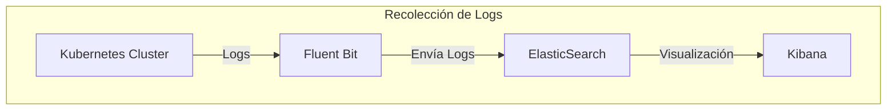
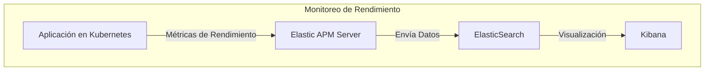

# Monitoreo de Logs y Rendimiento con ELK

## Descripción General
En AgendaPro utilizamos la suite **ELK** (ElasticSearch, Logstash, Kibana) para centralizar la recolección de logs y monitorear el rendimiento de nuestras aplicaciones. Esto nos permite tener visibilidad completa de nuestras aplicaciones y su desempeño en producción.

### 1. Recolección de Logs
Para la recolección de logs, empleamos **Fluent Bit** como agente para capturar y enviar los registros de todos los contenedores en nuestro clúster de **Kubernetes** hacia **ElasticSearch**. Estos logs luego pueden ser consultados y visualizados en **Kibana**, facilitando el diagnóstico y solución de problemas de manera eficiente.

#### Diagrama de Flujo de Recolección de Logs

A continuación se presenta el flujo de datos desde los contenedores hasta Kibana, mostrando el proceso de recolección de logs:

### 2. Monitoreo de Rendimiento con APM

Además de la recolección de logs, utilizamos **Elastic APM** (Application Performance Monitoring) para supervisar el rendimiento de nuestras aplicaciones en tiempo real. Elastic APM recopila métricas detalladas, como:

- **Tiempos de Respuesta**: Mide la duración de las solicitudes, permitiendo identificar posibles cuellos de botella.
- **Errores**: Registra errores en tiempo de ejecución, lo que facilita la detección de fallos críticos.
- **Uso de Recursos**: Monitorea el uso de memoria y CPU de la aplicación, proporcionando información clave para optimización.

Estos datos se envían al **APM Server**, que los procesa y almacena en **ElasticSearch**. Luego, podemos visualizar y analizar toda esta información en **Kibana**. Esto nos permite entender el rendimiento de nuestras aplicaciones y resolver problemas de eficiencia antes de que impacten a los usuarios finales.

#### Diagrama de Flujo para Monitoreo de Rendimiento

Aquí se presenta un diagrama en Mermaid que muestra el flujo de datos de rendimiento desde la aplicación hasta Kibana a través de Elastic APM:

### 3. Beneficios de ELK para AgendaPro

El uso de ELK para monitorear logs y rendimiento aporta múltiples ventajas a nuestra infraestructura:

- **Centralización de Logs**: La recolección de logs de todos los contenedores en Kubernetes a través de Fluent Bit y su almacenamiento en ElasticSearch permite una visualización y análisis unificados desde Kibana. Esto simplifica enormemente el diagnóstico y rastreo de problemas, acelerando la resolución de incidencias.
  
- **Visibilidad del Rendimiento**: Elastic APM brinda métricas detalladas que permiten entender el comportamiento de la aplicación y detectar cuellos de botella. Las métricas de tiempos de respuesta, errores y uso de recursos contribuyen a optimizar la eficiencia y mejorar la experiencia del usuario.

- **Detección Proactiva de Problemas**: Gracias a la integración de Elastic APM, el equipo puede identificar y resolver problemas de rendimiento antes de que afecten a los usuarios, permitiendo una intervención temprana y mejorando la estabilidad de la aplicación.

- **Mejora Continua**: La información consolidada en Kibana facilita la toma de decisiones basada en datos, impulsando la mejora continua y la capacidad de respuesta del equipo ante cambios y necesidades de la aplicación.

---

> **Nota**: Tanto los logs como las métricas de rendimiento están disponibles para el equipo de DevOps y los desarrolladores, fomentando la colaboración en la resolución de problemas y en la optimización de aplicaciones.

# Ejemplos de configuracion
[Configure Node](./configure-node.md).

[Configure Ruby](./configure-ruby.md).

## Actualizaciones

| Versión | Fecha       | Descripción                          | Author|
| ------- | ----------- | ------------------------------------ |---------------------------------- |
| 1.0     | 11-11-2024  | Versión inicial de la documentación. | Yonathan Duran|
